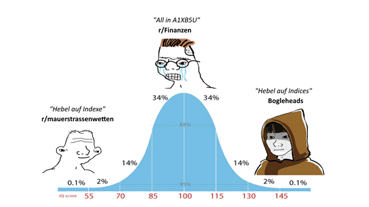

# Einleitung / Was ist die HFEA-Strategie?

Liebe Schwestern und Brüder der Mauerstraße,

heute möchte ich euch mit auf ein Abenteuer nehmen. Ein Abenteuer, welches uns viel Schweiß und Arbeit abverlangen wird, aber an dessen Ende wir einen Schatz finden können. Ich habe seit Ende letzten Jahres Stück für Stück Daten gesammelt, bereinigt und aufgearbeitet um damit einen Backtest der HFEA Strategie vom 1943 bis Anfang 2022 durchführen zu können und zwar auf täglicher Basis.

Damit können wir gemeinsam die HFEA Strategie unter Berücksichtigung der deutschen Kapitalertragssteuer testen und Alternativen zu den U.S. ETFs der Originalstrategie auswählen. Leider kann ich euch jetzt schon einmal sagen, dass die Originalstrategie nicht unter allen denkbaren Marktszenarien der nächsten Jahre gleich erfolgreich sein wird, aber wir werden gemeinsam im Laufe dieser Serie Alternativen erarbeiten, mit denen ihr je nach Situation besser aufgestellt seid.

Als ich diese Arbeit begann dachte ich, dass ich euch hier nur einen kurzen DD abliefere und dann ist die Sache gelaufen. Doch je länger ich mit der Datenaufbereitung beschäftigt war stellte ich fest, dass es so viele Annahmen und Randbedingungen gibt, dass es fahrlässig wäre, euch eine Strategie zu präsentieren ohne euch zu zeigen auf welchen Prämissen diese basiert. Daher beschloss ich eine DD-Serie zu starten, in welcher ihr von den ersten Daten bis zu den letzten Backtest-Ergebnissen jede einzelne Entscheidung die ich getroffen habe nachvollziehen und demnach auch in Frage stellen könnt. Ich möchte mit euch hier gemeinsam darüber diskutieren ob meine Entscheidungen sinnvoll sind, oder ob es bessere Alternativen gibt. Und natürlich habe ich kein Problem damit einen Test oder eine Analyse noch einmal zu wiederholen, falls sich die Annahmen während unserer Diskussion ändern sollten.

Zuerst möchte ich euch kurz die HFEA-Strategie erklären. Anschließend werde ich euch zeigen, wie man die Schatzkisten-Fond Daten von 1943 bis heute berechnen kann. Danach erkläre ich, wie ich die restlichen Daten zusammengesammelt habe und führe eine ganz allgemeine Analyse verschiedener Anlageklassen durch. Hier schauen wir uns mal die Gewinnchancen und das dazugehörige Risiko dieser Anlageformen im Detail an und berechnen auch die Korrelation zueinander. Ohne zu viel zu verraten, kann ich schon mal sagen, dass wir hier die ersten überraschenden Ergebnisse sehen werden.

Im Anschluss modellieren wir gemeinsam die ganzen ETFs auf denen unsere Strategie aufbauen soll. Wir machen das für U.S. ETFs um immer einen Vergleich zur Originalstrategie zu haben, aber eben auch für europäische ETFs. Dann können wir die ETFs noch einmal genauer auf ihr Gewinn- und Risikoverhältnis hin analysieren und danach starten wir endlich mit unseren Backtests.

Dabei werden wir verschiedene Strategien erarbeiten, die man unter Annahme unterschiedlicher zukünftiger Marktbedingungen verfolgen kann. Am Ende der Backtests, führen wir ein Modell für die deutsche Kapitalertragssteuer ein um zu schauen, ob diese Strategien überhaupt Sinn machen, oder ob wir einfach in einen thesaurierenden All-World ETF investieren sollten. Und dann ziehen wir mal ein vorläufiges Fazit.

Kommt mit auf diese Reise! Ihr werdet viel lernen, wir werden einigen Spaß zusammen haben und am Ende warten sicherlich interessant Erkenntnisse auf uns.

**Was ist die HFEA-Strategie?**

Vor knapp 3 Jahren hat ein Nutzer mit dem Namen *Hedgefundie* im Forum Bogleheads einen Beitrag mit dem Namen „HEDGEFUNDIES’s excellent adventure“ \[1\] verfasst. Wahrscheinlich gibt es viele von euch die von Bogleheads noch nie etwas gehört haben. Das ist ein Forum in denen viele amerikanische FIRE (Financial Independence, Retire Early) Anhänger rumhängen. Man kann sich das wie eine r/Finanzen Community vorstellen, nur ohne Sankey Chart und weniger Kreiswichs auf den All-World ETF und den Verzicht auf Bananen. Stattdessen mit vielen hoch interessanten und teils (mathematisch) anspruchsvollen Beiträgen zu mehr oder weniger risikoreichen Anlageformen.

Da ich jetzt gerade viele komplizierte Wörter verwendet habe, möchte ich euch noch einmal in einem Bild erklären was die Bogleheads sind:

Nun gut, das wichtigste ist, dass Hedgefundie in seinem Beitrag eine Strategie vorgestellt hat, welche später als HFEA-Strategie bezeichnet wurde. Er baut ein Portfolio aus zwei nahezu gleichwertigen Anteilen auf:

* Einen Wachstumsanteil, dessen Aufgabe darin besteht in guten Phasen möglichst hohe Gewinne abzuwerfen.
* Und einen Hedge-Anteil, dessen Aufgabe darin besteht auch in schlechten Zeiten einen ordentlichen Teil des Geldes zu besitzen, um damit den Wachstumsanteil zu stützen.

Hedgefundie schlägt zunächst eine 40% zu 60% Aufteilung vor. Wobei der Wachstumsanteil 40% und der Hedge-Anteil 60% beträgt. Einmal im Quartal werden diese Anteile dann neu balanciert, so dass danach die prozentuale Aufteilung wieder 40% zu 60% beträgt. Später korrigiert Hedgefundie die Aufteilung, weil er mehr Backtests gemacht hat, und schlägt 55%/45% vor \[2\].

Als Wachstumsanteil entscheidet er sich für einen 3-fach gehebelten S&P 500 ETF, den UPRO und als Hedge-Anteil für einen 3-fach gehebelten Long Term Treasury Fund, den TMF, der Schatzkisten-Bonds mit 30 bis 20 Jahren Laufzeit beinhaltet. Das macht auch alles Sinn, denn wenn man sich den Verlauf vom S&P 500 und den langfristigen Schatzkisten ansieht stellt man schnell fest, dass diese nicht zu einander korrelieren. Mit anderen Worten: Steigt der S&P 500, bleiben die Schatzkisten gleich oder fallen sogar. Steigen dagegen die Schatzkisten, dann ist das dem S&P 500 ziemlich egal.

Er entscheidet sich bewusst für 3-fach gehebelte ETFs um eine hohe Rendite einfahren zu können, auf Kosten eines ebenso hohen Risikos. Wir werden später genau sehen was „Risiko“ in diesem Kontext bedeutet, aber schon einmal soviel vorweg: Der UPRO kann locker mal um mehr als 90% einbrechen in einer Krise. Ja genau 90%! Leute, lasst euch das mal auf der Zunge zergehen: Da habt ihr 20 Jahre lang gespart und auf Bananen und dazugehöriger Freundin verzichtet und somit irgendwie 100k€ zusammenbekommen und dann kommt eine verfikte Krise und ihr habt nur noch 10k€ übrig. Glückwunsch! Das ist der Albtraum von r/Finanzen!

Aber warum funktioniert HFEA dennoch? Ganz einfach: Wegen dem Hedge und dem Rebalancing. Nehmen wir also an, dass ihr 100k€ hattet, wovon 55k€ im UPRO steckten und 45k€ im TMF. Und nun kommt diese Krise mit 90% Verlust beim UPRO. Was habt ihr dann? 5,5k€ im UPRO und 45k€ im TMF. Warum? Na, **weil beide unkorreliert sind**! Zusammen macht das dann 50,5k€ aus. Nun macht ihr ein zeitnahes Rebalancing, ihr teilt also diese 50,5k€ wieder zu 55% und 45% zwischen UPRO und TMF auf. Damit habt ihr dann 27,8k€ in UPRO und 22,8k€ in TMF. 1 Jahre später kommt ein absoluter Bullenlauf und der UPRO macht 350% innerhalb weniger Jahre. Dann habt ihr 97.3k€ im UPRO und vielleicht immer noch nur 22.8k€ im TMF. Und für alle die das nicht im Kopf rechnen können, das sind 120.1k€, also ganze 20% mehr als vor der Krise. Dazu kommt, dass sowohl UPRO als auch TMF halbwegs vernünftige Rendite in normalen (nicht Krisen) Jahren abwerfen.

Hier habe ich mal ein Bild, wo genau eine solche Situation gezeigt wird:

(Achtung: Logarithmische Y-Achse!)

Wir haben 2007 noch 100k$ auf unserer Deponie. Als dann die Finanzkrise kommt, bricht der UPRO um fast 95% ein. Ein Portfolio, welches nur UPRO halten würde, hätte dann nur noch ca. 5k$ und würde, trotz des folgenden starken Wachstums, bis ca. 2014 benötigen um den ursprünglichen Betrag wieder herzustellen (hat hier jemand Pfadabhängigkeit gesagt 👀)?

Der TMF dagegen ist die ganze Krise über ziemlich stabil, er gewinnt sogar zeitweise deutlich. Dementsprechend ist ein HFEA Portfolio auch nur um ca. 40% eingeknickt und konnte dann aber auch ziemlich gut durch das anschließende Wachstum vom UPRO profitieren. Nun mögen manche Neunmalklugen unter euch sagen „hätte ich nur auf TMF gesetzt wäre ich 2013 auf den gleichen Betrag wie bei HFEA gekommen“. Tja, das ist das schöne, wenn man Daten nur Auszugsweise betrachtet: Die Wahrheit ist, dass auch der TMF so seine Schwächephasen hat und im Schnitt weniger stark wächst als der UPRO. Daher schauen wir uns das noch einmal von 1986 bis 2018 an.

(Achtung: Logarithmische Y-Achse!)

Und hier sehen wir sehr deutlich, dass HFEA sowohl den UPRO als auch den TMF deutlich ausperformt (8-mal höherer Endbetrag!). Klar, es gibt Phasen da ist der UPRO mal etwas höher als HFEA, aber wer hoch fliegt kann bekanntlich auch tief fallen und so ist es mit dem UPRO ab dem Jahr 2000 geschehen. Der UPRO war erst 2018 wieder auf dem Niveau von vor 2000. HFEA hat dagegen schon 2011 den UPRO-Wert von kurz vor 2000 überschritten. Genau deswegen hat diese Strategie das Potenzial, trotz des hohen Risikos bei den einzelnen Anteilen, den Markt deutlich auszuperformen und damit vor allem auch den All World ETF.

Also der Schlüssel zum Erfolg ist ein *geeigneter Hebel*, *unkorrelierte Anteile* im Portfolio sowie *ein regelmäßiges Rebalancing*. Können wir eine solche Strategie in Europa und Deutschland auch machen? Bedingt! Denn einerseits haben wir in Europa ein Problem mit 3-fach gehebelten ETFs, diese sind nämlich nicht Zugelassen und daher gibt es nur 3-fach gehebelte ETNs, mit Emittentenrisiko und häufig auch höheren Kosten. Außerdem fällt bei jedem Rebalancing in Deutschland Steuer auf die Gewinne an, was den Zinseszinseffekt deutlich schmälert und sich deutlich negativ auf die Gesamtperformance auswirkt. Die Amerikaner haben hier mit ihren Rentenportfolios, wo Steuern erst bei der Auszahlung anfallen, einfach einen gewaltigen Vorteil.

Ob damit die HFEA-Strategie völlig unmöglich ist, ist damit aber nicht gesagt und genau dieser Frage wollen wir in den kommenden Kapiteln nachgehen. Wichtig ist hier: Wir haben nicht das Ziel einen glücklich getimten Anruf auf Tesler auszuperformen, sondern wir wollen eine langfristige Strategie welche lediglich den Markt also einen S&P 500 ETF ausperformt.

Darüber hinaus möchte ich noch auf ein anderes Problem bei HFEA hinweisen: Die Originalstrategie wurde mit Daten von 1986 an entwickelt. Aber Backtests von Hedgefundie von 1955 \[3\] an zeigen deutlich, dass die Strategie nicht immer so toll funktioniert hat wie oben in den Bildern gezeigt. In der Zeit vor 1987 gab es nämlich deutliche Probleme mit dem TMF. Wir werden darauf auch im Rahmen unserer Analyse zurückkommen.

Außerdem gibt es noch andere interessante Ideen, wie man aus dem UPRO Gewinn schlagen kann, ohne einen aktiven Hedge-Anteil \[4\] \[5\], auch diese Ideen können wir bei dieser Gelegenheit untersuchen und gegenüber HFEA vergleichen.

&#x200B;

**Quellen**

\[1\] [https://www.bogleheads.org/forum/viewtopic.php?f=10&t=272007](https://www.bogleheads.org/forum/viewtopic.php?f=10&t=272007)

\[2\] [https://www.bogleheads.org/forum/viewtopic.php?f=10&t=272007&start=3350#p4692509](https://www.bogleheads.org/forum/viewtopic.php?f=10&t=272007&start=3350#p4692509)

\[3\] [https://www.bogleheads.org/forum/viewtopic.php?p=4426381#p4426381](https://www.bogleheads.org/forum/viewtopic.php?p=4426381#p4426381)

\[4\] [https://www.reddit.com/r/LETFs/comments/nnfqg0/backtesting\_3x\_leveraged\_sp500\_results\_along\_with/](https://www.reddit.com/r/LETFs/comments/nnfqg0/backtesting_3x_leveraged_sp500_results_along_with/)

\[5\] [https://www.bogleheads.org/forum/viewtopic.php?f=10&t=297591&sid=d6cdd9a4895f6dfc8c08ea25329471ea](https://www.bogleheads.org/forum/viewtopic.php?f=10&t=297591&sid=d6cdd9a4895f6dfc8c08ea25329471ea)

**Edit 1:** *Mich hat jemand darauf hingewiesen, dass ich im Text und Beispiel die von Hedgefundie modifizierte Aufteilung verwechselt habe. Tatsächlich hat Hedgefundie später eine Aufteilung von 55% UPRO und 45% TMF vorgeschlagen und mit längeren Zeitreihen getestet. Ich habe den Text und das Beispiel entsprechend angepasst. Und natürlich machen wir später auch einen eigenen Backtest mit beiden Varianten über die komplette Zeitreihe von 1943 bis heute. Danke für den Hinweis.*
