# Schatzkisten-Daten von 1943 / Schatzkisten-Fond

ZL;NG:

* *Die Bogleheads haben eine Excel Datei mit monatlichen Treasury Yields von 1941 an*
* *Von dort konnte ich die monatlichen Yields ab 1943 herausnehmen und linear auf Tageswerte interpolieren*
* *Ab 1955 bzw. 1977 gibt es tägliche Treasury Yields bei FRED*
* *Die Zeitreihen beider Quellen habe ich miteinander verbunden*
* *Ich konnte dank Bogleheads verschiedene Modelle für Treasury Bond Funds testen*
* *Das beste Modell benutzte ich dann um die 3 Funds zu simulieren, die im Bogleheads Backtest Excel-Sheet verwendet werden*
* *Zudem simulierte ich 3 Funds, welche als Vorbild europäische ETFs haben*

Liebe Schwestern und Brüder der Mauerstraße,

nachdem wir uns im ersten Teil kurz mal angesehen hatte wie die HFEA-Strategie grundsätzlich funktioniert, wollen wir nun in Richtung unserer eigenen Backtests gehen, um die Strategie eingehender beurteilen zu können. Natürlich sind uns auch hier die Bogleheads mal wieder ein Stück voraus und der User Simba hat schon vor einigen Jahren eine Excel-Datei \[1\] erstellt, mit der man jährliche Backtests verschiedener Anlageformen von 1871 an machen kann. Die Datei wird weiterhin gepflegt, wobei der User Siamond diese Aufgabe übernommen hat \[2\].

Ich hatte mit dieser Datei vor einigen Monaten schon einmal einen Backtest gemacht \[3\] und bin zu ganz interessanten Ergebnissen für uns Europoors gekommen: Damals war mein Fazit, dass man einen 40%/60% Split europäische ETFs verwenden kann (2x S&P 500 und 1x 20y+ Treasury Bonds), aber dass angesichts der steigenden Inflation eventuell eine 40%/30%/30% Aufteilung zwischen 2x S&P 500, 1x 20y+ Treasury und 1x Gold sinnvoller sein könnte. Damals gab es das Problem, dass die Daten nur auf Jahresbasis vorlagen, so dass das Rebalancing auch nur jährlich gemacht werden konnte. Außerdem war unklar, ob wir durch starke Einbrüche unterhalb eines Jahres, aufgrund der Pfadabhängigkeit, doch andere Ergebnisse bekommen würden.

Kurzum, ich hatte mich damals entschlossen der Sache weiter nachzugehen und einen Backtest mit täglichen Daten durchzuführen. Und zwar am besten mit Daten die so weit zurück liegen, dass es uns sinnlos erscheinen würde noch weiter in der Vergangenheit zu stochern. Was wäre da so ein Jahr, bei dem es sinnlos wäre weiter zurück zu gucken? Natürlich 1945, alles andere liegt für uns Deutsche so weit zurück, das nicht einmal der Großvater davon erzählen will.

Ich habe es dann tatsächlich geschafft tägliche Kursdaten verschiedener Anlagetypen von 1943 aufzutreiben. Aber bei einigen Anlagetypen sind die Zahlen ganz am Anfang ziemlich mit der heißen Nadel zusammengestrickt. Ihr werdet noch sehen was ich damit meine.

## Woher zum fik bekommt man Schatzkisten-Daten von 1943?

Fangen wir mal mit den Schatzkisten (U.S. Treasuries) an. Die ersten öffentlichen Fonds die ich gefunden habe reichen so bis in die 1980er Jahre zurück, das ist natürlich viel zu wenig. Mit Hilfe von Xeo (Wo bist du, Brudi?) hatte ich dann tatsächlich Treasury Yields bis in die 1950er Jahre auftreiben können. Und zwar gibt es die ganz locker bei der FRED \[4\]. Je nach Laufzeit der Treasuries (30 Jahre bis 1 Jahr) gibt es die aber auch erst ab 1977. Also woher bekomme ich die Daten von 1943 an?

Auch dabei konnte mir Bogleheads weiterhelfen. Und zwar gibt es dort einen User der hat die Treasury Yields monatlich von 1941 an aus einem Buch abgetippt und in eine Excel-Datei übertragen \[5\]. Aber wir brauche ja tägliche Werte, also was sollen wir machen? Eigentlich hat man da nur 3 Möglichkeiten so etwas zu lösen:

1. Man könnte einfach den monatlichen Wert für alle Tage im Monat annehmen. Das Problem ist, dass man damit unschöne Stufen bekommt, die einfach in der Realität so gar nicht existieren. Das kann sich durch die ganzen Daten später durchziehen.
2. Man könnte die Werte der Tage zwischen den monatlichen Werten linear interpolieren. Das Problem ist hier, dass man zwar einen schönen Verlauf bekommt, aber ob dieser der Realität entspricht weiß man nicht. Vielleicht gibt es ja einen Crash am Anfang vom Monat und eine V-förmige Erholung bis zum Monatsende. Das würde man nicht mitbekommen.
3. Man könnte die Wahrscheinlichkeitsverteilung für die Veränderung der Yields aus den täglichen Daten der FRED herausrechnen und dann einfach einen Zufallsverlauf erzeugen der dieser Wahrscheinlichkeitsverteilung entspricht und exakt dort endet wo der nächste Monatswert anfängt. Damit hätte man zwar immer noch keine realistischen Daten, aber zumindest hätte man die Chance auch seltene Ereignisse in die Daten hineinzubringen.

Ich habe mich hier für die Lösung 2 entschieden. Vor allem deswegen, weil es so schön einfach ist das so zu machen. Außerdem gehe ich bei Treasury Yields nicht davon aus, dass diese sich innerhalb eines Monats komplett ändern, aber am Monatsende wieder da sind wo sie zu Beginn waren. Tatsächlich hat die FED Zinspolitik einen hohen Einfluss auf die Erträge der Schatzkisten und diese ändert sich ja nun auch nicht täglich.

Also habe ich die monatlichen Werte von 1943 an bis 1992 auf tägliche Werte interpoliert. Die täglichen Werte der FRED, die ja nur für Handelstage vorliegen und wo ab und zu auch mal ein Wert fehlte, konnte ich einfach nach Methode 1 auf das ganze Jahr umrechnen (also am Wochenende ist der Wert vom Freitag genommen worden). Anschließend kombinierte ich dann beide Zeitreihen miteinander. Dabei habe ich das erste sich überlappende Jahr genutzt um langsam von der einen Zeitreihe (Bogleheads Yield Curve) zur anderen Zeitreihe (FRED) überzugehen.

Um Sicherzustellen, dass die Werte gut miteinander harmonieren und ich keinen Fehler gemacht habe, ließ ich die jeweils überlappenden Bereiche für jede Zeitreihe in einer Grafik übereinander darstellen. Somit sieht man sofort, wenn was schiefgelaufen ist. Da die täglichen Werte etwas wild aussehen, akkumulierte ich die Renditen über die Jahre hinweg auf, was die Zeitreihen glättete. Die Darstellung ist daher etwas sauberer und mich interessiert ja nicht, ob am Tag X eine Abweichung von 0.5% war, sondern nur ob der Verlauf im großen Ganzen hinhaut.

Das wiederholte ich für die Treasury Yields mit einer Laufzeit von 1, 3, 5, 7, 10, 20 und 30 Jahren.

Hier ist das Ergebnis (Wachstums-Diagramm mit überlappenden Kurven):

* [Treasury Yields 1 Year](https://paste.pics/a3c1ae8faf419d520aaf3550c833badc)
* [Treasury Yields 3 Years](https://paste.pics/93326ac34192f288dbb275b56478d40a)
* [Treasury Yields 5 Years](https://paste.pics/60efad856ad7bc1905ea5bde3b1b6370)
* [Treasury Yields 7 Years](https://paste.pics/1a0c69cbd682617fb29dadc343a1822b)
* [Treasury Yields 10 Years](https://paste.pics/747d6e4e804911bddbfcfecd66861241)
* [Treasury Yields 20 Years](https://paste.pics/e73161c09014b5b3f053f556129b3f01)
* [Treasury Yields 30 Years](https://paste.pics/2bbec1a233878557ec65657963311916)

Das sieht sehr gut aus. Man sieht ganz leichte Abweichungen in den letzten Jahren bei den Bogleheads Daten, aber in diesen Jahren benutzen wir schon längst die FRED Daten. Die Tatsache, dass die Abweichungen nur leicht sind zeigt auch, dass die beiden Datenreihen gut miteinander kompatibel sind und unsere Annahme, dass man zwischen zwei Monatswerten interpolieren kann nicht unbegründet ist.

Wenn ich jetzt den Verlauf der Yields aller Laufzeiten in einem Diagramm darstelle sieht das folgendermaßen aus:

&#x200B;

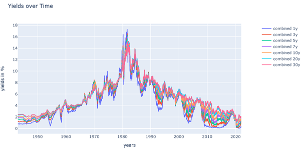

Wir sehen also ganz gut, dass die Schatzkisten mit kurzer Laufzeit am anfälligsten gegenüber Zinsänderungen sind. Wohingegen Schatzkisten mit langer Laufzeit weniger stark auf eine Zinsänderung reagieren. Noch besser ist das zu sehen, wenn man nur die 1 Jahres und 30 Jahres Treasuries anzeigen lässt:

&#x200B;

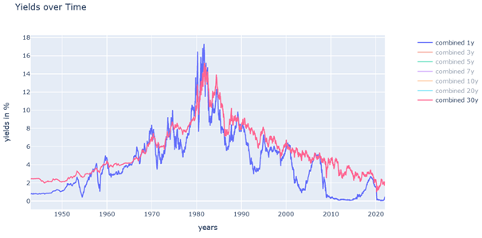

Und wir sehen auch toll, wie unglaublich hoch die Treasury Yields in den 1980er Jahren waren und wie niedrig sie nun, aufgrund geringer Zinsen, heutzutage sind. Das wird uns später noch einmal beschäftigen.

## Was ist eigentlich ein Treasury Bond Fund und wie funktioniert so etwas?

Jetzt haben wir die Treasury Yields, aber was sollen wir damit anfangen? In Wirklichkeit benötigen wir für unseren Backtest die Rendite der Fonds, welche solche Treasury Bonds halten. Das hat erst einmal eine Zeit lang gebraucht, bis ich kapierte, dass Treasury Yields und Treasury Bond Returns nicht das gleiche sind. Immerhin bin ich ja kein Finanzmathematiker, noch nicht einmal ein BWLer, sondern nur ein dummer Programmieraffe. Also was kann man da tun? Hängen die Treasury Bond Fund Renditen irgendwie mit den Treasury Yields zusammen? Wahrscheinlich schon.

Mein erster Gedanke war daher, dass ich die Yields der Schatzkisten einfach auf akkumuliere, so als ob es sich dabei direkt um die Rendite einer Aktie oder so handeln würde. Das habe ich mal für die 10-jährigen Schatzkisten gemacht und aus Simbas Backtest Excel-Datei \[1\] konnte ich mir als Vergleichswert die jährlichen ITT (Intermediate Term Treasury) Daten heraussuchen und ebenfalls auf akkumulieren:

&#x200B;

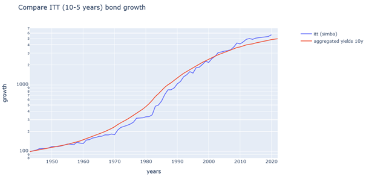

Ah ja! So dumm war meine Vermutung also gar nicht. Die beiden Kurven passen grundsätzlich schon mal ganz gut zueinander. Aber meine Kurve ist einfach viel zu glatt und der prozentuale Unterschied meiner Lösung im Vergleich zur den Daten der Bogleheads ist zum Teil schon sehr hoch (ca. 60% im Januar 1982). Also woher hat Simba, bzw. Siamond von den Bogleheads die Zahlen die in der Backtest Excel-Datei drinstehen?

Auch hier hat mir wieder das Studium von Bogleheads weitergeholfen. Der User Longinvest erklärte in einem Beitrag \[6\] ein Modell mit dem man die Renditen verschiedener Treasury Bond Funds berechnen kann und Siamond hat dann dessen Simulation in die Excel-Datei übernommen. Habe ich euch eigentlich schon mal den Unterschied zwischen Bogleheads und verschiedener Finanzunters von Reddit erklärt? Hier noch einmal zur Erinnerung ein Bild:

&#x200B;

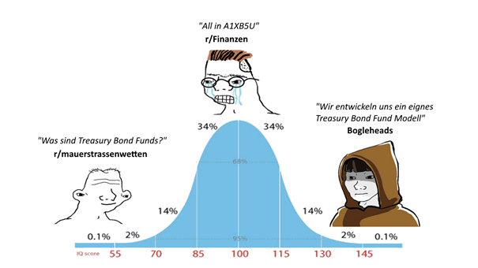

Da ich nun leider eher zur Kategorie der Leute auf der linken Seite gehöre, habe ich seinen Beitrag erst überhaupt nicht verstanden. Aber so leicht gebe ich ja nicht auf. Über Weihnachten las ich mir den Beitrag einfach so lange durch, bis ich die ersten Worte zuordnen konnte und irgendwann hat es Stück für Stück klick gemacht, was mir Longinvest dort eigentlich erklären will. Und dieses Wissen möchte ich heute mit euch teilen.

Was ist eigentlich ein Treasury Bond? Das ist eine Schuldverschreibung einer Regierung die ihr kaufen könnt. Beispielsweise kauft ihr diese für 100$. Nehmen wir an, ihr habt euch so eine Schuldverschreibung für 10 Jahre gekauft, dann bezahlt ihr einmalig 100$ und bekommt dann 10 Jahre lang jedes Jahr Zinsen darauf gezahlt (sogenannte Coupons). Diese Coupons sind die Treasury Yields die zum Zeitpunkt eures Kaufs galten. Waren die Yields für 10-jährige Treasuries damals bei 5%, bekommt ihr nun 10 Jahre lang 5$ gezahlt und am Ende der 10 Jahre bekommt ihr die 100$ von der Regierung zurück.

&#x200B;

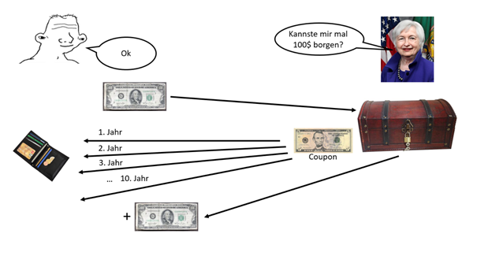

Natürlich habe ich die Grafik etwas vereinfacht dargestellt und in Wirklichkeit werdet ihr nicht mit der netten Dame dort oben direkt kommunizieren. Tatsächlich könnt ihr euch solche Treasury Bonds einfach an der Börse kaufen und der tatsächliche Preis den ihr dafür bezahlen müsst, wird durch den Markt ermittelt.

Nun sind aber die zukünftigen Gewinne eines solchen Finanzprodukts so klar berechenbar, dass ihr nicht denken müsst, dass der Markt euch da die Chance auf einen Rabatt gibt. Stattdessen kann man den zu erwartenden Preis eines Bonds ziemlich exakt ausrechnen \[8\]. Er bestimmt sich durch seinen nominellen Wert (also die 100$), den Coupon (also den Yields die bei der Ausgabe gültig waren), die Restlaufzeit und die aktuellen Yields auf einen Bond mit exakt dieser Restlaufzeit. Würde der Preis an der Börse davon abweichen, würden sofort unzählige Algorithmen das ausnutzen und dafür sorgen, dass der Preis wieder exakt diesem Gesetz folgt. Die Formel dafür sieht (vereinfacht) so aus:

&#x200B;

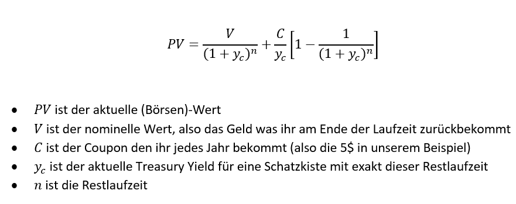

Wir können ja mal diese Formel nehmen und dort unser Beispiel von oben Eintragen: Also 100$ nomineller Wert, 10 Jahre Restlaufzeit, 5$ jährliche Coupons und demnach ein Yield von 5%. Damit erhalten wir einen aktuellen Wert von, oh Wunder, oh Wunder, 100$.

Nehmen wir mal an, dass wir diese Schuldverschreibung 1 Jahr lang gehalten haben. Dann ist der nominelle Wert immer noch 100$, die jährlichen Coupons ebenfalls noch 5$, aber die Restlaufzeit nur noch 9 Jahre. Als aktuellen Yield für 9-jähige Staatsanleihen nehmen wir einfach erneut 5% an. Der Wert dieser Schuldverschreibung wäre dann ebenfalls noch 100$. Warum? Weil, das ist der Betrag den wir am Ende der Laufzeit zurückbekommen und an den Randbedingungen (Yields) hat sich ja nichts verändert.

Steigen nun aber die Yields an (was aktuell ja passiert), dann ändert sich diese Situation. Nehmen wir mal an, dass für 9-jährige Schuldverschreibungen die Yields plötzlich auf 5.5% ansteigen, dann haben wir nur noch ein Wert von 96,52$. Unsere Schuldverschreibung ist billiger geworden, weil man inzwischen für höhere Coupons den gleichen Betrag verleihen könnte. Wir müssen also dem Käufer unserer Schuldverschreibung einen Rabatt geben um die entgangenen Gewinne auszugleichen. Genau das ist der Grund, warum aktuell die ganzen Treasury Bond Funds von der Klippe stürzen: Die zukünftigen Zinsanhebungen der FED werden in die Yields eingepreist und damit will keiner mehr aktuelle Schuldverschreibungen für den ursprünglichen Wert kaufen.

Aber was nützt uns das? Erinnert ihr euch an unser Ziel? Wir wollen eigentlich einen Treasury Bond Fond simulieren. Und was machen Treasury Bond Funds? Jawohl, sie kaufen Schuldverschreibungen und kassieren die Zinseinkünfte. Genau das ist nun der Einstiegspunkt wo Longinvest mit seiner Bond Fund Simulation anfängt. Zunächst stellt er ein naives Modell vor. Dieses Modell funktioniert so:

1. Der Bond Fund hat ein Anfangskapital von 100$.
2. Dann wird eine 10-jährige Staatsanleihe für das vorhandene Kapital gekauft
3. Diese wird 1 Jahr lang halten
4. Dann kassieren wir den Coupon (also den Zins)
5. Danach verkaufen wir die Anleihe als 9-jähige Staatsanleihe
6. Dann zurück zu Schritt 2, aber dieses Mal mit dem Geld, den der Fund jetzt besitzt (Verkaufspreis im Schritt 5 + Coupon aus Schritt 4)

Das kann man nun für beliebige Jahre immer so weiter machen, wobei der Wert des Bond Funds exakt der Betrag ist, der im Schritt 6 zum Neukauf zur Verfügung steht. Nun haben wir aber ein Problem: Nämlich wir kennen nur die Yields für 1-, 3-, 5-, 7-, 10-, 20- und 30-jährige Treasury Bonds. Woher sollen wir die Yields für 9-jähirgen nehmen? Longinvest schlägt vor, der Einfachheit halber für 9-jährige Yields die 10-jährigen zu benutzen. Die werden schon nicht zu unterschiedlich sein, oder? Schauen wir uns mal das Ergebnis unseres simulierten naiven Bond Funds gegenüber der ITT Werte aus Simbas Excel-Datei an.

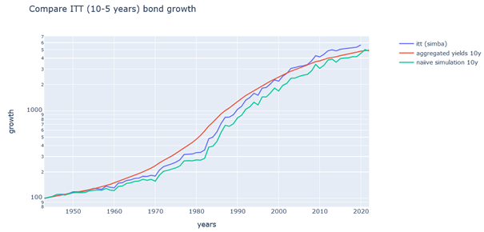

Ah ja! Die grüne Linie sieht schon deutlich besser aus als unser vorheriger Versuch. Sie folgt den Höhen und Tiefen der blauen Linie, aber über die Zeit hinweg scheint sie sich davonzubewegen und unterzuperformen. Dafür gibt es zwei Gründe: Zum einen haben wir einen Fehler eingeführt, als wir unsere 9-jähigen Staatanleihen auf Grundlage der 10-jährigen Yields verkauft haben. Dieser Fehler akkumuliert sich über die Jahre hinweg auf und wird daher immer größer. Zum anderen ist die Referenzlinie ein ITT also ein Bond Fund der 5-10-jährige Staatsanleihen enthält. Unsere Simulation hingegen besitzt nur 9-10-jährige Anleihen. Damit bekommen wir einfach eine veränderte Charakteristik im Verlauf.

Das sieht auch Longinvest so ein und schlägt daher eine Verbesserung vor. Diese funktioniert so ähnlich wie das erste Modell, aber verwendet 2 Staatsanleihen:

1. Wir starten wieder mit einem Kapital von 100$
2. Dann kaufen wir uns für die Hälfte eine 10-jährige Anleihe
3. Und für die andere Hälfte kaufen wir eine 1-jährige Anleihe
4. Dann warten wir ein Jahr
5. Wir kassieren die Coupons für beide Anleihen
6. Dann verkaufen wir die 9-jährige Anleihe
7. Und wir bekommen das Geld für die abgelaufene 1-jährige Anleihe zurück
8. Mit dem eingesammelten Geld machen wir dann bei 2 weiter

Da wir es jetzt ohnehin schon mit 1-jährigen und 10-jähigen Yields zu tun haben, können wir durch eine lineare Interpolation einfach die 9-jähigen Yields erraten. Außerdem besitzen wir im Mittel nun eine Laufzeit von ca. 5,5 Jahren bei den gehaltenen Staatsanleihen, was etwas näher an den 5-10 Jahren des echten Bond Funds dran ist. Schauen wir uns mal an, wie gut unsere Simulation jetzt ist:

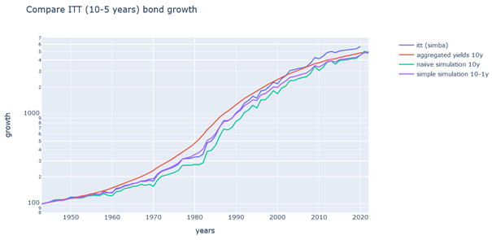

Unsere neue Simulation ist die lila Linie und wir sehen, dass diese näher an der blauen Linie ist als unsere vorherige Simulation. Dennoch bewegen wir uns mit den Jahren von unserer Referenz weg. Das liegt weiterhin daran, dass wir einen Fehler bei der Berechnung des Wertes der 9-jährigen Anleihen machen und diesen über die Jahre hinweg auf akkumulieren. Außerdem besitzen wir ja nun auch 1-jährige Anleihen, die im echten Fund gar nicht vorkommen. Man kann auch davon ausgehen, dass ein echter Bond Fund nicht so simple ist, dass er nur 2 verschiedene Arten von Anleihen hält.

Daher schlägt Longinvest ein drittes Modell vor:

1. Wir fangen wieder mit $100 Startkapital an
2. Für unser Kapital kaufen wir uns eine 10-jährige Staatsanleihe
3. Wir warten ein Jahr und kassieren die Coupons aller gehaltenen Staatsanleihen
4. Dann schauen wir ob irgendeine Staatsanleihe bei uns nur noch 5 Jahre oder weniger läuft. Falls ja, verkaufen wir diese und fügen den Erlös zusammen mit den Coupons unserem Kapital zu.
5. Anschließend gehen wir wieder zu 2.

In diesem Modell errechnet sich der aktuelle Wert des Bond Funds einfach aus der Summe der aktuellen Werte aller Staatsanleihen die wir im Fund halten. Nach 5 Jahren haben wir also 5 verschiedene Staatsanleihen mit einer Laufzeit von 10 bis 6 Jahre. Wow, das ist ja eigentlich genau so wie es ein echter Fund auch machen würde, oder?

Natürlich haben wir weiterhin das Problem, dass wir nur die exakten Preise für 10-, 7-, 5-jährige Staatsanleihen ausrechnen können. Aber hier können wir einfach die Yields zwischen 10- und 5-jährigen Anleihen interpolieren. Da wir die daraus folgenden Werte nicht verwenden um ein Investment in eine neue Anleihe zu tätigen, ist der kleine Fehler den wir damit machen egal. Denn wir akkumulieren ihn ja nicht mehr auf. Wir verwenden lediglich den Verkaufspreis der 5-jährigen Staatsanleihen für den Kauf neuer Anleihen, aber diesen Preis können wir dank der vorhanden Yields exakt ausrechnen. Schauen wir uns mal an wie gut sich unser Modell schlägt:

&#x200B;

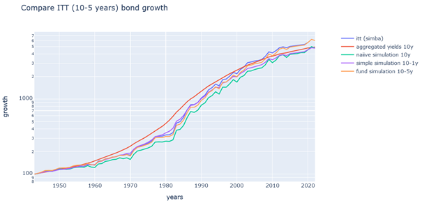

Das neue Modell ist die orangene Linie und das ist die mit Abstand beste Linie im Chart. Wir können uns den Fehler auch in einem sogenannten Telltale Chart \[9\] genauer ansehen. Ein Telltale Chart stellt die prozentuale Abweichung im zeitlichen Verlauf bezogen auf eine Referenz dar. Wir verwenden einfach den ITT vom Simba als Referenz und erhalten dann dieses Diagramm:

&#x200B;

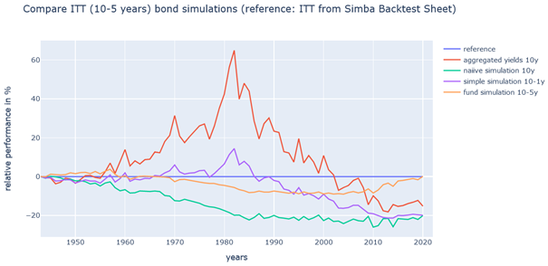

Wir sehen auch hier, dass die orangene Linie wirklich den kleinsten Fehler hat. Aber vor allem divergiert sie mit fortlaufender Zeit nicht immer weiter von der Referenz weg. Wir haben also ein stabiles Modell für einen Treasury Bond Fund gefunden.

Bis hierhin habe ich die Berechnung einfach auf Jahreswerten gemacht, damit ich sie einfacher mit den jährlichen Werten aus Simbas Excel-Datei vergleichen kann. Aber selbstverständlich kann man das gleiche Bond Fund Modell auch auf täglichen Werten berechnen. Hierbei wird an jedem Tag eben nur ein Bruchteil der Coupons ausgeschüttet und anstatt einmal jährlich einen neuen Bond zu kaufen, kaufen wir einfach jeden Tag mit dem durch unsere Coupons (und eventuelle Verkäufe) erwirtschafteten Kapital einen neuen Bond.

Auf diese Weise habe ich je 3 U.S. Treasury Bond Funds für die USA und für Europa erstellt. Bei den USA orientierte ich mich an den STT (Short Term Treasury), ITT (Intermediate Term Treasury) und LTT (Long Term Treasury) von Simbas Excel-Datei und bei den europäischen U.S. Treasury Bond Funds orientiert ich mich an realen Bond ETFs (IBTA, SXRM, DTLA). Das sind meine Ergebnisse:

## Simulation (3-1 Jahre) vs. STT (3-1 Jahre):

&#x200B;

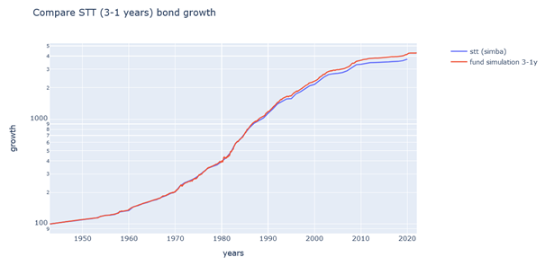

## Simulation (10-6 Jahre) vs. ITT (10-5 Jahre):

&#x200B;

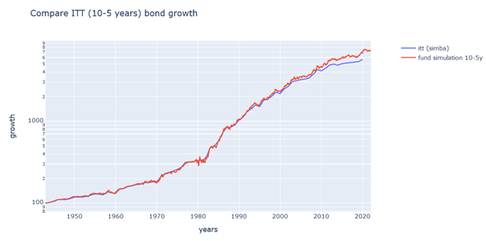

## Simulation (30-10 Jahre) vs. LTT (30-10 Jahre):

&#x200B;

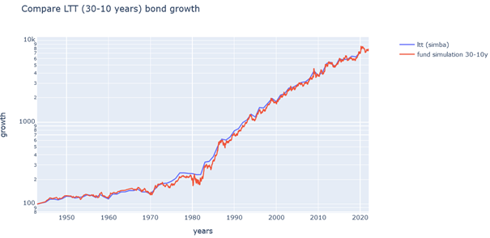

## Simulation (3-1 Jahre) vs. IBTA ETF (3-1 Jahre):

&#x200B;

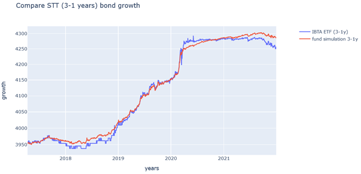

## Simulation (10-7 Jahre) vs. SXRM ETF (10-7 Jahre):

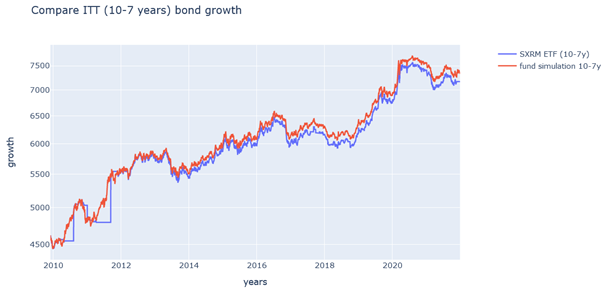

## Simulation (30-20 Jahre) vs. DTLA ETF (30-20 Jahre):

&#x200B;

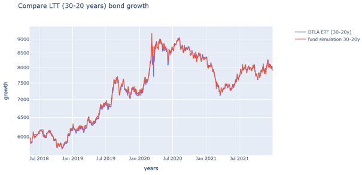

Wie wir sehen folgt die Simulation den ETFs ziemlich gut. Klar manchmal kommt es zu Abweichungen, aber am Ende ist es halt auch nur ein Modell und nicht die Realität. Natürlich habe ich die Simulation von 1943 an berechnet. Die Diagramme oben stellen halt nur den Ausschnitt dar bei welchem sich die Simulations- und ETF-Daten überlagern.

Ich habe für euch alle Eingangsdaten, den kompletten Code für die Berechnung, aber auch die Ergebnisse in ein Git Repository \[7\] geladen. Es ist alles mit Python und Jupyter Notebook programmiert. Viel Spaß beim Herumspielen mit den Daten.

## Fragen

&#x200B;

Ja den gibt es, wie wir an unserem Beispiel der Wertberechnung eines einzelnen Bonds gesehen haben. Steigen die Zinsen, dann fällt der Wert schon existierender Bonds, weil man dann für einen neu herausgegebenen Bond mit dem gleichen nominellen Wert höhere Coupons bekommen würde. Damit steht den U.S. Treasury Bond Funds in den nächsten Monaten und Jahren eine schwere Zeit bevor.

&#x200B;

Extra für dich: 🚀🚀🚀🚀🚀🚀🚀

## Quellen

\[1\] [https://www.bogleheads.org/wiki/Simba%27s\_backtesting\_spreadsheet](https://www.bogleheads.org/wiki/Simba%27s_backtesting_spreadsheet)

\[2\] [https://www.bogleheads.org/forum/viewtopic.php?p=6438846#p6438846](https://www.bogleheads.org/forum/viewtopic.php?p=6438846#p6438846)

\[3\] [https://www.reddit.com/r/mauerstrassenwetten/comments/qycd85/hfea\_f%C3%BCr\_europoors\_und\_inflationspropheten/](https://www.reddit.com/r/mauerstrassenwetten/comments/qycd85/hfea_f%C3%BCr_europoors_und_inflationspropheten/)

\[4\] [https://fred.stlouisfed.org/categories/115](https://fred.stlouisfed.org/categories/115)

\[5\] [https://drive.google.com/file/d/1azbWYdUDHjjtgxJ-logORbsGOmKanqxJ/view](https://drive.google.com/file/d/1azbWYdUDHjjtgxJ-logORbsGOmKanqxJ/view)

\[6\] [https://www.bogleheads.org/forum/viewtopic.php?t=179425](https://www.bogleheads.org/forum/viewtopic.php?t=179425)

\[7\] [https://code.launchpad.net/zgea](https://code.launchpad.net/zgea)

\[8\] [https://www.calculatorsoup.com/calculators/financial/present-value-calculator.php](https://www.calculatorsoup.com/calculators/financial/present-value-calculator.php)

\[9\] [https://www.bogleheads.org/wiki/Telltale\_chart](https://www.bogleheads.org/wiki/Telltale_chart)
