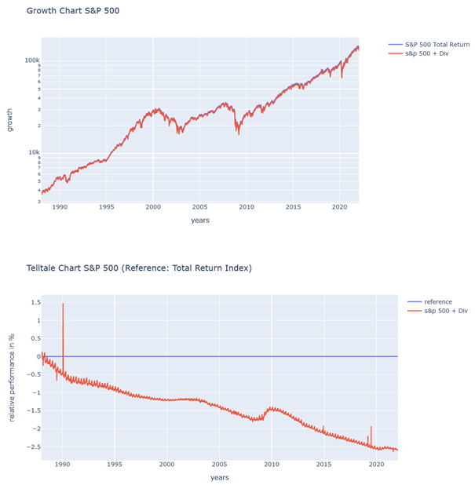
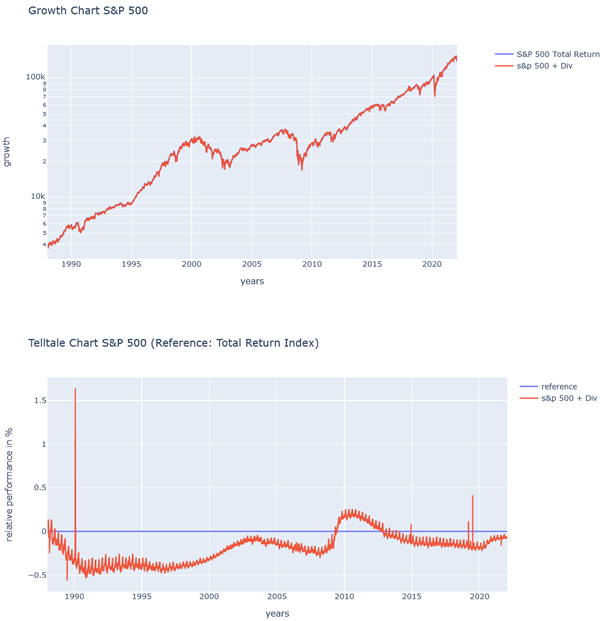
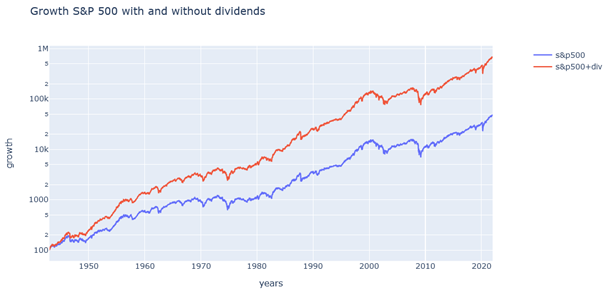
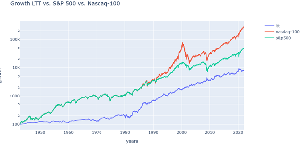
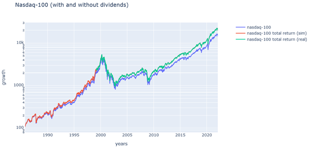
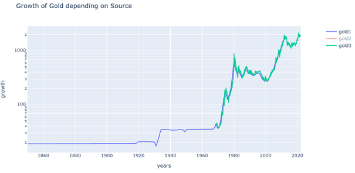
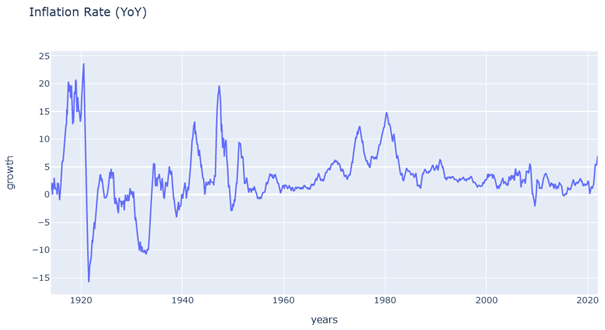
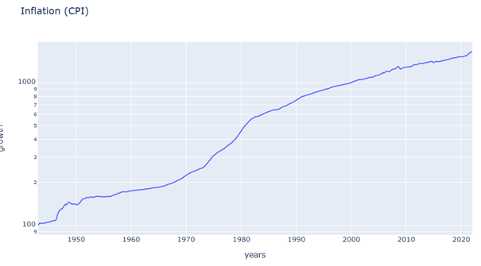
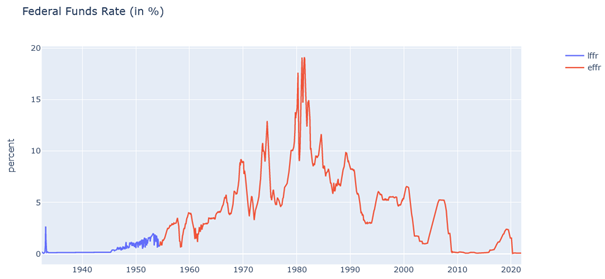
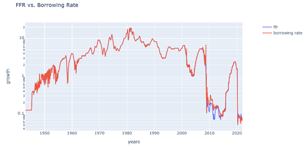

## ZL;NG:

* *S&P 500 Daten bekommt man bei Yahoo Finance ab 1928 aber Dividenden müssen bis 1988 manuell raufgerechnet werden*
* *Ab 1988 gibt es einen S&P 500 Total Return Index, der auch Dividenden enthält*
* *Nasdaq-100 Daten gibt es auch bei Yahoo (ohne Dividenden)*
* *Den Nasdaq-100 Total Return Index gibt es ab 1999, davor müssen Dividenden „dazugedichtet“ werden*
* *Gold gibt es ab 1968 bei der Nasdaq, davor gibt es nur jährliche Werte ohne große Volatilität*
* *Inflationsdaten und CPI gibt es bei der Nasdaq und FRED*
* *Zinsraten gibt es ab 1954 bei der FRED, davor habe ich andere Zinsangaben verwendet*
* *Die Übernacht-Leihgebühren (LIBOR) gibt es erst ab 2001 bei der FRED, davor habe ich die Zinsraten verwendet*

Liebe Schwestern und Brüder der Mauerstraße,

im letzten Teil haben wir die Treasury Bond Fund Daten von 1943 bis Anfang 2022 zusammengetragen. Aber wir brauchen natürlich noch viele andere Daten. Heute möchte ich euch zeigen woher ich die anderen Zeitreihen genommen habe und welche Annahmen ich bei der Zusammenstellung treffen musste. Dabei handelt es sich wieder um eine sehr technische Beschreibung, die vielleicht nicht jeden interessiert.

Allerdings schauen wir uns danach im Teil 3b die Daten mal genauer an und ich bin der Meinung, dass hier sehr interessante Erkenntnisse auf uns warten. Wer also nur wenig Zeit hat, liest sich einfach ausschließlich den zweiten Abschnitt durch, der aufgrund einer Begrenzung der Anzahl der Bilder pro Post im [nächsten Post](https://www.reddit.com/r/mauerstrassenwetten/comments/sdd5kv/zahlgrafs_exzellente_abenteuer_teil_3b/) enthalten ist.

## Woher stammen die restlichen Daten?

## S&P 500 mit Dividenden

Die täglichen S&P 500 Daten sind von 1928 an bei Yahoo Finance \[1\] unter dem Symbol „\^GSPC^(“) verfügbar. Auch hier habe ich, wie schon bei den Treasury Yield Daten, die fehlenden Tage (Wochenende, Feiertage, etc.) einfach durch den letzten bekannten Wert ersetzt. Das macht den Backtest später einfacher, weil alle Zeitreihen die gleichen Tage im Jahr besitzen.

Um später ETFs simulieren zu können, benötigen wir jedoch nicht nur die Kursdaten vom S&P 500, sondern auch die Dividenden. Diese sind nämlich in den ETFs miteinberechnet (unabhängig davon ob der ETF selbst ausschüttet oder thesaurierend ist). Hier gibt es den sogenannten S&P 500 Total Return Index, welche die Dividenden mitberücksichtigt, so als ob man sie direkt wieder investieren würde.

Dieser Index steht ab 1988 ebenfalls bei Yahoo Finance \[1\] unter dem Symbol „\^SP500TR^(“) zur Verfügung. Aber was machen wir mit den Jahren vor 1988? Hier konnte ich tatsächlich eine Tabelle online \[2\] finden, in welcher monatliche Dividendenzahlungen (in Prozent) seit 1903 angegeben waren. Mit Hilfe dieser Tabelle konnte ich dann auf jeden Tag eines Monats ein Tagesbruchteil der Dividende prozentual raufrechnen. Also jeweils 1/365-stel, wobei ich mich hierbei dem geometrischen Mittel \[3\] bedient habe um die prozentuale Dividende durch 365 zu teilen.

Im Anschluss hatte ich mit Hilfe dieser Tabelle und dem S&P 500 ohne Dividende den Total Return Index von 1928 an. Diesen konnte ich dann mit dem tatsächlichen Total Return Index ab 1988 vergleichen. Das Ergebnis sieht folgendermaßen aus:

Das sieht zwar nicht so schlecht aus, aber im Telltale Chart sehen wir, dass der rekonstruierte Total Return Index langsam abdriftet. Wie ich euch ja schon im letzten Teil geschrieben habe, bin ich eher jemand mit geringer Intelligenz, daher blieb mir nichts anderes übrig als mit der Anzahl der Tage, durch welche eine Dividende geteilt werden muss oder mit dem geometrischen Mittel herumzuspielen. In keinem Fall erhielt ich eine zufriedenstellende Übereinstimmung. Also habe ich am Ende, ganz unkreativ, einfach einen Korrekturfaktor von 0,075% pro Jahr noch dazugerechnet. Also so, als ob die Jahresdividende 0,075% höher gewesen wäre als in der Tabelle. Damit erhielt ich dann eine nahezu perfekte Übereinstimmung der Zeitreihen von 1988 an:

Vielleicht weiß ja jemand von euch eine Lösung ohne diesen Korrekturfaktor? Den berechneten Total Return Index und den tatsächlichen Total Return Index von 1988 konnte ich dann zusammenfügen, so dass wir ab 1988 den echten Index benutzen. Und damit kam ich dann auf den vollständigen Verlauf des S&P 500 Total Return Index von 1928 an:

Hier sieht man schon deutlich, was ein langfristiger Unterschied von 2-3% Jährlich ausmacht.

## Nasdaq-100 mit Dividende

Ähnlich kann man mit dem Nasdaq-100 vorgehen. Die Daten bekommt man ab 1985 von Yahoo Finance unter dem Ticker „NDX“. Der Nasdaq-100 wurde erst ab 1985 eingeführt, daher gibt es keine früheren Daten. Zur Vereinfachung des Backtests habe ich vor 1985 für den Nasdaq-100 den S&P 500 genommen. Das ist natürlich nicht korrekt, aber mein Gedanke war dabei, dass jemand der ab 1985 den Nasdaq-100 kauft, davor halt in den S&P 500 investiert hat. Andernfalls müsste man später kategorisch alle Backtests, die den Nasdaq-100 einschließen auf ein Startdatum von 1985 beschränken. Auch hier füllte ich fehlende Tage durch die Werte der vorhergehenden Tage auf, so dass wir eine durchgängige Zeitreihe bekommen.

&#x200B;

Allerdings haben wir beim Nasdaq-100 ebenfalls das Problem mit den fehlenden Dividenden. Hier gibt es auf Yahoo leider auch kein Total Return Index. Stattdessen half mir u/pr0fa345 den Nasdaq-100 Total Return Index bei Investing.com \[4\] ausfindig zu machen. Leider gibt es den dort erst ab 1999, so dass ich mir für 1985 bis 1999 was ausdenken musste.

Nirgendswo konnte ich die Dividendenwerte ähnlich wie beim S&P 500 auftreiben, also dachte ich mir, dass es eigentlich gar nicht auf die korrekte Dividende ankommt, sondern nur auf ungefähre Schätzwerte die halbwegs realistisch sind. Daher rechnete ich die prozentuale Dividende vom Nasdaq-100 von 1999 bis heute aus und setzte diese ins Verhältnis zur prozentualen Dividende vom S&P 500 von 1999 bis heute. Im S&P 500 wird deutlich mehr Dividende gezahlt, weswegen der Faktor kleiner als 1 ist.

Im Anschluss nahm ich einfach die prozentuale Dividende vom S&P 500 zwischen 1985 und 1999 und multiplizierte diese mit dem oben berechneten Faktor. Somit konnte ich die S&P 500 Dividenden in diesem Zeitraum auf den gleichen Zahlenbereich skalieren wie die Nasdaq-100 Dividende von 1999 bis heute. Diese skalierte Dividende wendete ich dann einfach auf den Zeitraum zwischen 1985 bis 1999 an, so wie ich es schon beim S&P 500 getan hatte.

Damit erhält man definitiv nicht die korrekten Zahlen des Nasdaq-100 Total Return Index in diesem Zeitraum, aber man erhält Zahlen die zumindest nicht völlig unrealistisch sind. Natürlich könnte es sein, dass sich die Dividendenzahlungen in diesem Zeitraum völlig anders verhalten haben als nach 1999, aber woher sollen wir das wissen, wenn es die Zahlen nirgendwo gibt? Wenn jemand von euch hier eine bessere Idee hat, können wir das gerne noch einmal ausprobieren.

Die vollständige Zeitreihe vom Nasdaq-100 Total Return Index sieht dann so aus:

## Gold

Den historischen Goldpreis bekommt man leider auch nicht so einfach. Die Nasdaq bietet den Goldpreis frühestens ab 1968 an \[5\].

Vor 1968 wird es allerdings richtig schwer. Hier fand ich nur ein Buch \[6\] aus welchem ich den jährlichen Goldpreis ab 1850 entnehmen konnte. Es scheint mir aber so zu sein, dass der Goldpreis sehr stabil war und sich bis 1970 praktisch kaum änderte. Ich habe kurz deswegen recherchiert und glaube verstanden zu haben, dass der Goldpreis lange Zeit von einer Bank in London festgeschrieben wurde, bevor man anfing Gold frei zu handeln. Vielleicht weiß jemand von euch die Historie dazu?

**Edit:** u/boq hat die Erklärung geliefert: [https://www.reddit.com/r/mauerstrassenwetten/comments/sdd3a1/comment/hubxyr6/?utm\_source=share&utm\_medium=web2x&context=3](https://www.reddit.com/r/mauerstrassenwetten/comments/sdd3a1/comment/hubxyr6/?utm_source=share&utm_medium=web2x&context=3)

Um zu schauen, ob der jährliche Goldpreis aus dem Buch \[6\] und der von der Nasdaq miteinander kompatibel sind, habe ich diese zusammen in einem Diagramm dargestellt:

Man sieht gut, dass diese denselben Preis abbilden. Die jährlichen Daten vor 1968 interpolierte ich auf tägliche Daten und ab 1968 füllte ich die täglichen Daten der Nasdaq so auf, dass bei fehlenden Tagen einfach der letzte gültige Preis verwendet wurde.

## Inflationsdaten

Die Inflationsrate ist ebenfalls bei der Nasdaq \[6\] verfügbar. Es handelt sich um monatliche Prozentwerte (YoY), welche ich auf tägliche Werte interpoliert habe:

Zusätzlich konnte ich die CPI Daten ab 1913 von der FRED \[7\] unter dem Ticker „CPIAUCNS“ laden und auf tägliche Werte interpolieren:

&#x200B;

## Zinsraten

Die Zinsraten der U.S. Zentralbank stehen auch bei der FRED \[7\] unter dem Ticker „FEDFUNDS“ zur Verfügung. Allerdings erst ab 1954 und in monatlichen Werten. Die monatlichen Werte lassen sich problemlos auf tägliche Werte interpolieren (die Zinsen ändern sich nicht so oft). Aber woher bekommt man die Zinsen von vor 1954? Hier ist mir die Zeitreihe „FFWSJLOW“ bei der FRED \[7\] aufgefallen, welche die den „Low Value of the Federal Funds Rate“ beinhaltet. Diese Daten sehen ziemlich unsauber aus, passen aber von der Größenordnung ganz gut mit der Zinsrate zusammen. Wenn ich diese für die Werte vor 1954 nehme erhalte ich die folgende Zeitreihe:

Wenn ihr hier eine bessere Idee habt, woher man die Zinsrate von vor 1954 hernehmen kann, gebt mir bitte Bescheid. Grundsätzlich verwenden wir die Zinsrate später nur noch für die Berechnung der LETF Kosten. Je kleiner diese ist, desto unproblematischer ist dann auch ein Schätzfehler. Die Werte vor 1954 sind eher klein, darauf deutet ja auch der Anfang der roten Linie hin. Daher spielen Fehler in diesem Bereich weniger eine Rolle. Würden wir stattdessen die Werte um 1980 verfälschen, dann würde sich das später sehr stark auf die LETFs auswirken.

## Overnight Borrowing Rate

Tatsächlich verwenden wir für die LETF Berechnung später die „Overnight Borrowing Rate“, welche bei der FRED \[7\] unter dem Symbol „USDONTD156N“ abgerufen werden kann. Diese Zeitreihe beginnt aber erst 2001. Bei den Bogleheads wird für die Zeit vorher die Zinsrate der Zentralbank als Ersatz genommen \[8\]. Wenn wir beide Zeitreihen zusammen in einer Grafik darstellen, sehen wir, dass es starke Überlappungen gibt:

Die LIBOR (Overnight Borrowing Rate) besitzt ein paar Spikes nach oben, vor allem bei einer Krise wie 2007 und die Jahre danach. Ansonsten folgt sie ziemlich gut der Zinsrate. Daher habe ich dann vor 2001 einfach die Zinsrate hergenommen. Wenn jemand eine bessere Quelle für die LIBOR Daten kennt, kann er oder sie mir gerne Bescheid geben.

## Original HFEA Daten

Ganz zum Schluss habe ich noch die originalen HFEA Backtest-Daten von Hedgefundie \[9\] auf tägliche Werte interpoliert. Diese Daten beginnen allerdings erst ab 1986, können aber später bei einem Backtest als Vergleichsdaten herangezogen werden.

Ab hier geht es weiter in [Teil 3b](https://www.reddit.com/r/mauerstrassenwetten/comments/sdd5kv/zahlgrafs_exzellente_abenteuer_teil_3b/).

## Quellen

\[1\] [https://de.finance.yahoo.com/](https://de.finance.yahoo.com/)

\[2\] [https://www.multpl.com/s-p-500-dividend-yield/table/by-month](https://www.multpl.com/s-p-500-dividend-yield/table/by-month)

\[3\] [https://de.wikipedia.org/wiki/Geometrisches\_Mittel](https://de.wikipedia.org/wiki/Geometrisches_Mittel)

\[4\] [https://www.investing.com/indices/nasdaq-100-tr-historical-data](https://www.investing.com/indices/nasdaq-100-tr-historical-data)

\[5\] [https://data.nasdaq.com/data/LBMA/GOLD-gold-price-london-fixing](https://data.nasdaq.com/data/LBMA/GOLD-gold-price-london-fixing)

\[6\] [https://data.nasdaq.com/data/RATEINF/INFLATION\_USA-inflation-yoy-usa](https://data.nasdaq.com/data/RATEINF/INFLATION_USA-inflation-yoy-usa)

\[7\] [https://fred.stlouisfed.org/](https://fred.stlouisfed.org/)

\[8\] [https://www.bogleheads.org/forum/viewtopic.php?t=272640](https://www.bogleheads.org/forum/viewtopic.php?t=272640)

\[9\] [https://www.bogleheads.org/forum/viewtopic.php?f=10&t=272007](https://www.bogleheads.org/forum/viewtopic.php?f=10&t=272007)
