# Was können wir aus diesen Daten lernen?

**ZL;NG:**

* *Wer 80 Jahre in den S&P 500 und Nasdaq-100 investiert ist danach steinreich*
* *Wer 30 Jahre lang in Gold investiert kann sich glücklich schätzen Brechgleich zu sein*
* *Short Term Treasury Bonds sind ein ziemlich sicheres Investment ohne große Gewinne*
* *Nasdaq-100 und S&P 500 können auch schon mal 82% oder 55% einbrechen*
* *Es gibt so etwas wie Saisonalität in den Märkten, allerdings nur sehr langfristig betrachtet*
* *Gold, Schatzkisten und Aktien haben zueinander (langfristig betrachtet) keine Korrelation*
* *Schatzkisten hatten jedoch längere Phasen hoher Korrelation mit Aktien in der Vergangenheit*
* *Inflation hat nur eine mittlere Korrelation zu Aktien, Gold und Schatzkisten*
* *Zinsen hingegen kaum (lediglich ein wenig mit Gold)*

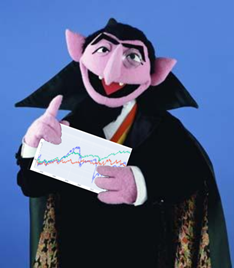

Liebe Schwestern und Brüder der Mauerstraße,

hier geht es mit Teil 3 weiter. Da ein Post auf Reddit nicht mehr als 20 Bilder enthalten darf, war ich gezwungen den Teil 3 in zwei Posts aufzuteilen.

## Was können wir aus diesen Daten lernen?

## Wachstumspotenzial

Da wir nun all diese tollen Daten von 1943 an besitzen, können wir diese mal analysieren und schauen, ob sie uns etwas spannendes verraten. Schauen wir uns als erstes das Wachstum unterschiedlicher Investments seit 1943 an:

&#x200B;

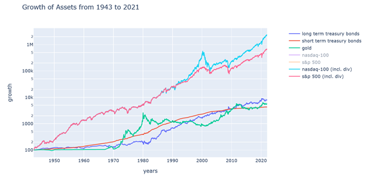

Wie man schnell erkennen kann, haben Gold und Short Term Treasury Bonds das geringste Wachstum über die Jahre hinweg. Interessant ist bei Gold, dass dieses eine Hochphase 1980 hatte, wo die Inflation ziemlich hoch war und danach aber über 20 Jahre lang nur seitwärts gelaufen ist. Seit 2010 befinden wir uns hier auch wieder in einem Seitwärtstrend.

Die Short Term Treasury Bonds haben praktisch keine großen Höhen und Tiefen, sondern wachsen einfach gemächlich vor sich hin. Was das bedeutet sehen wir auch später noch einmal in einer anderen Grafik.

Die Long Term Treasury Bonds hatten gegenüber den Short Term Treasury Bonds in den 1970er und 1980er Jahren einen ziemlich lange Seitwärtsphase, was sich gut mit der Theorie deckt. Denn immerhin leiden diese ziemlich stark unter steigenden Zinsen. Man muss auch beachten, dass diese vor 1985 „callable“ waren. Daher, die U.S. Regierung konnte solche Bonds einfach frühzeitig zurückzahlen und dafür neue - für sie günstigere - Anleihen herausgeben. Wie sich das auf den Preis davor auswirkt, lässt aber schlecht quantitativ ermitteln. Behalten wir das einfach mal im Hinterkopf.

Was richtig ins Auge sticht ist das geile Wachstum vom S&P 500 und dann später den Nasdaq-100. Diese liegen weit vor den anderen Anlageformen. Hätten eure Urgroßeltern 1943 einfach mal $100 in den S&P 500 gegeben und ab 1985 das Geld in den Nasdaq-100 umgeschichtet, dann würden euch jetzt über 2 Millionen Dollar zur Verfügung stehen. Aber vermutlich hatten die damals andere Sorgen als $100 Dollar zur Seite zu legen.

Allerdings macht euch mal ein paar Gedanken über eure Urenkel: Ihr könntet ja mal ein Jahr lang auf etwas verzichten, wo ihr 2€ die Woche für ausgebt. Stattdessen packt ihr die 2€ in eine Sparbüchse und nach einem Jahr zahlt ihr das Geld in einen Broker mit einem Nasdaq-100 ETF ein und schaut euch das Depot nie wieder an. Vererbt es an eure Kinder mit der Auflage, dass diese es gefälligst an ihre Kinder vererben müssen u.s.w. In 80 Jahren steht dann euer Urenkel an eurem Grab und legt euch bestimmt einen besonders schicken Blumenstrauß drauf.

Aber man kann das auch anders betrachten: Hätten eure Eltern 1980 einfach mal $5000 in den S&P 500 investiert (und ab 1985 in den Nasdaq-100), dann wären sowohl sie als auch ihr Millionäre. Aber wir sind ja hier nicht bei r/Finanzen 🤡

## Risikoanalyse

Jetzt wissen wir schon einmal was die besten Performer in unseren Daten so sind. Schauen wir uns also als nächstes das Risiko an. Ihr kennt es ja alle: Wenn man an der Börse investiert, bricht danach gleich der Kurs ein. Gefühl investiert jeder von uns zum schlecht möglichsten Zeitpunkt, oder? Also dachte ich mir, dass ich mal den MSW Effekt aus den Daten heraussuche: Was wäre, wenn man sein Geld einmalig zum absolut schlechtesten Zeitpunkt in eine dieser Anlageklassen investiert und anschließend eine feste Anzahl von Jahren wartet?

Die folgende Grafik gibt euch die Antwort: Die X-Achse ist die Anzahl der Jahre (von 1 bis 30) und die Y-Achse gibt die schlechteste Rendite der Anlage zurück, die aus den Daten ermittelt werden konnte:

&#x200B;

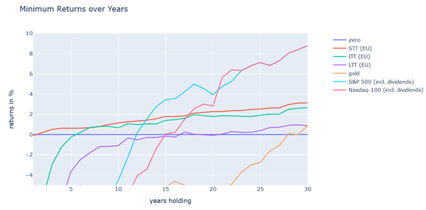

Sehr interessant sind hier die STTs. Wenn man diese kauft, kann man sich eigentlich sicher sein, dass selbst zum schlimmsten Kaufzeitpunkt die Rendite nach einem Jahr positiv ist. Dafür liegt die minimale Rendite nach 30 Jahren auch nur bei ca. 3% pro Jahr. Also hat man viel Geld, welches man für ein paar Jahre zwischenparken muss, sind STTs eigentlich keine schlechte Idee. Das haben wir auch schon oben gesehen, als wir bemerkten, dass STTs kaum Höhen und Tiefen aufwiesen, sondern einfach gemächlich gewachsen sind.

ITTs hingegen, die man zum schlimmsten Zeitpunkt angelegt hätte, wären erst nach 6 Jahren wieder Brechgleich. Nach 30 Jahren wäre deren Rendite dann immer noch kleiner als bei STTs. Richtig schlimm sieht es für LTTs und Gold aus. LTTs erreichen erst nach 17 Jahren Brechgleich und die jährliche Rendite liegt nach 30 Jahren nur bei 1% - wohlgemerkt: Nur dann, wenn man es schafft den schlimmsten Zeitpunkt für die LTTs abzupassen (also zum Beispiel kurz vor einer starken Zinserhöhung 🤡). Für Gold sieht es noch schlechter aus. Wir haben schon oben gesehen, dass Gold 1980 eine sehr hohe Spitze hatte und dann 20 Jahre lang nur gefallen ist. Genau diese Spitze wäre der schlimmste Zeitpunkt für das Investment in Geld gewesen und selbst nach 30 Jahren könnte man sich über 1% Rendite pro Jahr noch glücklich schätzen.

Diese Grafik zeigt wie unglaublich gefährlich es ist einen großen Geldbetrag einmalig in nur eine Anlageklasse zu werfen. Wenn man – so wie wir hier – ein goldenes Händchen für schlechtes Timing hat, ist man dann sehr lange ein Taschenhalter. Daher ist es wichtig solche großen Beträge Stück für Stück zu investieren und möglichst nicht nur in eine Anlageklasse zu geben.

Schauen wir uns nun einmal den maximalen Wertverlust jeder Anlageklasse an. Also auch hier ist die Annahme, dass ihr exakt zum lokalen Hoch investiert und dann genau beim Boden verkauft (die geheime Supermacht aller MSWler).

&#x200B;

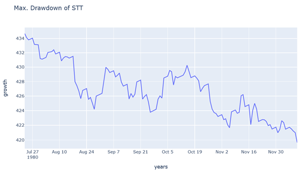

Bei den SSTs handelt es sich hier um einen Zeitraum von 4 Monaten im Jahr 1980. Ja wir erinnern uns: Hohe Inflation und starke Zinserhöhungen standen damals auf der Tagesordnung. Innerhalb dieser Zeit verloren die STTs sage und schreibe 3.5% an Wert. Das ist natürlich ein Verlust, von dem man sich nur schwer erholen kann. 😂

&#x200B;

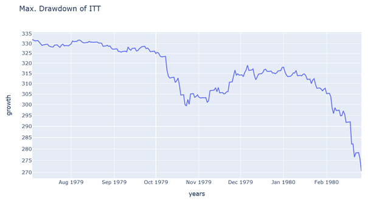

Schon ein wenig anders sieht es bei den ITTs aus. Hier gab es den schlimmsten Einbruch mit 18.5% von Mitte 1979 bis Anfang 1980, also auch im gleichen Zeitraum wie die STTs. Bei den LTTs haben wir  dann ebenfalls den gleichen Zeitraum:

&#x200B;

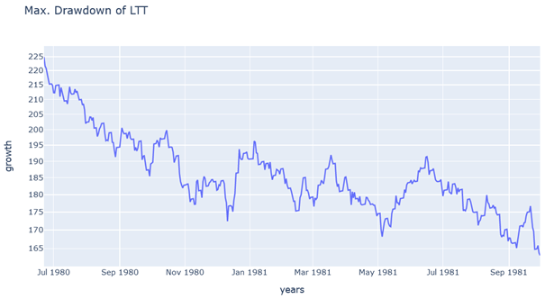

Allerdings reden wir hier schon von 27.5% Verlust und über einem Jahr Wartezeit bis der Boden erreicht wurde. Die Zeit um 1980 war für alle Bond Funds aufgrund steigender Zinsen eine Zeit der Verluste.

&#x200B;

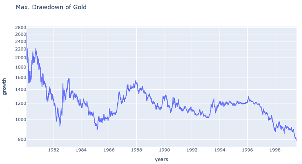

Aber das ist nichts gegenüber Gold, welches von 1980 bis 1999 über 70% einbüßen musste. Gold hatte davor aufgrund der hohen Inflation einen ziemlichen Bullenlauf hingelegt und blutete dann 20 Jahre lang, während die Inflation wieder herunter ging.

&#x200B;

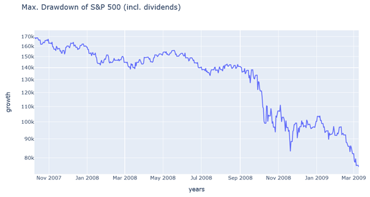

Dagegen war die Finanzkrise von 2007 bis 2009 für den S&P 500 mit einem Verlust von 55% kein so großes Thema. Am schlimmsten hat es jedoch den Nasdaq-100 während der .com Blase getroffen. Hier verlor dieser 83% an Wert und der Boden war erst nach über 2 Jahren erreicht:

&#x200B;

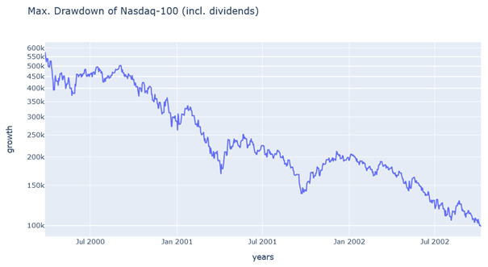

Fassen wir nun die wichtigsten Kennzahlen aller Anlageklassen kurz zusammen:

|Name|CAGR|Min. jährliche Rendite|Max. jährliche Rendite|Max. Einbruch|
|:-|:-|:-|:-|:-|
|STT|5%|0.4%|21%|\-3%|
|ITT|6%|\-5%|35%|\-19%|
|LTT|6%|\-18%|48%|\-27%|
|Gold|5%|\-32%|127%|\-70%|
|S&P 500 (+Div.)|12%|\-37%|52%|\-55%|
|Nasdaq-100 (+Div.)|13%|\-42%|102%|\-83%|

Im folgenden Diagramm wird das CAGR dem maximalen Einbruch gegenübergestellt. Damit lässt sich gut das Risiko/Gewinn Verhältnis abschätzen:

&#x200B;

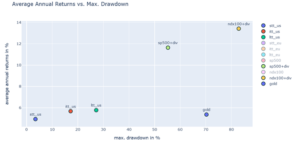

Wie schon oben gesehen, bieten die U.S. Schatzkisten Fonds nur wenig Gewinn, dafür sind es auch die Risikoärmsten Investments in unseren Daten. Der S&P 500 und Nasdaq-100 haben ein deutlich höheres Risiko, aber dafür eben auch deutlich höhere Gewinne. Eine traurige Ausnahme stellt Gold dar, welches sowohl ein höheres Risiko als der S&P 500 aufweist, aber dennoch nur ein Gewinn, der es kaum schafft die STTs zu überflügeln.

## Die Zeit hoher Inflation

Ein weiteres interessantes Bild sind die Jährlichen Gewinne von Schatzkisten, Gold und Aktien in den Jahren 1965 bis 1990:

&#x200B;

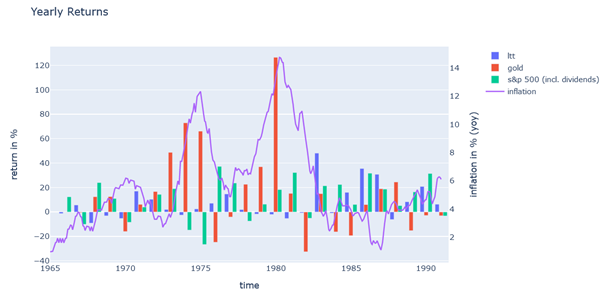

Wir sehen wie die Inflation in den 70er Jahren sehr stark anzieht. Mit ein wenig Vorlaufzeit bricht auch Gold nach oben aus. Sobald die Inflation wieder zurück geht, bricht Gold stark ein. Wenn man also Gold als Inflationsausgleich kaufen möchte, dann muss man es davor kaufen und auf keinen Fall dann, wenn die Inflation schon hoch ist. Hier gilt also auch „Kaufe die Gerüchte und verkaufe die Schlagzeilen“. Wir erkennen auch deutlich, dass die LTTs in diesen Jahren keine oder gar negative Renditen erzielt haben. Bei den Aktienpreisen fällt es dagegen schwerer ein klares Muster zu erkennen.

**Edit:** Verschiedene User haben [hier](https://www.reddit.com/r/mauerstrassenwetten/comments/sdd5kv/comment/hucx0bc/?utm_source=share&utm_medium=web2x&context=3) und [hier](https://www.reddit.com/r/mauerstrassenwetten/comments/sdd3a1/comment/hucbwgu/?utm_source=share&utm_medium=web2x&context=3) auf den Zusammenbruch des [Bretton-Woods System](https://de.wikipedia.org/wiki/Bretton-Woods-System) Anfang der 1970er Jahre hingewiesen. Zuvor gab es eine Bindung vieler westlicher Währungen an den Goldpreis, welche dann aufgehoben wurde. Das starke Anziehen des Goldpreises in dieser Zeit kann also auch darauf zurückzuführen sein und weniger auf die Inflation. Das Stellt meiner Meinung nach Gold als Hedge für Inflation wieder stark in Frage.

## Saisonalitäten

Man liest häufig, dass es deutliche Saisonalitäten am Aktienmarkt gäbe. Daher habe ich die monatlichen Gewinne mal gemittelt und grafisch dargestellt. Hierbei verzichtete ich jedoch auf Jahre in denen eine Krise gab (1973, 1974, 2000, 2001, 2002, 2008, 2020):

&#x200B;

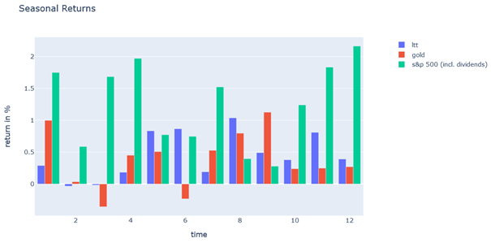

Das sieht tatsächlich so aus, als ob es Monate gäbe, in denen bestimmte Anlageklassen weniger gut performen als in anderen Monaten. Da ich den Braten nicht ganz so traue habe ich einfach mal einen Monat herausgenommen (den Februar) und dann einen gleitenden Durchschnitt über jeweils 10 Jahre berechnet. Das Ganze lässt sich dann als Diagramm darstellen:

&#x200B;

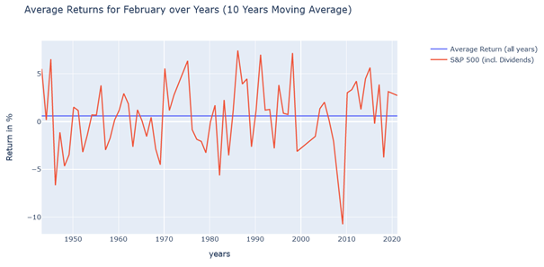

Wir sehen hier also ein ganz schön wildes Gezappel. Es gibt Jahre in denen ist der Mittelwert aller Februare Februar positive und wenn man das Fenster auch nur ein Jahr weiter bewegt wird der Mittelwert wieder negativ. Im Mittel ergeben sich halt die 0.587% für den Februar, aber es gibt keinen Trend, sondern die negativen und positiven Monatsrenditen scheinen ziemlich gleichmäßig verteilt zu sein. Schauen wir uns im Vergleich mal einen besonders starken Monat, nämlich den Dezember mit der sogenannten Jahresendrallye:

&#x200B;

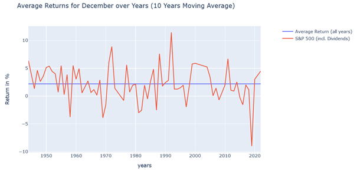

Auch hier geht es die Jahre über wild hin- und her. Aber es ist schon auffällig, dass negative Renditen für Dezember einfach seltener vorkommen. Auch hier ist kein Trend zu beobachten, sondern die Ergebnisse scheinen ziemlich gleichmäßig über die Jahre verteilt zu sein.

Also man könnte schon sagen, dass man – zumindest sehr langfristig betrachtet – manche Monate einfach auslassen könnte, um damit die Verlustwahrscheinlichkeit zu senken. Aber es ist schwer alleine nur darauf eine Strategie aufzubauen.

## Korrelationen

Zum Schluss wollen wir noch die Korrelationen verschiedener Investmentklassen zueinander ansehen. Wenig überraschend: die Korrelation zwischen der EU- und US-Variante der U.S. Staatsanleihen ist nahezu 1. Hier ist der Beweis:

* [STT](https://paste.pics/60badb4f577e2286eba6089242bf62b2)
* [ITT](https://paste.pics/8501e2e9bced5c967d25552eb2dc48fa)
* [LTT](https://paste.pics/21a3a2f4ee58eb25ce8511fc1c45e3e9)

Auch zueinander besitzen die Schatzkisten Fonds, kaum verwunderlich, eine sehr starke Korrelation:

&#x200B;

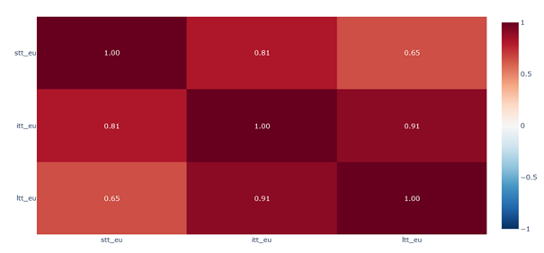

[Für Details klick hier](https://paste.pics/331d42bf1aadd0eff65dec5672046311).

Die Korrelation zwischen Schatzkisten, Gold und Aktien ist hingegen praktisch Null:

&#x200B;

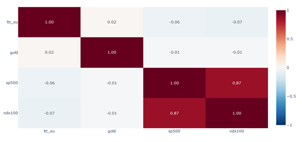

[Für Details klick hier](https://paste.pics/0ea8ad62c78b199b44e0df0075a48466).

Für die Berechnung der Korrelationen habe ich die tägliche Rendite hergenommen. Aber im Großen und Ganzen bleiben die Korrelationen gleich, wenn man [monatliche](https://paste.pics/100feb8f7903e4df810a7482b75f0174) und [jährliche](https://paste.pics/572ee9552b9ff953a4768fb7f0873afe) Rendite stattdessen benutzt. Lediglich bei jährlichen Werten nimmt die Korrelation etwas zu (absolut gesehen).

Sehr interessant ist die Korrelation zwischen Inflation und den verschiedenen Investmentklassen. Die Korrelation zu Aktien und Schatzkisten ist leicht negativ und gegenüber Gold leicht positiv. Das passt auch gut zu der Beobachtung zum Goldpreis in den 1970er und 1980er Jahren.

&#x200B;

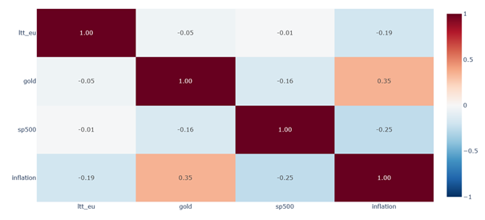

[Für Details klick hier](https://paste.pics/fab72d6b984e9153104cc71465cf5111).

Ähnlich, aber in stark abgeschwächter Form sieht es für die Korrelation zwischen Zinsraten und den Investmentklassen aus:

&#x200B;

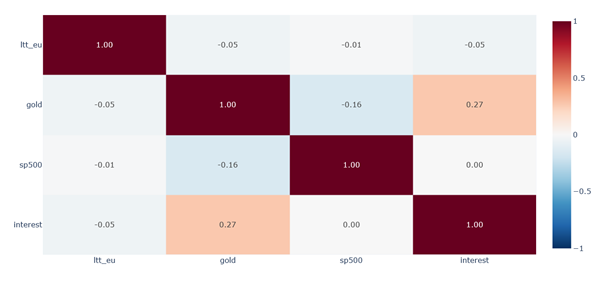

Ich hatte die Zeitreihen auch zeitlich gegeneinander verschoben, um zu sehen, ob es eine starke nachlaufende Korrelation gibt, aber diese konnte ich nicht finden.

Zum Schluss stellte sich für mich die Frage, ob die Korrelation über die Jahre hinweg gleich bleibt, oder ob es Zeiten gibt in denen die Korrelation sich stark ändert. Hierzu berechnete ich die Korrelation über ein Fenster von 5 Jahren, welches ich immer einen Monat weiter nach vorn geschoben habe. Den Verlauf der Korrelation kann man dann über die Jahre hinweg darstellen. Schauen wir uns zunächst einmal Gold vs. S&P 500 an:

&#x200B;

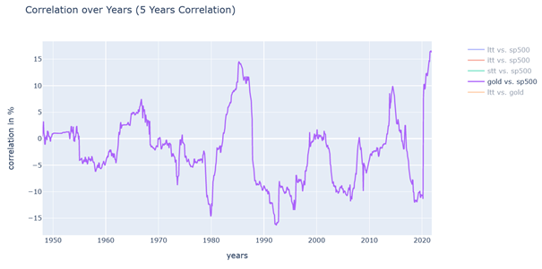

Wir sehen, dass die Korrelation durchaus stark hin- und herschwankt. Manchmal haben wir -15% und manchmal +15%. Für Schatzkisten und Stöcker sieht das sogar noch schlimmer aus:

&#x200B;

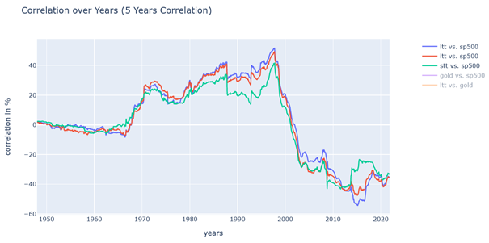

Hier hatten wir ab den 1070er Jahren eine starke positive Korrelation die in der Spitze sogar über 40% erreichte. Erst danach ist die Korrelation negativ geworden, so dass sich im Mittel keine nennenswerte Korrelation ergibt. Wenn wir davon ausgehen, dass uns aktuell eine Zeit höherer Zinsen und höherer Inflation bevorsteht, könnte dies bedeuten, dass die Korrelation zwischen Schatzkisten und Stöckern wieder stark positiv wird, so wie es dieser Artikel \[10\] beschreibt. In diesem Fall könnte es sein, dass es nicht mehr ausreicht nur Schatzkisten als Hedge für den S&P 500 zu benutzen. Eine Beimischung von Gold in das Portfolio könnte die Gesamtkorrelation zwischen Hedge- und Wachstumsanteil etwas abmildern. Dafür hat Gold eben das Problem der schlechten Jahresrendite und eines hohen Verlustrisikos bei falschem Timing. Wir werden das auf jeden Fall in unseren Backtests noch einmal genauer betrachten.

## Fazit

Wir haben nun alle Ausgangsdaten zusammen und konnten dank einer kleinen Analyse ein gewissen Gefühl für die unterschiedlichen Investmentklassen entwickeln. Wenn ihr noch weitere Ideen für Tests und Analysen habt, schreibt sie mir in die Kommentare. Vielleicht schiebe ich im nächsten Teil noch ein paar Wunsch-Analysen ein, wenn ich die Daten dafür parat habe.

Ansonsten findet ihr die Daten und den Code wieder im Git Repository \[11\]. Macht unbedingt eure eigenen Analysen damit und schreibt geile DDs dazu!

## Fragen

Das dachte ich auch. Aber so wie es aussieht gibt es durchaus länger andauernde Phasen mit einer starken positiven Korrelation zwischen Bonds und Aktien. Das könnte die HFEA Strategie suboptimal beeinflussen, wenn die Inflation hoch wird und die Zinsen daher ebenfalls stark steigen.

## Quellen

\[10\] [https://russellinvestments.com/us/blog/is-the-stock-bond-correlation-positive-or-negative](https://russellinvestments.com/us/blog/is-the-stock-bond-correlation-positive-or-negative)

\[11\] [https://code.launchpad.net/zgea](https://code.launchpad.net/zgea)
