# ETF-Preisberechnung / Was können wir aus diesen Daten lernen?

**ZL;NG**

* *Wir haben nun die simulierten (L)ETFs von 1943 an.*
* *Unbekannt Kosten mussten dabei allerdings durch einen „sorgsam“ gewählten Faktor abstrahiert werden.*
* *Weisheitsbaum ETNs sind verdammt teuer und lohnen sich eigentlich nicht für eine längere Haltedauer.*

&#x200B;

* *Gehebelte ETFs verlieren in Krisen extrem an Wert (teilweise über 99%)!*
* *Wenn man den S&P 500 hebeln möchte, dann am besten mit dem UPRO (3x gehebelt)*
* *In der EU ist man besser mit dem DBPG (2x gehebelt S&P 500) aufgehoben*
* *Beim Nasdaq-100 stechen die 2x gehebelten ETFs positiv hervor (mit sehr hohem Risik)*
* *Den QQQ3 sollte man wirklich nur kurzfristig halten*
* *Gold darf man nicht hebeln! Weder in der EU noch in den USA*
* *Gehebelte LTTs könnten je nach Zeitpunkt und Situation noch Sinn ergeben*
* *Gehebelte ITTs ergeben eigentlich keinen Sinn*

Liebe Schwestern und Brüder der Mauerstraße,

im Teil 3 hatten wir uns alle nötigen Basisdaten für unseren Backtest besorgt. Bevor wir nun wild verschiedene Portfolioallokationen testen können, müssen wir allerdings noch die leveraged ETFs (LETFs) modellieren. Dies werden wir im vorliegenden Teil tun. Mir ist klar, dass der erste Abschnitt wieder sehr technisch ist und nicht alle von euch interessieren wird. Aber ich halte die öffentliche Diskussion darüber dennoch für wichtig, um euch zu erklären, welche Annahmen ich bei der Modellierung getroffen habe.

Wer sich dafür nicht interessiert, kann einfach gleich zum zweiten Abschnitt wechseln, in welchem wir eine kleine Analyse der (L)ETFs durchführen. Diese Analyse versucht ein Gefühl dafür zu entwickeln, welche (L)ETFs sich für ein langfristiges Halten eignen und wie hoch das Risiko im Vergleich zur Gewinnchance ist.

## Woher bekommen wir (L)ETF Daten ab 1943?

## Das Modell

Auf den ersten Blick erscheint ein LETF Modell sehr einfach umzusetzen zu sein: Man berechnet die täglichen Gewinne eines Basiswerts, dann multipliziert man diese mit dem Hebel und zieht noch eventuelle Kosten für den ETF sowie Zinsen für den Kredit ab, über welchen der Hebel realisiert wird.

Dennoch waren es vor allem die LETFs die mir während dieser Serie unerwartet am meisten Kopfschmerzen bereitet haben. Denn zum einen, muss man unbedingt Dividenden in den Basiswert miteinbeziehen, weswegen ich damals noch einmal eine Sonderrunde drehen musste, um die Daten im Teil 3 mit Dividenden zu versehen. Außerdem sind nicht alle Kosten für (L)ETFs transparent. Durch das tägliche Kaufen und Verkaufen des Basiswerts verursacht zum Beispiel der Spread zusätzliche Kosten. Und die Realisierung über Swaps ist ebenfalls nicht Kostenneutral.

Allerdings bin ich auch in diesem Fall bei den Bogleheads fündig geworden, welche verschiedene mehr oder weniger komplizierte Modelle für LETFs vorschlagen \[1\]. Ich habe mich für meine Versuche für das Modell entschieden, welches der Benutzer Siamond, nach längerer Diskussion präferiert:

&#x200B;

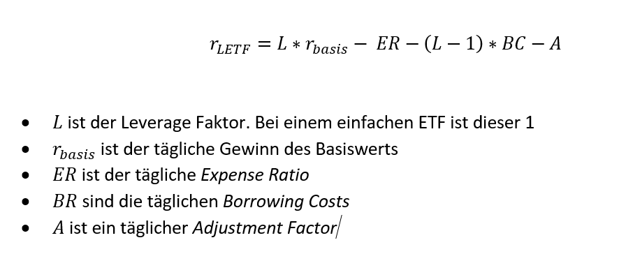

Den *Expense Ratio* können wir über die Anbieterseite eines ETFs leicht herausfinden. Beispielsweise beträgt der ER für SPY aktuell 0.09% im Jahr. Diesen Wert rechne ich mit Hilfe des geometrischen Mittels \[2\] auf tägliche Werte um. Hierbei nehme ich 365 Tage an. Siamond benutzt in seinem Modell nur 360 Tage \[1\], was offenbar in der Bankenwelt sehr weit verbreitet ist \[3\]. Ich habe mit beiden Zahlen herumgespielt und keinen nennenswerten Vorteil darin gesehen nur 360 Tage zu verwenden. Man muss auch beachten, dass die *Expense Ratio* für ETFs nicht fix ist, sondern sich über die Zeit hinweg verändern kann. Wir haben allerdings davon keine historischen Daten, vor allem auch nicht von der Zeit vor der Auflage eines ETFs, also nehmen ich hier einfach an, dass die aktuellen Kosten schon immer so existierten.

Die *Borrowing Costs* werden über die LIBOR berechnet, welche wir im letzten Teil aufgearbeitet und vor 2001 durch die *Effective Federal Funds Rate* ersetzt haben. Dies ist auch das Vorgehen, welches Siamond, nachdem er mehrere andere Kostenschätzungen getestet hat, vorschlägt \[1\]. Auch die *Borrowing Costs* werden natürlich in tägliche Werte umgerechnet.

Zuletzt schlägt Siamond einen *Adjustment Factor* vor über welchen zusätzlichen Kosten, wie SWAP Transaktionen, Spreads oder sonstige Dinge modelliert werden können. Der Faktor wird durch einen Vergleich des Simulierten ETFs mit dem tatsächlichen ETF ermittelt. Es handelt sich also um ein bloßes „Curve Fitting“, was etwas unbefriedigend ist. Es gibt zahlreiche Versuche bei den Bogleheads diese Kosten weiter aufzuteilen in Kosten, die sich ebenfalls modellieren lassen, aber aufgrund fehlender Zeitreihen hierzu, verwende ich das Modell, welches auch Siamond in seiner Backtest Excel-Datei \[4\] angewendet hat. Auch den *Adjustment Factor* werde ich hier in der Folge immer jährlich angeben, intern wird dieser dann in tägliche Werte umgerechnet.

Bei der Ermittlung des *Adjustment Factors* habe ich mich vor allem an den Telltale Charts orientiert. Der Faktor ist also so eingestellt, dass der tatsächliche ETF und der simuliert ETF eine gute Übereinstimmung zeigte. Völlig entgegen guter Data-Science Regeln, habe ich keine Daten zur Modell-Evaluation zurückgehalten und den Faktor damit getestet. Ich bin mir darüber im Klaren,  dass damit die von mir vorgeschlagenen Modelle daher zu einer Überanpassung neigen können. Allerdings wollte ich die ohnehin schon wenigen Daten nicht noch weiter reduzieren, indem ich auch noch 1 bis 2 Jahre zum Testen zurückhalte. Wir können in einem Jahr noch einmal prüfen, wie gut sich die hier gezeigten Modelle in der Realität geschlagen haben.

## Simulierte ETFs

Im Folgenden gebe ich euch einfach eine Liste aller ETFs, die ich simuliert habe. In der Liste findet ihr das Ticker-Symbol des ETFs, ob es sich um einen US oder EU ETF handelt, welcher *Leverage Factor*, welche *Expense Ratio* und auch welchen *Adjustment Factor* ich verwendet habe. Dazu gebe ich euch ein Link auf ein Bild, damit ihr euch anschauen könnt wie gut die Simulation sich mit der Realität deckt. Bei manchen ETFs habe ich auch noch ein paar Notizen dazugeschrieben.

&#x200B;

* [SPY (1x S&P 500), US, L = 1, ER = 0.09%, A = 0.04%](https://paste.pics/4906597a791582cfe132df099b8e52fb)
* [ULPIX (2x S&P 500), US, L = 2, ER = 1.51%, A = 1.1%](https://paste.pics/32a1ed2ffd1d36fd765ece883b274cd2)
* [UPRO (3x S&P 500), US, L = 3, ER = 0.91%, A = 1.0%](https://paste.pics/2ac87cf81f510177479c76226cf44b86)

&#x200B;

* [SXR8 (1x S&P 500), EU\*, L = 1, ER = 0.07%, A = 0.3%](https://paste.pics/935cc6b9771d13264f6ac79377915eb1)
* [DBPG (2x S&P 500), EU\*, L = 2, ER = 0.6%, A = 1.2%](https://paste.pics/d350e8bdf15623735cc850c64c3c381e)
* [3USL (3x S&P 500), EU\*, L = 3, ER = 0.75%, A = 2.75%](https://paste.pics/15a4b6ca5c6f7b5d1a0103e5f1b61661)
   * Der *Adjustment Factor* ist hier sehr hoch. Wir werden später sehen, dass dies bei allen Produkten vom Weisheitsbaum der Fall ist. Ich habe daher vor 3 Wochen den Kundensupport vom Weisheitsbaum angeschrieben, ob sie wüssten warum die Kosten – im Vergleich zu anderen leveraged ETPs – so hoch sind. Aber leider kam keine Antwort bisher.

&#x200B;

* [QQQ (1x Nasdaq-100), US, L = 1, ER = 0.2%, A = 0.01%](https://paste.pics/45b82d8677aa093b438cc5287376a297)
* [QLD (2x Nasdaq-100), US, L = 2, ER = 0.95%, A = 0.55%](https://paste.pics/084d311e2fb9228cddac5e47aec54a2e)
* [TQQQ (3x Nasdaq-100), US, L = 3, ER = 0.95%, A = 1.1%](https://paste.pics/69baf776f0afa57d471ca8a15a49a1c0)

&#x200B;

* [EQQQ (1x Nasdaq-100), EU\*, L = 1, ER = 0.33%, A = 0.8%](https://paste.pics/4bbcdc511d9000a1849eb74fbad3d669)
* [L8I7 (2x Nasdaq-100), EU\*, L = 2, ER = 0.6%, A = 0.2%](https://paste.pics/8669b10713a28422f0b59c3b1b692784)
* [QQQ3 (3x Nasdaq-100), EU\*, L = 3, ER = 0.75%, A = 2.1%](https://paste.pics/eabe30baa2141ad8a0263bbaefecc547)
   * Und wieder fällt der Weisheitsbaum ETP mit einem sehr hohen *Adjustment Factor* auf.

&#x200B;

* [GLD (1x Gold), US, L = 1, ER = 0.4%, A = 0%](https://paste.pics/ddc2bf6a2a7de635e81ad5bc2f3bbb59)
* [UGL (2x Gold), US, L = 2, ER = 0.95%, A = 2%](https://paste.pics/0a0081d41394998e7d30d89abe656a1b)
   * Trotz der Einführung eines hohen *Adjustment Factors* ist der Fehler leider immer noch ziemlich hoch. Allerdings ist es durchaus bekannt, dass gehebelte Gold und Silber ETPs hohe Tracking Fehler besitzen \[5\].

&#x200B;

* [SGLD (1x Gold), EU, L = 1, ER = 0.12%, A = 0.28%](https://paste.pics/1b7c6427a2bfd5c15afacebf2d5bac2c)
* [3GOL (3x Gold), EU\*, L = 3, ER = 0.99%, A = 4%](https://paste.pics/1b2bf548089b8365efaac099ea82eba5)
   * So hohe Kosten, die sich nicht korrekt auf ER und Leihkosten mappen lassen, sind selbst für Weisheitsbaum ungewöhnlich. Zudem besitzt das Telltale Diagram mehrere Stellen, wo sich das Verhalten vom ETP zum simulierten ETP eigenartig ändert. Keine Ahnung wie das zu Stande kommt, vielleicht ändert sich bei denen ständig der ER oder die Methode mit der sie den Goldpreis gehebelt nachstellen?

&#x200B;

* [SHY (1x STT), US, L = 1, ER = 0.15%, A = 0.15%](https://paste.pics/210365f80c98596e7384420eb7834da9)
   * Das Telltale Diagramm sieht schlimmer aus als es ist. Das liegt an der kleinen Skalierung der Y-Achse. In Wirklichkeit ist der Fehler viel kleiner als bei anderen ETFs.

&#x200B;

* [IBTA (1x STT), EU, L = 1, ER = 0.07%, A = 0%](https://paste.pics/3ebbfaf6cec7d4ce1487ffb8dc9eab7b)
   * Auch hier ist der Fehler in Wirklichkeit sehr klein.

&#x200B;

* [VFITX (1x ITT), US, L = 1, ER = 0.2%, A = 0.5%](https://paste.pics/3f26dcb394c0fa776d88408e47932483)
* [UST (2x ITT), US, L = 2, ER = 0.95%, A = 0.1%](https://paste.pics/7663ad611195806f3fd8fcae61de00bb)
* [TYD (3x ITT), US, L = 3, ER = 1.05%, A = 0%](https://paste.pics/54c6310bde5b58c679d9e6831c50838c)

&#x200B;

* [SXRM (1x ITT), EU, L = 1, ER = 0.07%, A = 0.15%](https://paste.pics/37f0e063e21abbbaf06aed7a23ef1f1a)
* [3TYL (3x ITT), EU\*, L = 3, ER = 0.3%, A = 2.5%](https://paste.pics/ff410887d9e488f512bbd4b126bc3dfa)

&#x200B;

* [VUSTX (1x LTT), US, L = 1, ER = 0.2%, A=0%](https://paste.pics/837281df372ca09bec765a6337c4a7a5)
* [UBT (2x LTT), US, L = 2, ER = 0.95%, A = 0%](https://paste.pics/e073ed7134cf048c7bed6a9175f42675)
* [TMF (3x LTT), US, L = 3, ER = 1.06%, A = 1%](https://paste.pics/63fd29df3096490f46ce93659c398727)

&#x200B;

* [DTLA (1x LTT), EU, L = 1, ER = 0.07%, A = 0%](https://paste.pics/798e68c89db3c08873e1bbf1f1627c21)

*\*) Bei diesen ETPs waren die Preise in Euro. Ich habe sie zum Vergleich in USD umgerechnet, was jedoch ein gewisses Rauschen in die Daten einfügt.*

Damit haben wir nun alle unsere ETFs und ETNs beisammen und können bald den Backtest angehen.

## Was können wir aus der Preisentwicklung der ETFs lernen?

Um das Verhalten von LETFs besser einschätzen zu können, schauen wir uns diese mal in zwei Zeitbereichen an: von 1943 bis 1986 und von 1986 bis heute. Diese Unterteilung habe ich gewählt, weil die original HFEA Strategie ursprünglich mit Daten von 1986 an getestet wurde.

## S&P 500

&#x200B;

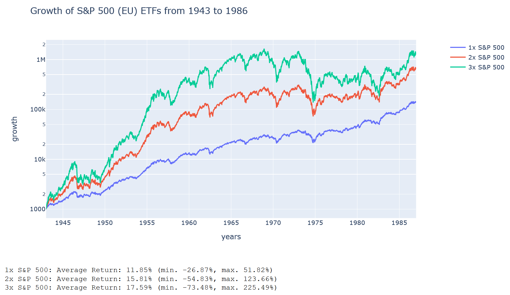

Beim S&P 500 erkennen wir ab 1943, abgesehen von einem Einbruch im Jahr 1946, ein stetiges Wachstum bis etwa 1965. Ab da verlangsamt sich der Trend und mehre Crashes sorgen dafür, dass der 3-fach gehebelte ETF effektiv Geld verliert, wohingegen der ungehebelte ETF tendenziell weiterwächst. Dennoch ist der 3-fach gehebelte ETF von 1950 an so stark gewachsen, dass er gegenüber den anderen ETFs einen uneinholbaren Vorteil hat. Zumindest, wenn man sein Geld 1950 angelegt hätte. Ein Investment in den UPRO im Jahre 1965 wäre hingegen mit einer langen Seitwärts- und Abwärtsphase bestraft worden.

&#x200B;

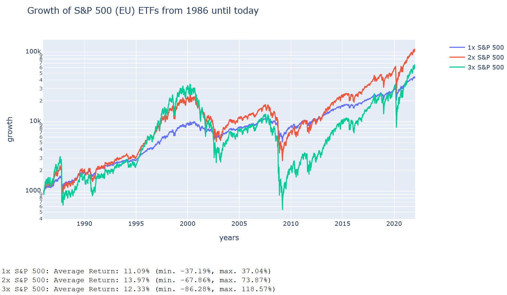

Das können wir auch bei einem Investment im Jahr 1986 gut erkennen. Ab dieser Zeit haben wir deutlich stärkere Einbrüche an den Aktienmärkten und es fehlt uns das massive Wachstum von 1950-1965. Zwar schafft es der 3-fach gehebelte ETF auch hier immer wieder sich aus einem Tal herauszuarbeiten, aber dafür verliert er bei jedem Börsencrash auch deutlich mehr Geld. Interessant ist allerdings das Missverhältnis zwischen minimales und maximalen jährlichen Wachstum. Während die gehebelten ETFs auf Jahressicht gegenüber dem ungehebelten ETF, um ein Vielfaches einbrechen, welches in etwa dem Hebel entspricht, ist das maximale jährliche Wachstum viel größer, als es der Hebel erwarten lassen würde. Der UPRO zum Beispiel ist im schlimmsten Jahr um 86% eingebrochen, was fast 3x dem Einbruch vom SPY entspricht. Dafür ist er aber im besten Jahr um 122% gewachsen, was mehr als dem 3-fachen maximalen Wachstum vom SPY entspricht.

Also sehr langfristig betrachtet ist der UPRO offenbar ein gutes Investment, aber wenn man das Geld im falschen Moment benötigt, dann ist gegebenenfalls nichts mehr davon übrig. Das sieht man auch im folgenden Diagramm, welches die minimale Rendite bei einer festen Anzahl von Jahren anzeigt. Also welche Rendite ihr innerhalb der Zeit 1943 bis heute mindestens erreicht hättet, wenn ihr exakt X Jahre lang einen solchen ETF gehalten hättet:

&#x200B;

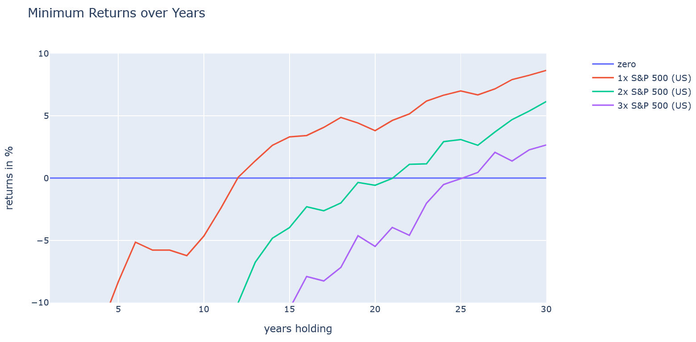

Die Rendite vom ungehebelten ETF ist bis zu einer Haltedauer von 12 Jahren negativ, erst dann wird sie positive. Der 3-fach gehebelte ETF wäre im schlimmsten Fall erst nach 25 Jahren wieder brechgleich gewesen. Selbst nach 30 Jahren Haltezeit, hätte der 3-fach gehebelte ETF noch lange nicht die Rendite des ungehebelten ETFs erreicht. Man müsste ihn also im schlimmsten Fall deutlich länger als 30 Jahre halten, damit sich das Investment auch tatsächlich ausgezahlt hätte.

Der schlimmste Einbruch bei allen ETFs fand während der Dot-Com Bubble (und im Anschluss die Finanzkrise) statt. Der 3-fach gehebelte ETF hätte in dieser Zeit über 98% an Wert verloren:

&#x200B;

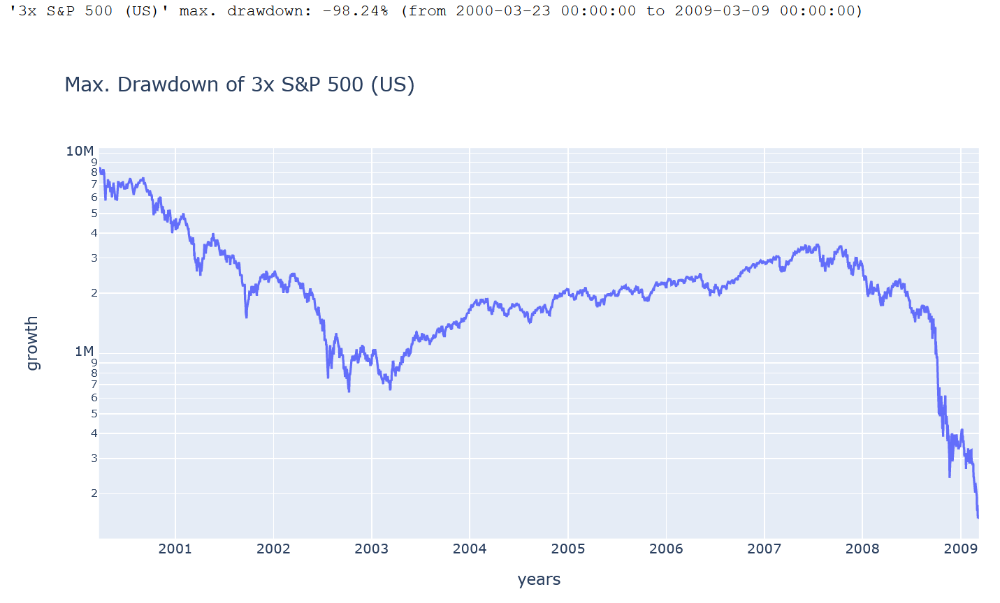

Im Gewinn-Risiko-Diagramm, welches den mittleren jährlichen Gewinn dem maximalen Einbruch gegenüber stellt, ist der 3-fach gehebelte ETF dementsprechend der Kandidat mit dem besten Gewinn, aber auch der mit dem höchsten Risiko:

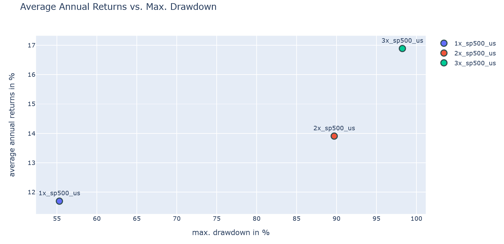

Interessant ist hier, dass schon der 2-fach gehebelte ETF ein Risiko von fast 90% erreicht, aber nur ein leicht besseres mittleres Wachstum als der ungehebelte ETF. Man könnte also sagen: Wenn man schon in einen LETF hineingeht (mit einer guten Absicherung versteht sich), wäre der 3-fach gehebelte am Ende diese bessere Wahl.

Die europäischen ETFs verhalten sich etwas anders:

&#x200B;

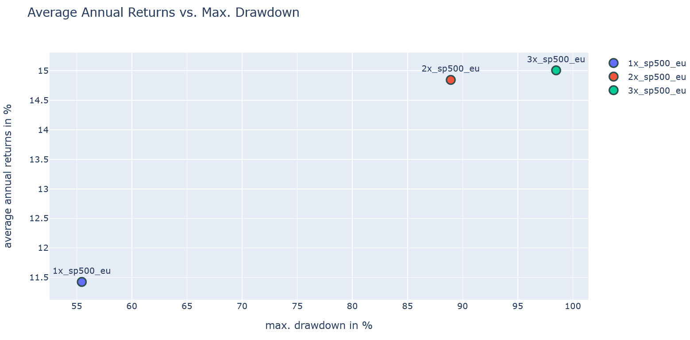

Der 2-fach gehebelte ETF hat eine leicht höhere mittlere Rendite als in den USA, und dass beim gleichen Risiko. Der 3-fach gehebelte ETN allerdings ist deutlich schlechter als die US-Version. Das liegt vor allem an den extrem hohen Kosten, die durch den *Adjustment Factor* bei der Simulation des ETNs abstrahiert wurden. Der Ursprung dieser Kosten ist mir leider unbekannt und auch der Weisheitsbaum Support hat nicht auf meine Anfrage dazu geantwortet. Bei den EU ETFs/ETNs würde ich daher den 2-fach gehebelten ETF bevorzugen.

## Nasdaq-100

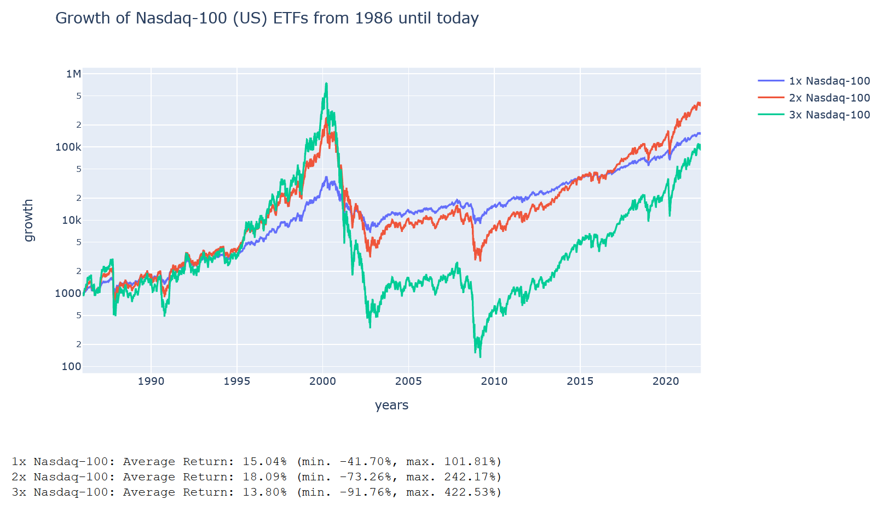

Der Nasdaq hat deutlich unter der Dot-Com Bubble gelitten und bis heute hätte es der TQQQ (3-fach gehebelt) nicht geschafft den ungehebelten QQQ wieder einzuholen. Damit ist die mittlere jährliche Rendite, von 1986 an bis heute gesehen, sehr mager. Allerdings ist die maximale jährliche Rendite beim TQQQ mehr als 4-mal so groß als beim QQQ. In einem Jahr sein Geld zu vervierfachen ist halt schon ordentlich.

&#x200B;

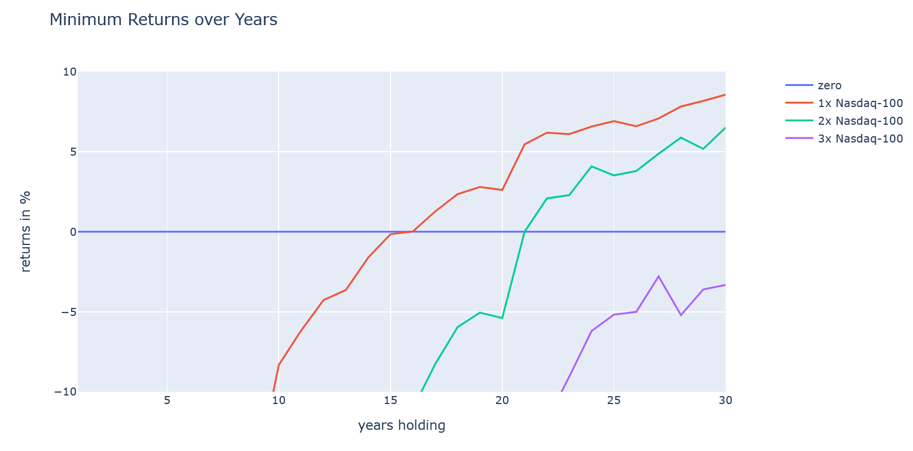

Insgesamt ist der Nasdaq-100 stärker risikobehaftet als der S&P 500, was man auch in dieser Grafik gut sieht. Hier dauert es gut 16 Jahre, bis man mit dem Nasdaq-100 brechgleich wäre, wenn man zum dämlichsten Zeitpunkt seit 1986 investiert hätte. Beim TQQQ wäre man dann selbst nach 30 Jahren noch nicht brechgleich. Der maximale Einbruch beim TQQQ fand – wenig überraschend - von 2000 bis 2009 statt und betrug stolze 99.98% (!).

&#x200B;

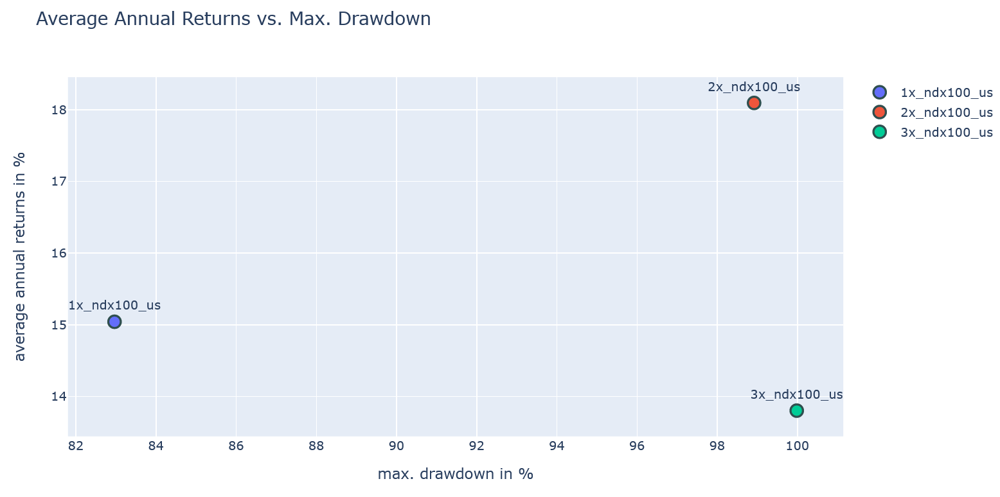

Wie man im Risiko-Gewinn Diagramm sieht, sind beide gehebelten Varianten extrem risikoreich mit maximalen Einbrüchen von deutlich über 98% und interessanterweise ist der 3-fach gehebelte ETF deutlich schlechter als der ungehebelte ETF. Selbst wenn man den S&P 500 vor 1986 als Grundlage für den Nasdaq-100 nimmt ändert das nichts daran, dass der 3-fach gehebelte ETF bei der mittleren jährlichen Rendite schlechter ist als der 2-fach gehebelte ETF ([siehe Bild](https://paste.pics/7a77e13304f2de203d51751492266d26)).

Bei den europäischen Nasdaq-100 ETFs zeigt sich ein sehr ähnliches Bild ([siehe hier](https://paste.pics/945907b98a76578a0a36893b653ed5cf)). Auch hier ist der 2-fach gehebelte ETF deutlich besser als der 3-fach gehebelte. Die EU-Variante ist sogar etwas besser als die US-Variante. Der Grund dafür sind die etwas geringeren Kosten. Und natürlich ist auch hier die EU-Variante des dreifach gehebelten Nasdaq-100 noch einmal schlechter als die US-Variante, eben weil der Weisheitsbaum sehr hohe Kosten besitzt.

## Gold

Bei Gold wissen wir inzwischen, dass es bis 1970 keine großen Änderungen beim Goldpreis gab, da der US-Dollar in der Zeit davor an Gold gebunden war. Erst nach dem Zusammenbruch des Bretton-Woods-Systems hat sich das geändert. Daher untersuchen wir die Gold ETFs auch erst ab 1970, weil ein Hebel davor einfach keinen Sinn ergeben hätte:

&#x200B;

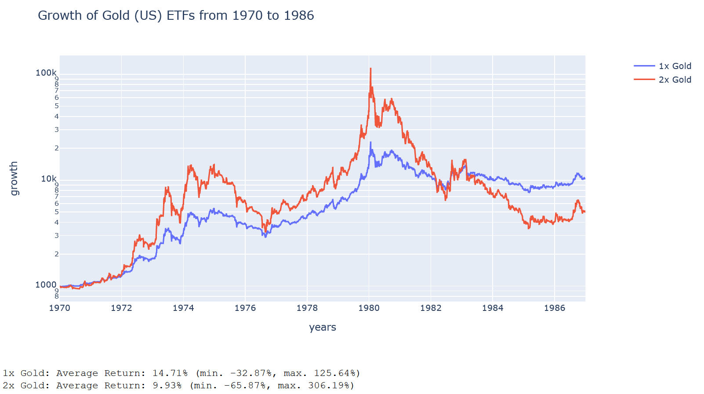

Hier sehen wir deutlich, dass schon ein 2-fach Hebel wesentlich schlechter performt als ein ungehebelter Gold ETF. Das Problem beim gehebelten Gold ETF ist eben, dass Gold an sich ein so schwaches Wachstum aufweist, dass die hohen Kosten durch den Hebel nicht kompensiert werden können. Lediglich in den wenigen Jahren von 1970 bis 1980, wo Gold eine regelrechte Rallye hingelegt hat, war der 2-fach gehebelte ETF besser. Aber ob dieser Erfolg von Gold an der damals massiv steigenden Inflation oder an einem Nachholeffekt nach der Entkoppelung des Dollars von Gold lag, kann ich hier nicht einschätzen. Vielleicht gibt es ja einen Volkswirt unter euch, der dazu eine fundierte Meinung abgeben kann?

Bei der EU-Variante vom 3-fach gehebelten Gold ETF sieht die Situation natürlich noch viel schlimmer aus:

&#x200B;

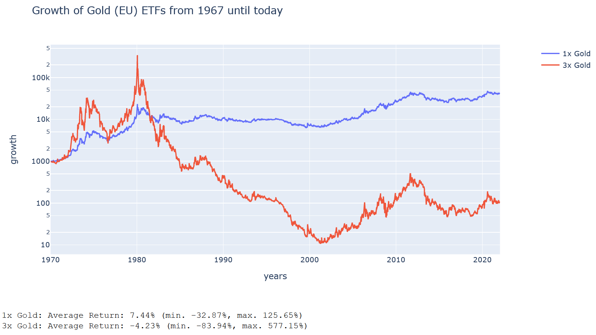

***Also: Gehebelte Gold-ETPs sind absolut nicht für ein langfristiges Investment geeignet!***

## Long Term Treasury Bond ETFs

Auf den ersten Blick sehen wir auch bei den LTT ETFs in den USA ein ähnlich schlimmes Bild wie bei den Gold ETFs:

&#x200B;

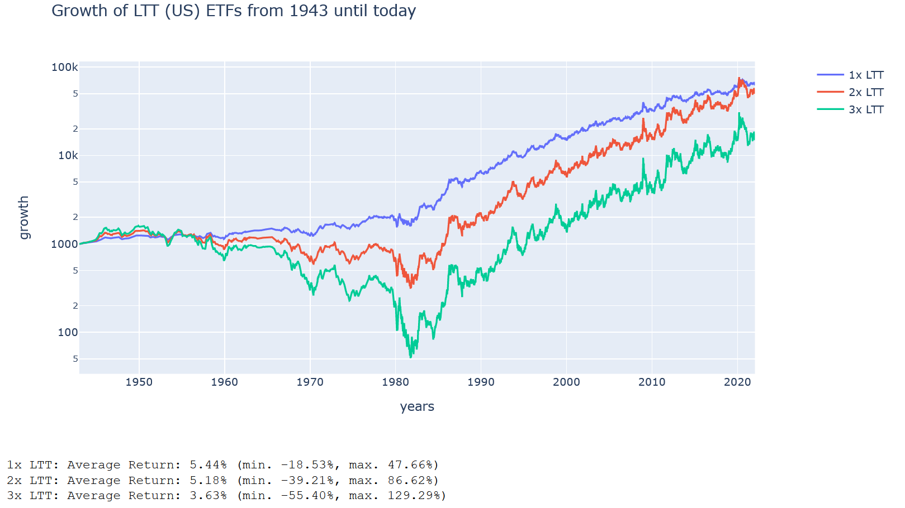

Die gehebelten ETFs schaffen es nicht die Verluste aus den 1970er und 1980er Jahren aufzuholen, denn das LTT Wachstum ist einfach zu klein, um gehebelt noch einen großen Unterschied zu machen. Warum hat Hedgefundie dann gerade den TMF, also den 3-fach gehebelten ETF ausgewählt?

Ganz einfach, weil er seinen Backtest ab 1986 gemacht hat und ab da sah die Situation schon ganz anders aus:

&#x200B;

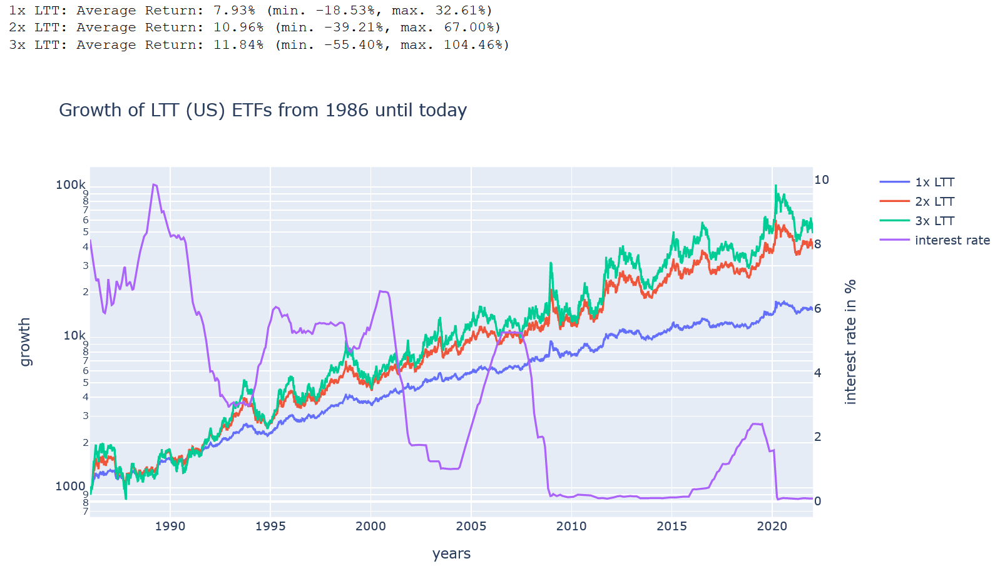

Wir sehen hier ganz deutlich, wie die gehebelten ETFs den ungehebelten ETF davonrennen. Der Gewinn des TMF gegenüber dem 2-fach gehebelten UBT ist allerdings nicht so groß. Dafür ist das Risiko eines hohen Einbruchs wiederum beim TMF deutlich größer als beim UBT. In der Grafik habe ich auch mal die Zinsraten dargestellt. Wir sehen, dass diese tendenziell die ganze Zeit runter gegangen ist (trotz einiger zeitweiser Erhöhungen), wahrscheinlich war das auch einer der Gründe, warum die LTTs so gut gestiegen sind.

Da Hedgefundie zunächst seinen Backtest von 1986 an gemacht hat, kam er zu dem Ergebnis, dass eine 40% UPRO und 60% TMF Aufteilung optimal ist. Später hat er einen Backtest von 1952 an wiederholt und verringerte den TMF Anteil deutlich auf nur 45%. Der Grund dafür liegt auf der Hand: Ein zu hoher TMF Anteil tut vor allem in den Jahren vor 1986 weh.

Von 1943 an gerechnet, kommt der 3-fach gehebelte TMF wirklich nicht gut weg:

&#x200B;

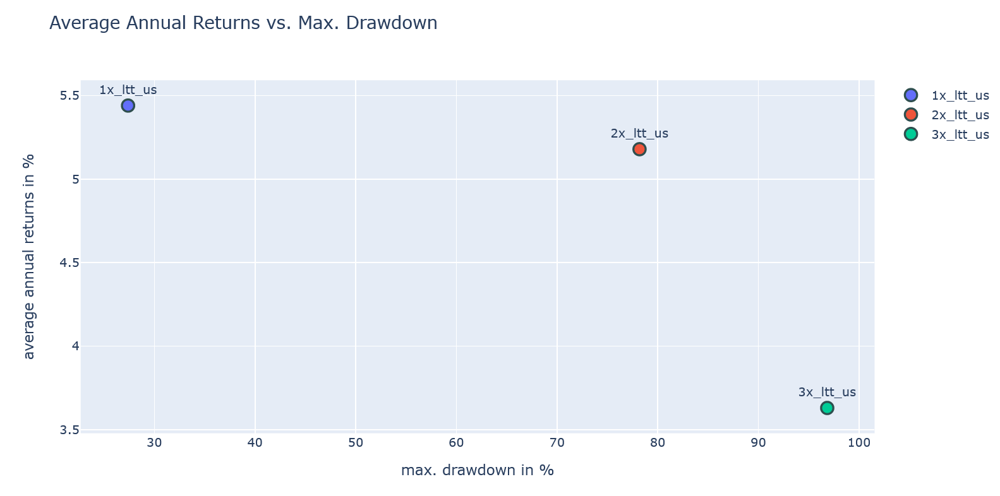

Er liegt deutlich abgeschlagen beim mittleren jährlichen Gewinn hinter dem 2-fach und ungehebelten ETF. Und gleichzeitig hatte er einen maximalen Einbruch von über 96% im Zeitraum von 1949 bis 1981. Also es ging bei ihm 32 Jahre lang nur runter! [Und genau in dieser Zeit gingen die Zinsen, 32 Jahre lang, tendenziell nur hoch](https://paste.pics/c2e493b436d63be2502a4fbfa4f4c12a).

Die europäischen ETFs müssen wir uns nicht ansehen, da es hier keine gehebelten LTT ETFs gibt.

## Intermediate Term Treasury Bond ETFs

Bei den ITTs sieht das Bild nicht ganz so düster aus. Diese verlieren zwar auch in der Zeit vor 1981 mächtig an Wert, aber die gehebelten ETFs schaffen es dennoch bis heute wieder aufzuholen:

&#x200B;

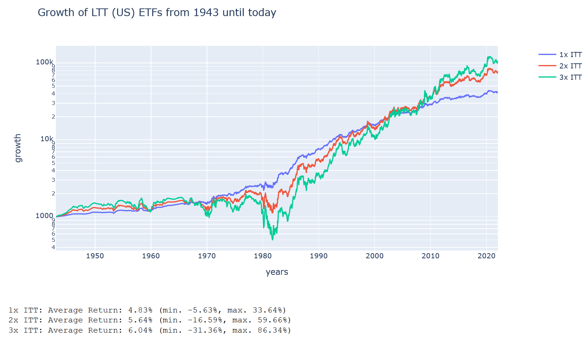

Der maximale Einbruch vom 3-fach gehebelten ETF ging von 1976 bis 1981 und betrug „nur“ 75%. Dafür reicht das Wachstum vom 3-fach gehebelten ETF gerade aus, um den ungehebelten LTT ETFs gerade so zu übertreffen. Damit macht ein Investment in 3x ITT eigentlich keinen Sinn, denn dann kann man mit viel weniger Risiko auch gleich in einen 1x LTT gehen.

Im Gewinn/Risikodiagram ordnen sich die ETFs folgendermaßen an:

&#x200B;

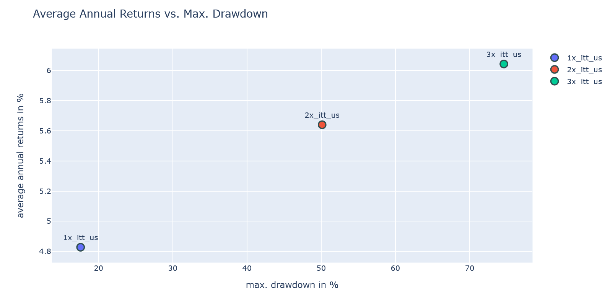

In Europa haben wir hier von Weisheitsbaum einen 3-fach gehebelten ITT ETF. Dieser hat allerdings mal wieder enorme Kosten und kann daher mit der US-Variante nicht mithalten:

&#x200B;

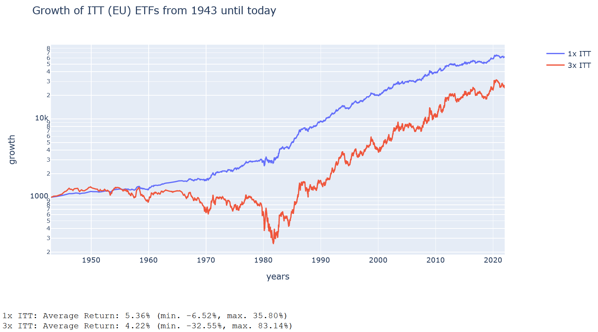

In der Zeit von 1986 an, performt er zwar mit 9% im jährlichen Mittel ganz gut. Aber in dieser Zeit wäre man mit einem TMF dennoch besser gefahren. Mit anderen Worten: der 3x ITT aus Europa ist nur dann ein Ersatz für den TMF, wenn man den Backtest von 1986 an laufen lässt. Testet man hingegen von 1943 an, würde selbst der europäische 1x LTT ETF den 3x ITT deutlich übertreffen.

## Fazit

Wir haben endlich alle Daten für den Backtest zusammengesammelt. Der einzige 3-fach gehebelte ETF, der sich als langfristiges Investment lohnen würde ist der UPRO. Schon die EU-Variante vom 3x S&P 500 ist kaum mehr besser als der 2-fach gehebelte ETF. Der TQQQ bietet zwar zeitweise sehr hohe Gewinne an, aber er stürzt auch bei einer Krise ins absolut bodenlose, so dass man diesen ETF nicht ohne Hedge halten darf. Bei Gold lohnt sich gar kein Hebel und bei den Treasury Bond ETFs kommt ein Hebel maximal beim LTT, aber dort auch nur in den Jahren ab 1986, in Frage.

Natürlich haben wir die ETFs bisher nur einzeln betrachtet. Im nächsten Teil führen wir die Backtests mit regelmäßigem Rebalancing durch. Dadurch könnte sich die Situation – vor allem beim LTT, ITT und TQQQ – noch einmal ändern. Das werden wir dann genauer begutachten.

Wie immer findet ihr alle Daten und den dazugehörigen Code in meinem Repository \[6\].

## Fragen

&#x200B;

Niemand kann die Zukunft voraussagen. Eventuell steht uns ein extremer Bullenlauf bevor und du verdoppelst dein Geld noch in diesem Jahr. Oder es steht uns ein Bärenmarkt bevor und du verliert innerhalb der nächsten 9 Jahre 99,98% deines Geldes, so wie es dem TQQQ um die Jahrtausendwende gegangen wäre, der sich bis heute davon nicht mehr erholt hat. Geld passiv in einen LETF zu werfen, ohne Hedges und Rebalancing, ist so etwas wie beim Roulette alle seine Ersparnisse auf Rot zu setzen und dann zu hoffen, dass die Kugel in 30 Jahren auch wirklich bei Rot angekommen ist.

## Quellen

\[1\] [https://www.bogleheads.org/forum/viewtopic.php?f=10&t=272640#top](https://www.bogleheads.org/forum/viewtopic.php?f=10&t=272640#top)

\[2\] [https://de.wikipedia.org/wiki/Geometrisches\_Mittel](https://de.wikipedia.org/wiki/Geometrisches_Mittel)

\[3\] [https://www.zinsen-berechnen.de/zinsmethoden/deutsche-zinsmethode.php](https://www.zinsen-berechnen.de/zinsmethoden/deutsche-zinsmethode.php)

\[4\] [https://www.bogleheads.org/wiki/Simba%27s\_backtesting\_spreadsheet](https://www.bogleheads.org/wiki/Simba%27s_backtesting_spreadsheet)

\[5\] [http://www.columbia.edu/\~klg2138/FieldsPaper\_v4.pdf](http://www.columbia.edu/~klg2138/FieldsPaper_v4.pdf)

\[6\] [https://code.launchpad.net/zgea](https://code.launchpad.net/zgea)
