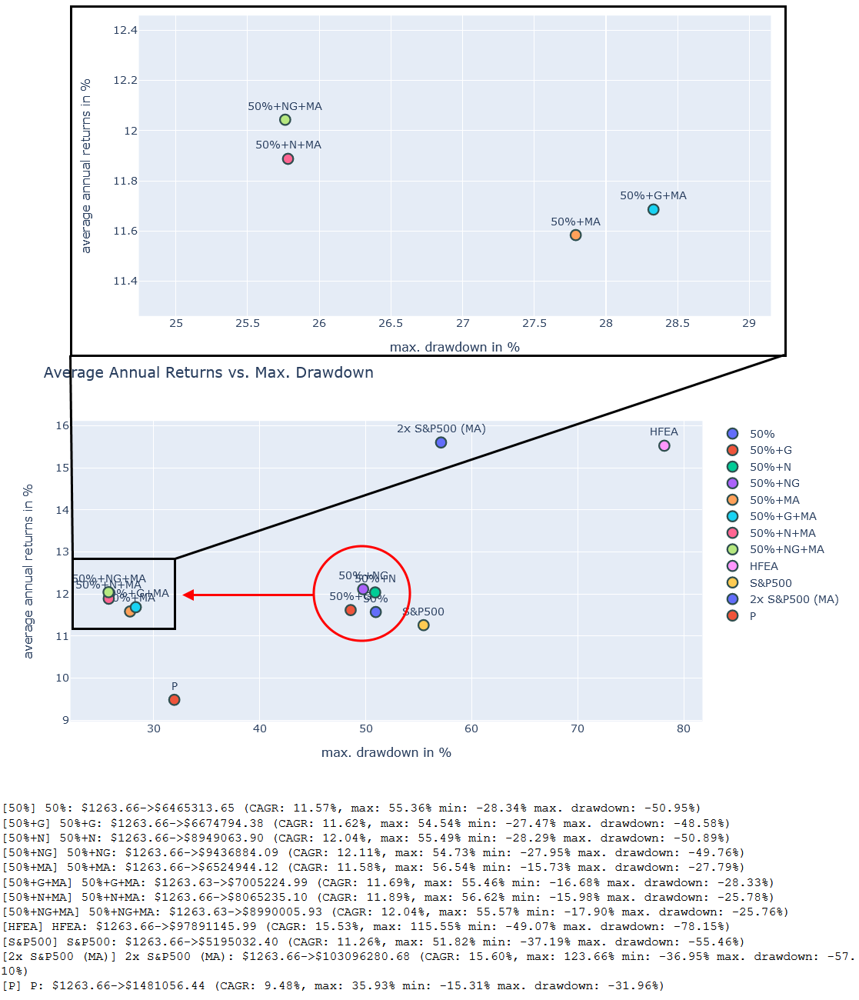
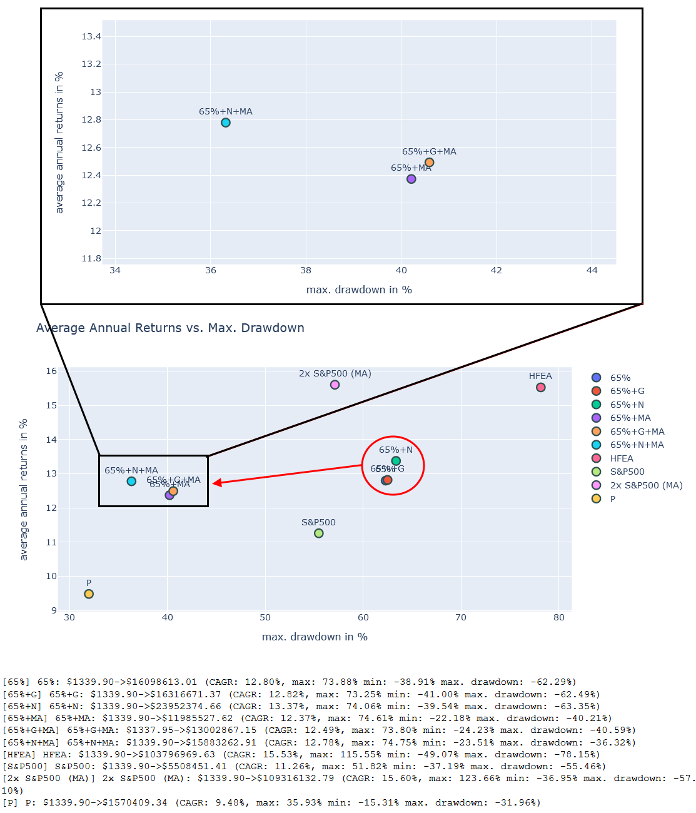
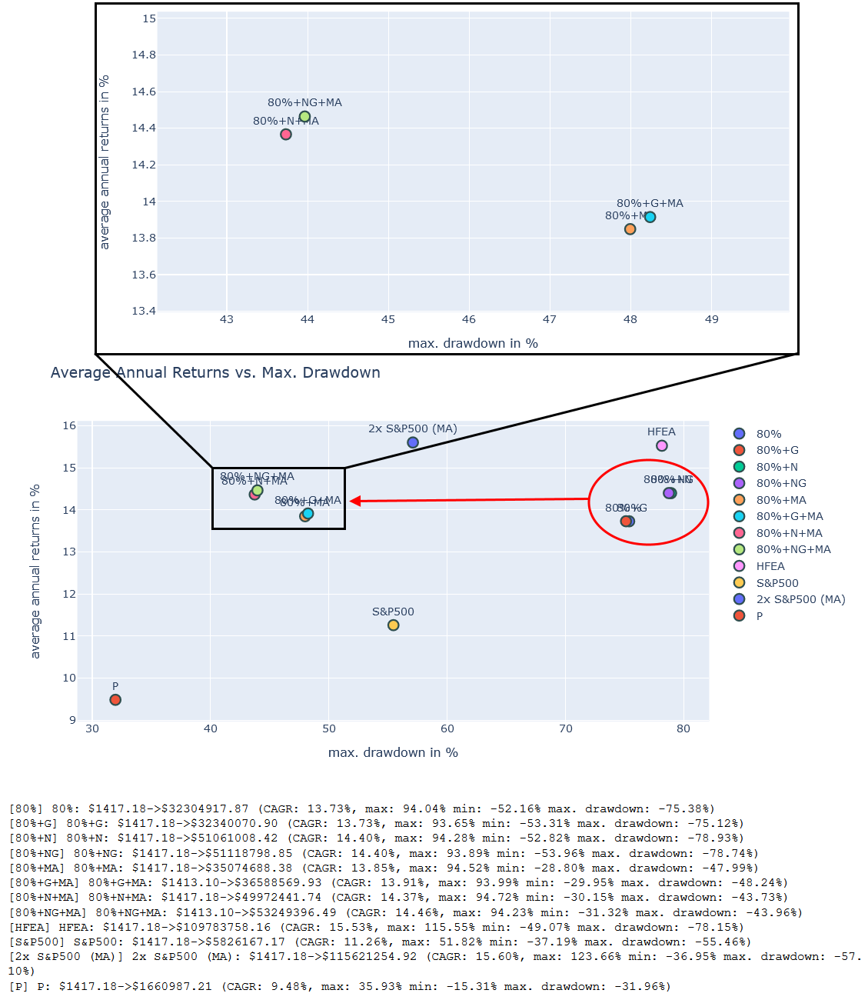
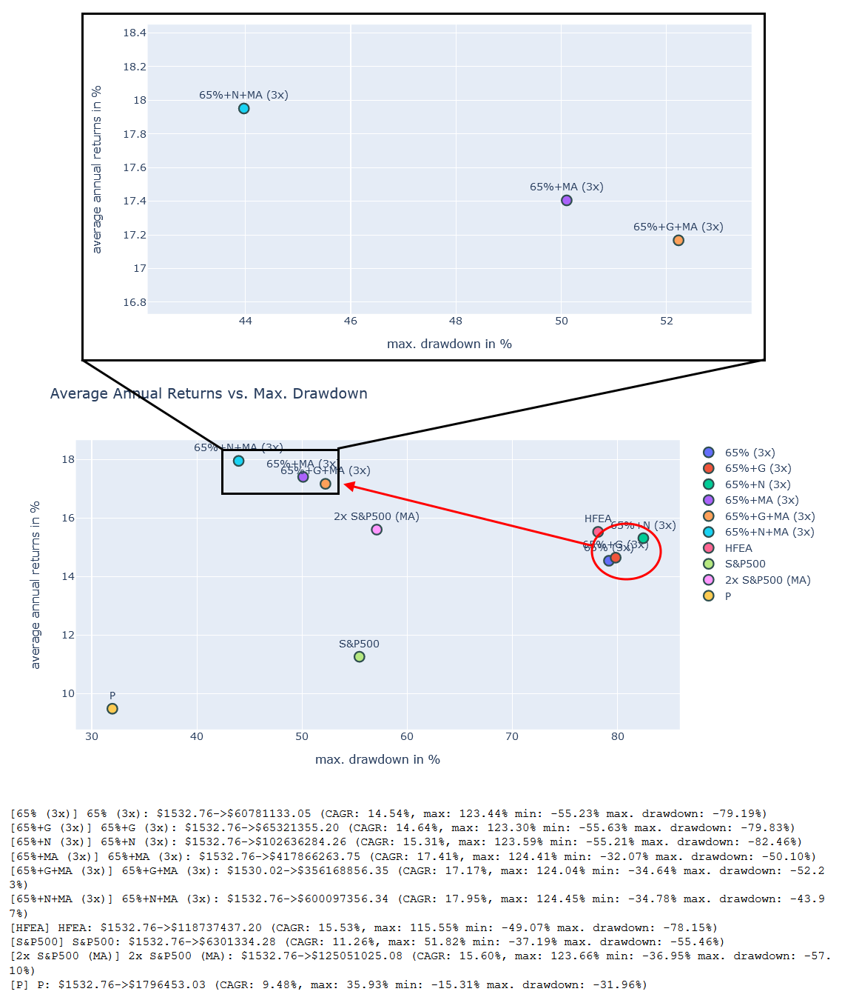
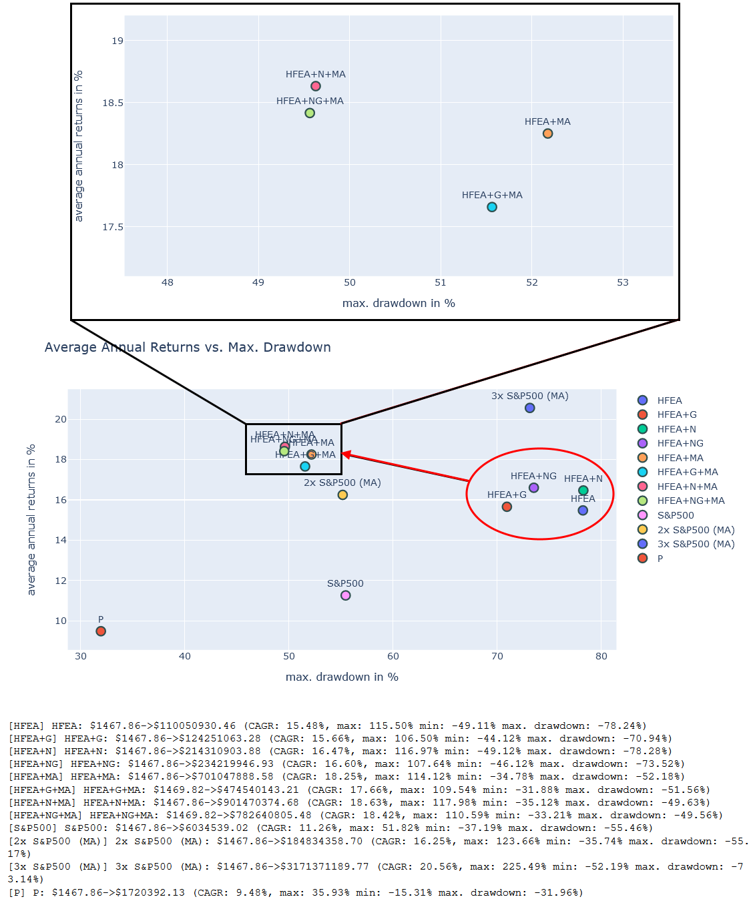

# HFEA für den Langlauf
**ZL;NG**

* *Kombiniert man die MA-Strategie, die wir im Teil 8 analysiert haben, mit HFEA kann man in allen Fällen das Risiko deutlich absenken.*
* *Im Falle von 3x gehebelten ETFs/ETNs erhöht sich sogar das CAGR.*
* *Dennoch ist eine MA-Strategie mit 100% 3x S&P 500 immernoch Top-Performer.*
* *Und es stellt sich weiterhin die Frage, ob uns der deutsche Steuerabzug hier nicht noch einen Strich durch die Rechnung macht.*

Liebe Schwestern und Brüder der Mauerstraße,

nachdem wir uns im letzten Teil die reizvolle MA200 Strategie genauer angesehen hatten, kam die Frage auf, ob es möglich wäre diese Strategie mit HFEA zu verbinden. Das wollen wir heute im Detail untersuchen.

## HFEA für den Langlauf

## Vergleichportfolios

Im Teil 7 hatten wir eine ganze Reihe von HFEA-ähnlichen Portfolios aufgestellt. Diese bestehen aus 5 Basisportfolios, von denen eines das Original HFEA mit US-ETFs umsetzt und 4 weitere eine Umsetzung mit EU-ETFs/ETNs probieren. Diese europäischen Umsetzungen sind jeweils nach der Höhe der Allokation für den Wachstumsanteil benannt. Daher besitzt das **50%** Portfolio 50% 2x S&P 500 und das **65% (3x)** Portfolio 65% 3x S&P 500. Außerdem hatten wir dann Abwandlungen eingeführt, welche entweder Gold (**+G**) oder Nasdaq-100 (**+N**) oder sogar beides hinzumischen (**+NG**). Hier ist noch einmal die vollständige Liste der Portfolios zur Erinnerung:

&#x200B;

* US-ETFs:
   * **HFEA**: 55% UPRO / 45% TMF
   * **HFEA+G**: 55% UPRO / 33.75% TMF / 11.25% Gold
   * **HFEA+N**: 41.25% UPRO / 13,75% TQQQ / 45% TMF
   * **HFEA+NG**: 41.25% UPRO / 13,75% TQQQ / 38.25% TMF / 6.75% Gold

&#x200B;

* EU-ETFs/ETNs:
   * Hohes Risiko:
      * **80%**: 80% 2x S&P 500 / 20% 1x LTT (Europa)
      * **80%+G**: 80% 2x S&P 500 / 15% 1x LTT / 5% Gold (Europa)
      * **80%+N**: 68% 2x S&P 500 / 12% 2x Nasdaq-100 / 20% 1x LTT (Europa)
      * **80%+NG**: 68% 2x S&P 500 / 12% 2x Nasdaq-100 / 15% 1x LTT / 5% Gold (Europa)
      * **65% (3x)**: 65% 3x S&P 500 / 35% 3x ITT (Europa)
      * **65%+G (3x)**: 65% 3x S&P 500 / 26.25% 3x ITT / 8.75% Gold (Europa)
      * **65%+N (3x)**: 55.25% 3x S&P 500 / 9.75% 3x Nasdaq-100 / 35% 3x ITT (Europa)
   * Mittleres Risiko:
      * **65%**: 65% 2x S&P 500 / 35% 1x LTT (Europa)
      * **65%+G**: 65% 2x S&P 500 / 26.25% 1x LTT / 8.75% Gold (Europa)
      * **65%+N**: 55.25% 2x S&P 500 / 9.75% 2x Nasdaq-100 / 35% 1x LTT (Europa)
   * Geringes Risiko:
      * **50%**: 50% 2x S&P 500 / 50% 3x LTT (Europa)
      * **50%+G**: 50% 2x S&P 500 / 37.5% 3x LTT / 12.5% Gold (Europa)
      * **50%+N**: 42.5% 2x S&P 500 / 7.5% 2x Nasdaq-100 / 50% 3x LTT (Europa)
      * **50%+NG**: 42.5% 2x S&P 500 / 7.5% 2x Nasdaq-100 / 37.5% 3x LTT / 12.5% Gold (Europa)

Zusätzlich führen wir bei allen Vergleichen auch noch Portfolios ein, welche einfach den **S&P 500** oder den **2x S&P 500** halten (und niemals verkaufen) sowie ein Portfolio, welches einen klassischen Risk-Parity-Ansatz verwendet (60% Aktien + 40% Anleihen) mit dem Namen **P**.

## 50% Portfolio mit Moving-Average-Strategie (+MA).

Wir starten damit, dass wir alle unsere **50% Portfolios** um die Moving-Average-Strategie erweitern. Hierbei verkaufen wir die Finanzinstrumente immer dann, wenn ein bestimmter Moving-Average Wert vom Basiswert unterschritten wird und kaufen es zurück, falls der Basiswert den Moving-Average wieder überschreitet. Je nach Anlageklasse verwenden wir für die Berechnung des Moving-Average Wertes eine unterschiedliche Anzahl an Tagen:

* S&P 500: 290 Tage (ca. **200 Handelstage**)
* Nasdaq-100: 320 Tage (ca. **220 Handelstage**)
* LTT: 90 Tage (ca. **60 Handelstage**)
* ITT: 70 Tage (ca. **50 Handelstage**)
* Gold: 400 Tage (ca. **280 Handelstage**)

Außerdem berücksichtigen wir beim Verkauf und Kauf von Finanzprodukten auch immer einen kleinen Spread in der Höhe von 0,2%. Das Ergebnis sieht dann folgendermaßen aus:

&#x200B;

Wir sehen sofort, dass sich das CAGR bei allen Portfolios mit der MA-Strategie nicht wesentlich verändert hat. Allerdings sinkt das Risiko drastisch ab. Hatten die Originalportfolios noch einen maximalen Einbruch von ca. 50%, so konnte dieser auf ungefähr 25% reduziert werden. Allerdings nur dann, wenn man die Steuer dabei nicht berücksichtigt.

Im vergrößerten Bereich erkennen wir, dass das einfache Hinzufügen von Gold keine deutliche Verbesserung mehr ergibt, aber mit einem Nasdaq-100 Anteil kann sowohl das CAGR erhöht, als auch das Risiko verringert werden.

## 65% Portfolio mit MA-Strategie

Nun wiederholen wir das gleiche Experiment beim **65% Portfolio**:

Auch hier zeigt sich wieder, dass durch die Anwendung der MA-Strategie das Risiko um fast die Hälfte Reduziert werden kann. Von ca. 63% auf ca. 36%. Dafür müssen wir hier schon eine kleine Verringerung des CAGR hinnehmen und die Steuern sind noch nicht berücksichtigt.

Ebenfalls interessant ist, dass auch in diesem Experiment das Portfolio mit Nasdaq-100 (**+N**) und MA-Strategie besser abschnitt als ohne Nasdaq-100. Auch das Gold-Portfolio (**+G**) hat ein leicht erhöhtes Risiko gegenüber dem Portfolio ohne Gold.

## 80% Portfolio mit MA-Strategie

Bisher waren die Ergebnisse relativ konsistent, daher schauen wir uns gleich mal das **80% Portfolio** an:

Wieder zeigen die MA-Varianten ein deutlich geringeres Risiko als die nicht MA-Varianten. Und auch wieder ist die MA-Variante mit Gold (**+G**) schlechter als die mit dem Nasdaq-100 (**+N/+NG**). Das CAGR von allen Varianten liegt jedoch in etwa im gleichen Bereich.

## 65% (3x) Portfolio mit MA-Strategie

Als letztes europäisches Portfolio testen wir das **65% (3x) Portfolio**, welches 3x gehebelte ETNs verwendet:

Durch Anwendung der MA-Strategie schafft es das **65% (3x)** Portfolio unter allen europäischen Portfolios als erstes das CAGR von HFEA zu überbieten und das bei einem fast halbierten Risiko! Die MA-Strategie scheint sehr stark von größeren Hebeln zu profitieren. Allerdings sehen wir auch hier wieder, dass die Gold-Variante (**+G**) schlechter ist als die Variante mit dem Nasdaq-100 (**+N**).

## HFEA mit MA-Strategie

Nach diesen Erfolgen sind wir nun gespannt, wie sich die MA-Strategie beim **HFEA-Portfolio** verhält:

&#x200B;

Auch beim HFEA Portfolio erhöht sich das CAGR durch die Anwendung der MA-Strategie deutlich. Gleichzeitig verringert sich auch das Risiko. Das CAGR ist sogar leicht höher als bei der **65% (3x)** Variante, was an den verringerten Kosten der ETFs liegt. Wenn man jedoch das gleiche Risiko wie bei der Original-HFEA-Strategie haben möchte und dafür das CAGR maximieren möchte, ist die 3x S&P 500 (MA) Variante immernoch profitabler (man muss aber das zusätzliche Emittentenrisiko beachten).

## Fazit

Es zeigt sich, dass man alle HFEA ähnlichen Portfolios durch das Anwenden der MA-Strategie verbessern kann, zumindest dann, wenn keine Steuern berücksichtigt werden. Im Falle der 2x gehebelten ETFs wird zumindest das Risiko deutlich gesenkt und im Falle von 3x gehebelten ETNs/ETFs steigt sogar das CAGR weiter an. Gleichzeitig zeigt sich, dass ein Portfolio mit Gold (**+G**) mit der MA-Strategie durchgängig schlechtere Performance und höhere Risiken besitzt als ein Portfolio mit Nasdaq-100 (**+N/+NG**), daher würde ich empfehlen die (**+G**) Variante nicht damit zu kombinieren.

Vielleicht helfen diese Erkenntnisse einigen Leuten unter uns, die beim Verkauf keine Steuern oder nur geringe Steuern bezahlen müssen (vvGmbH könnte da eine Lösung für sein). Ansonsten schauen wir uns im kommenden Teil alle diese Portfolios noch einmal mit einem Steuerabzug an. Danach wissen wir, ob die MA-Strategie auch für die Geringverdiener unter uns eine Option wäre.

Ihr findet wie immer alle Daten und Analysen im Repository \[1\].

## Fragen

Diesmal gab es keine passenden Fragen hierzu.

## Quellen

\[1\] [https://code.launchpad.net/zgea](https://code.launchpad.net/zgea)
