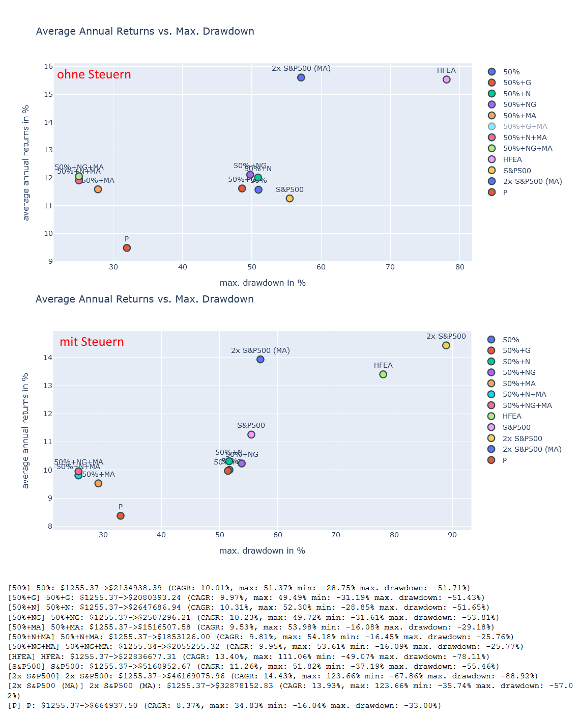
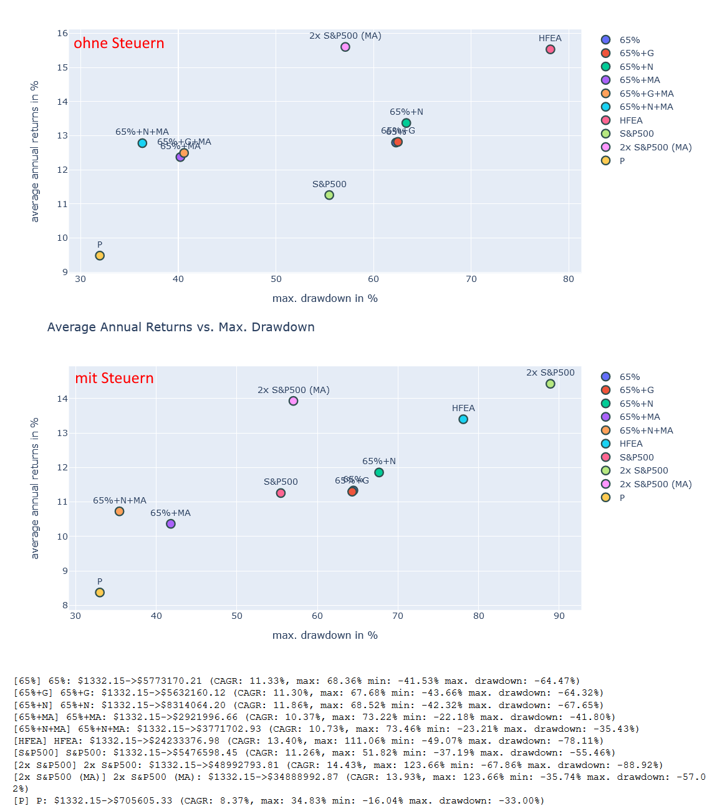
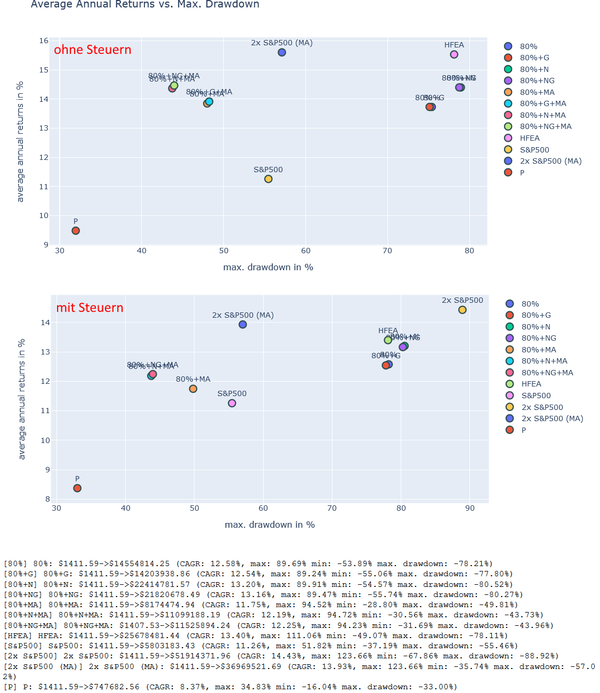
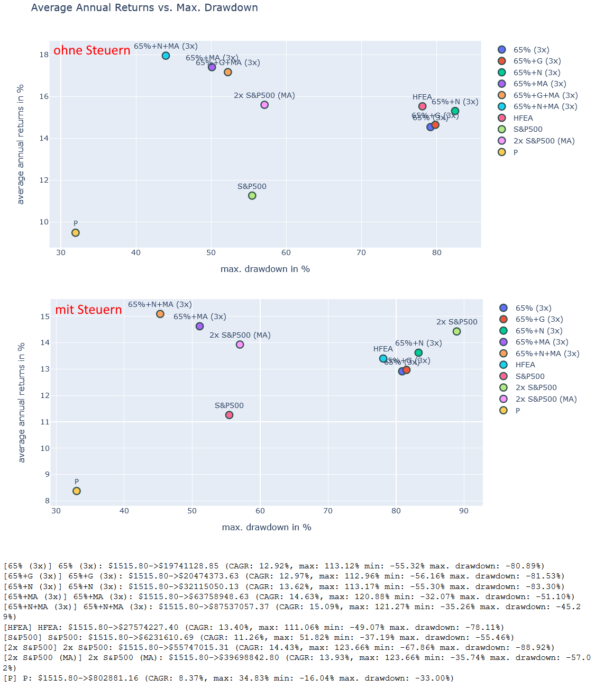
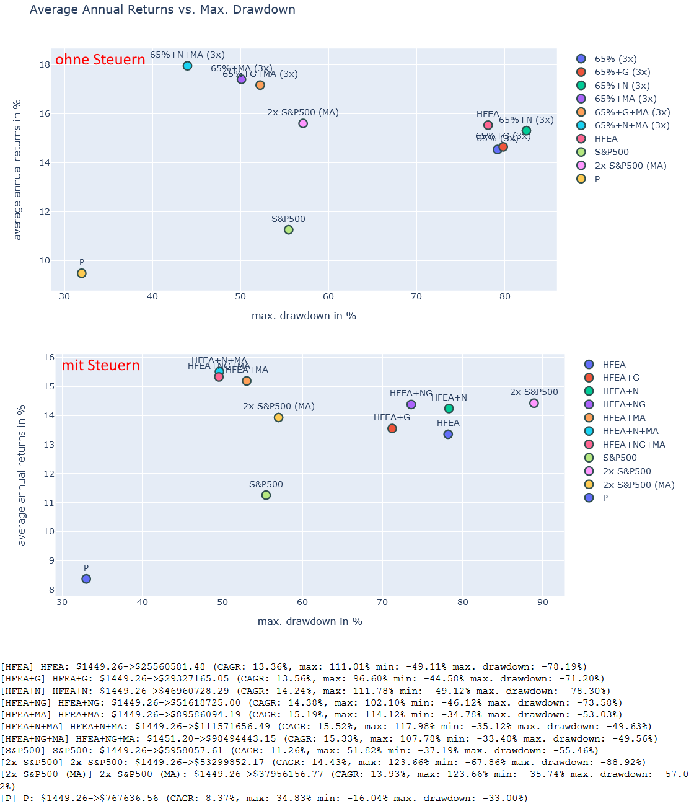

# Wie wirken sich deutsche Steuern auf die Strategie aus?

**ZL;NG**

* *Für HFEA-ähnliche Portfolios verringert die Steuerlast das CAGR um ca. 1-2% im Jahr.*
* *HFEA erreicht damit noch 13,5% CAGR und ist dann ähnlich gut wie ein Buy and Hold vom 2x S&P 500, bei jedoch nur der Hälfte des Risikos*
* *Bei der MA-Strategie (siehe Teil 8 u. 9) verringert die Steuerlast das CAGR um 2-3%.*
* *2x S&P 500 mit der MA-Strategie zu halten ist in Deutschland eine echte Alternative zu HFEA.*

Liebe Schwestern und Brüder der Mauerstraße,

endlich ist es soweit. Wir haben in den letzten Teilen genug von Strategien gesprochen. Heute wollen wir uns mal ansehen, was das deutsche Steuerrecht für uns arme Kleinaktionäre eigentlich bedeutet. Lohne sich HFEA überhaupt noch im Vergleich zu einer Buy and Hold Strategie, wenn man Steuern bezahlen muss? Stinkt die MA200-Strategie ab, wenn man beim Krisenverkauf plötzlich eine hohe Steuerlast hat? Diesen Fragen gehen wir heute nach.

## Wie wirken sich deutsche Steuern auf die Strategie aus?

## Vergleichsportfolios

Erneut möchte ich an dieser Stelle die Vergleichsportfolios zusammenfassen, die wir in den letzten Teilen erarbeitet haben. Wir haben 5 verschiedene Basisportfolios, von denen eines das Original HFEA mit US-ETFs umsetzt und 4 weitere eine Umsetzung mit EU-ETFs/ETNs probieren. Diese europäischen Umsetzungen sind jeweils nach der Höhe der Allokation für den Wachstumsanteil benannt. Daher besitzt das **50%** Portfolio 50% 2x S&P 500 und das **65% (3x)** Portfolio 65% 3x S&P 500. Außerdem hatten wir dann Abwandlungen eingeführt, welche entweder Gold (**+G**) oder Nasdaq-100 (**+N**) oder sogar beides hinzumischen (**+NG**). Hier ist noch einmal die vollständige Liste der Portfolios zur Erinnerung:

&#x200B;

* US-ETFs:
   * **HFEA**: 55% UPRO / 45% TMF
   * **HFEA+G**: 55% UPRO / 33.75% TMF / 11.25% Gold
   * **HFEA+N**: 41.25% UPRO / 13,75% TQQQ / 45% TMF
   * **HFEA+NG**: 41.25% UPRO / 13,75% TQQQ / 38.25% TMF / 6.75% Gold

&#x200B;

* EU-ETFs/ETNs:
   * Hohes Risiko:
      * **80%**: 80% 2x S&P 500 / 20% 1x LTT (Europa)
      * **80%+G**: 80% 2x S&P 500 / 15% 1x LTT / 5% Gold (Europa)
      * **80%+N**: 68% 2x S&P 500 / 12% 2x Nasdaq-100 / 20% 1x LTT (Europa)
      * **80%+NG**: 68% 2x S&P 500 / 12% 2x Nasdaq-100 / 15% 1x LTT / 5% Gold (Europa)
      * **65% (3x)**: 65% 3x S&P 500 / 35% 3x ITT (Europa)
      * **65%+G (3x)**: 65% 3x S&P 500 / 26.25% 3x ITT / 8.75% Gold (Europa)
      * **65%+N (3x)**: 55.25% 3x S&P 500 / 9.75% 3x Nasdaq-100 / 35% 3x ITT (Europa)
   * Mittleres Risiko:
      * **65%**: 65% 2x S&P 500 / 35% 1x LTT (Europa)
      * **65%+G**: 65% 2x S&P 500 / 26.25% 1x LTT / 8.75% Gold (Europa)
      * **65%+N**: 55.25% 2x S&P 500 / 9.75% 2x Nasdaq-100 / 35% 1x LTT (Europa)
   * Geringes Risiko:
      * **50%**: 50% 2x S&P 500 / 50% 3x LTT (Europa)
      * **50%+G**: 50% 2x S&P 500 / 37.5% 3x LTT / 12.5% Gold (Europa)
      * **50%+N**: 42.5% 2x S&P 500 / 7.5% 2x Nasdaq-100 / 50% 3x LTT (Europa)
      * **50%+NG**: 42.5% 2x S&P 500 / 7.5% 2x Nasdaq-100 / 37.5% 3x LTT / 12.5% Gold (Europa)

Darüber hinaus haben wir im letzten Teil auch die MA-Portfolios eingeführt, bei welchen wir die Investments beim Unterschreiten eines speziellen Moving-Average Wertes verkaufen und wieder zurückkaufen, wenn wir diesen Wert wieder überschreiten. Die folgenden Werte für den Moving-Average (der Wert in Klammern) hatten wir als sinnvoll ermittelt:

&#x200B;

* S&P 500: 290 Tage (ca. **200 Handelstage**)
* Nasdaq-100: 320 Tage (ca. **220 Handelstage**)
* LTT: 90 Tage (ca. **60 Handelstage**)
* ITT: 70 Tage (ca. **50 Handelstage**)
* Gold: 400 Tage (ca. **280 Handelstage**)

&#x200B;

Neben diesen **HFEA+MA** Portfolios haben wir auch ein Portfolio, welches nur 2x S&P 500 hält, diesen aber nach der MA-Strategie verkauft und zurückkauft (**2x S&P 500 (MA)**). Zusätzlich führen wir bei allen Vergleichen auch noch Portfolios ein, welche einfach den **S&P 500** oder den **2x S&P 500** halten (und niemals verkaufen) sowie ein Portfolio, welches einen klassischen Risk-Parity-Ansatz verwendet (60% Aktien + 40% Anleihen) mit dem Namen **P**.

## Berechnung der deutschen Steuern

Bei jedem Verkauf in einem unserer Portfolios wird nach dem FIFO-Prinzip der Gewinn ermittelt. Das bedeutet, dass immer die zuerst gekauften Anteile verkauft werden und aufgrund des damaligen Kaufpreises der Gewinn ermittelt wird. Haben wir also irgendwann mal 2x S&P 500 für 50€ gekauft und später für 75€, verkaufen wir zuerst die 50€ Anteile, wodurch der Gewinn dann natürlich höher ausfällt.

Auf diesen Gewinn bezahlen wir 26,38% Steuern, was sich aus 25% Abgeltungssteuer und darauf noch einmal 5,5% Solidaritätsbeitrag zusammensetzt. Die Kirchensteuer habe ich jetzt mal nicht berücksichtigt.

Eine Einschränkung gibt es dann aber doch: Bei Aktien ETFs/ETNs nahm ich eine Teilfreistellung von 30% an. Also man bezahlt die Steuern nur auf 70% der dafür angefallenen Gewinne. Bei Anleihen und Gold gilt dies jedoch nicht. Es gibt im Übrigen von u/what_the_actual_luck auch einen guten Beitrag hierzu im r/HFEA Unter \[1\].

Außerdem berechne ich bei allen Käufen und Verkäufen auch einen 0,2% Spread, was sich vor allem bei den MA-Strategien bemerkbar macht.

## 50% Portfolio

Schauen wir uns als erstes das 50% Portfolio an mit und ohne deutsche Steuern an:

Ohne Steuern erreichte das 50% Portfolio in etwa den Gewinn von einer Buy and Hold Strategie mit dem S&P 500 bei etwas verringerten Risiko. Werden die Steuern allerdings berücksichtigt, sinkt das CAGR hier noch einmal deutlich ab und erreicht mit Mühe und Not nur noch in etwa 10%. Die MA-Variante trifft dies aber noch härter. Dafür bleibt hier das Risiko gering (geringer als beim klassischen Risk-Parity-Portfolio).

Wir sehen also, dass die Steuerlast bei den MA-Portfolios stärker zuschlägt. Sie ist allerdings nicht so stark, dass diese Strategie gar undenkbar wäre. Ein Portfolio welches nur aus 2x S&P 500 mit MA-Strategie besteht erreicht trotz Steuern noch ein etwas geringeres CAGR als eine 2x S&P 500 Buy and Hold Strategie, hat aber dafür nur knapp die Hälfte Risiko (Auf dem Niveau einer 1x S&P 500 Buy and Hold-Strategie). Sie Übertrifft vom CAGR auch weiterhin die originale HFEA-Strategie bei weniger Risiko und stellt daher tatsächlich eine gute Alternative für HFEA in Deutschland dar.

## 65% Portfolio

Das gleiche Bild wiederholt sich beim **65%** Portfolio. Hier erreicht die MA-Variante mit Steuern nicht einmal mehr das CAGR von S&P 500 Buy and Hold. Das **65%** Portfolio ohne die MA-Strategie liegt dagegen in etwa gleich auf, aber mit einem höheren Risiko. Es stellt sich daher ernsthaft die Frage, ob man das **65%** Portfolio in der nicht MA-Variante wirklich noch benötigt. Es bietet keinen substanziellen Vorteil gegenüber S&P 500 Buy and Hold, weder beim Risiko noch beim Gewinn. Aus diesem Grund werde ich diese Portfoliovariante von weiteren Tests ausschließen.

## 80% Portfolio

Das **80%** Portfolio ohne MA-Strategie nährt sich dem **HFEA**\-Portfolio mit Steuern deutlich an. In der MA-Variante ist der Gewinn etwas kleiner, aber dennoch deutlich größer als bei einem S&P 500 Buy and Hold und das bei weiterhin geringerem Risiko. Somit haben alle **80%** Portfolio-Varianten weiterhin eine Daseinsberechtigung.

## 65% (3x) Portfolio

Dieses Portfolio schafft es – trotz Steuern – in der MA-Variante das **2x S&P 500 MA**\-Portfolio zu überbieten und das bei geringerem Risiko. Die nicht MA-Variante nährt sich sehr stark dem **HFEA**\-Portfolio an. Man muss aber bedenken, dass in dieser Variante ein Emittentenrisiko enthalten ist, welches sich nicht in Zahlen abbilden lässt.

## HFEA Portfolio

Das **HFEA** Portfolio verhält sich ähnlich dem **65% (3x)** Portfolio. Mit Steuern erreicht die nicht MA-Variante ein CAGR zwischen 14.5% und 13.4%. Die MA-Variante reduziert das Risiko und erhöht gleichzeitig das CAGR auf über 15%. In diesem Vergleich sieht man auch noch einmal gut, dass die **2x S&P 500 MA**\-Strategie sehr gut mit HFEA konkurrieren kann und daher, trotz aller Steuerzahlungen, eine echte Alternative zu HFEA in Deutschland darstellt.

## Fazit

Wir könnten uns nun über die hohe Steuerlast in Deutschland beklagen, oder darüber, dass wir keine Rentenportfolio haben, für welches wir erst Steuern beziehen, wenn wir das Geld aus dem Portfolio herausholen. Allerdings können wir das auch positiv formulieren: Grundsätzlich verringert zwar der Steuersatz unsere HFEA-Gewinne, aber es ist dennoch möglich im Backtest bis zu 15% CAGR zu realisieren. Selbst wenn wir das Geld konservativer als das originale HFEA Anlegen ist ein CAGR von ca. 10% realistisch, und dass bei weniger Risiko als ein S&P 500 Buy and Hold.

Lediglich das **65%** Portfolio passt einfach nicht so richtig zwischen die anderen Portfolios: Es ist Risikoreicher als S&P 500 Buy and Hold, bietet aber nur eine ähnliche Performance. Also warum sollte man dann diesen Stress auf sich nehmen? Dann kann man auch gleich das konservativere **50%** Portfolio nehmen oder **50%** mit der MA-Strategie koppeln und das Risiko deutlich reduzieren. Alternativ nimmt man dann halt die **80%** Variante oder die 65% Variante mit 3x gehebelten ETNs, welche dann wenigsten ein ordentliches CAGR haben und fast auf HFEA Niveau sind.

Für Leute mit Zugang zu US ETFs stellt **HFEA+MA** eine richtig interessante Strategie dar. 15% CAGR nach Steuerabzug ist schon echt gut und im Falle einer Krise hat man dann immer Cash zur Verfügung, was sicher reizvoll ist.

Die Liste unserer Portfolios sieht damit folgendermaßen aus:

* US-ETFs:
   * **HFEA**: 55% UPRO / 45% TMF
   * **HFEA+G**: 55% UPRO / 33.75% TMF / 11.25% Gold
   * **HFEA+N**: 41.25% UPRO / 13,75% TQQQ / 45% TMF
   * **HFEA+NG**: 41.25% UPRO / 13,75% TQQQ / 38.25% TMF / 6.75% Gold

&#x200B;

* EU-ETFs/ETNs:
   * Hohes Risiko:
      * **80%**: 80% 2x S&P 500 / 20% 1x LTT (Europa)
      * **80%+G**: 80% 2x S&P 500 / 15% 1x LTT / 5% Gold (Europa)
      * **80%+N**: 68% 2x S&P 500 / 12% 2x Nasdaq-100 / 20% 1x LTT (Europa)
      * **80%+NG**: 68% 2x S&P 500 / 12% 2x Nasdaq-100 / 15% 1x LTT / 5% Gold (Europa)
      * **65% (3x)**: 65% 3x S&P 500 / 35% 3x ITT (Europa)
      * **65%+G (3x)**: 65% 3x S&P 500 / 26.25% 3x ITT / 8.75% Gold (Europa)
      * **65%+N (3x)**: 55.25% 3x S&P 500 / 9.75% 3x Nasdaq-100 / 35% 3x ITT (Europa)
   * Geringes Risiko:
      * **50%**: 50% 3x S&P 500 / 50% 3x LTT (Europa)
      * **50%+G**: 50% 3x S&P 500 / 37.5% 3x LTT / 12.5% Gold (Europa)
      * **50%+N**: 42.5% 3x S&P 500 / 7.5% 2x Nasdaq-100 / 50% 3x LTT (Europa)
      * **50%+NG**: 42.5% 3x S&P 500 / 7.5% 2x Nasdaq-100 / 37.5% 3x LTT / 12.5% Gold (Europa)

Im nächsten Teil schauen wir uns mal verschiedene Krisen der Vergangenheit an und ermitteln, welches Portfolio sich dabei jeweils gut schlägt. Vielleicht hilft es uns weitere Portfolio auszusortieren oder zumindest die Stärken und Schwächen besser herauszuarbeiten.

Wie immer findet ihr alle Daten und Analysen im Repository \[2\].

## Fragen

Diesmal gab es keine passenden Fragen hierzu.

## Quellen

\[1\] [https://www.reddit.com/r/HFEA/comments/s2ijh4/hfea\_letfs\_from\_europe\_with\_tax\_implications\_from/](https://www.reddit.com/r/HFEA/comments/s2ijh4/hfea_letfs_from_europe_with_tax_implications_from/)

\[2\] [https://code.launchpad.net/zgea](https://code.launchpad.net/zgea)
