# Finanzieller Krisentourismus
**ZL;NG**

* *Es gibt keine perfekte Strategie für alle Krisen.*
* *Nach Kriegen kommt es zu einer schnellen Erholung am Aktienmarkt, solange der Konflikt lösbar erscheint und klar ist, dass er lokal begrenzt ist.*
* *Gold ist eigentlich nur richtig in der Ölkrise von Vorteil gewesen.*
* *Nasdaq-100 war nach 1985 fast immer von Vorteil, außer in der Dot-Com Blase.*
* *2x S&P 500 (MA) perform vor 1985 richtig gut. Danach dann eher HFEA.*
* *Keine europäische HFEA-Variante sticht besonders positiv heraus.*

## 

Liebe Schwestern und Brüder der Mauerstraße,

nachdem wir uns den Einfluss von Steuern auf unsere Strategien angesehen haben, möchten wir uns heute mit der Frage beschäftigen, wie sich die unterschiedlichen Portfolios in Ausnahmesituationen verhalten. Hierzu habe ich uns 7 verschiedene Krisen aus der Vergangenheit herausgesucht, die wir im Detail untersuchen können. Wir wollen wissen welches Portfolio am besten durch die Krise gekommen ist und wie hoch der Einbruch dabei war.

## Finanzieller Krisentourismus

## Vergleichsportfolios

Wie immer möchte ich an dieser Stelle alle Vergleichsportfolios zusammenfassen, die wir in den letzten Teilen erarbeitet haben. Wir haben 4 verschiedene Basisportfolios, von denen eines das Original HFEA mit US-ETFs umsetzt und 3 weitere eine Umsetzung mit EU-ETFs/ETNs probieren. Diese europäischen Umsetzungen sind jeweils nach der Höhe der Allokation für den Wachstumsanteil benannt. Daher besitzt das **50% Portfolio** 50% 2x S&P 500 und das **65% (3x) Portfolio** 65% 3x S&P 500. Außerdem hatten wir dann Abwandlungen eingeführt, welche entweder Gold (**+G**) oder Nasdaq-100 (**+N**) oder sogar beides hinzumischen (**+NG**). Hier ist noch einmal die vollständige Liste der Portfolios zur Erinnerung:

&#x200B;

* US-ETFs:
   * **HFEA**: 55% UPRO / 45% TMF
   * **HFEA+G**: 55% UPRO / 33.75% TMF / 11.25% Gold
   * **HFEA+N**: 41.25% UPRO / 13,75% TQQQ / 45% TMF
   * **HFEA+NG**: 41.25% UPRO / 13,75% TQQQ / 38.25% TMF / 6.75% Gold

&#x200B;

* EU-ETFs/ETNs:
   * Hohes Risiko:
      * **80%**: 80% 2x S&P 500 / 20% 1x LTT (Europa)
      * **80%+G**: 80% 2x S&P 500 / 15% 1x LTT / 5% Gold (Europa)
      * **80%+N**: 68% 2x S&P 500 / 12% 2x Nasdaq-100 / 20% 1x LTT (Europa)
      * **80%+NG**: 68% 2x S&P 500 / 12% 2x Nasdaq-100 / 15% 1x LTT / 5% Gold (Europa)
      * **65% (3x)**: 65% 3x S&P 500 / 35% 3x ITT (Europa)
      * **65%+G (3x)**: 65% 3x S&P 500 / 26.25% 3x ITT / 8.75% Gold (Europa)
      * **65%+N (3x)**: 55.25% 3x S&P 500 / 9.75% 3x Nasdaq-100 / 35% 3x ITT (Europa)
   * Geringes Risiko:
      * **50%**: 50% 2x S&P 500 / 50% 3x LTT (Europa)
      * **50%+G**: 50% 2x S&P 500 / 37.5% 3x LTT / 12.5% Gold (Europa)
      * **50%+N**: 42.5% 2x S&P 500 / 7.5% 2x Nasdaq-100 / 50% 3x LTT (Europa)
      * **50%+NG**: 42.5% 2x S&P 500 / 7.5% 2x Nasdaq-100 / 37.5% 3x LTT / 12.5% Gold (Europa)

Darüber hinaus haben wir auch die MA-Portfolios eingeführt, bei welchen wir die Investments beim Unterschreiten eines speziellen Moving-Average Wertes verkaufen und wieder zurückkaufen, wenn wir diesen Wert wieder überschreiten. Die folgenden Werte für den Moving-Average (der Wert in Klammern) hatten wir als sinnvoll ermittelt:

* S&P 500: 290 Tage (ca. **200 Handelstage**)
* Nasdaq-100: 320 Tage (ca. **220 Handelstage**)
* LTT: 90 Tage (ca. **60 Handelstage**)
* ITT: 70 Tage (ca. **50 Handelstage**)
* Gold: 400 Tage (ca. **280 Handelstage**)

Neben diesen **HFEA+MA** Portfolios testen wir auch ein Portfolio, welches nur 2x S&P 500 hält, diesen aber nach der MA-Strategie verkauft und zurückkauft (**2x S&P 500 (MA)**). Zusätzlich führen wir bei allen Vergleichen auch noch Portfolios ein, welche einfach den **S&P 500** oder den **2x S&P 500** halten (und niemals verkaufen) sowie ein Portfolio, welches einen klassischen Risk-Parity-Ansatz verwendet (60% Aktien + 40% Anleihen) mit dem Namen **P**.

## 1962: Kubakrise

Stellt euch vor es ist 1962: Der zweite Weltkrieg mit den bis dahin schlimmsten Gräueltaten in der Geschichte Europas und Weltweit ist nicht einmal 20 Jahre her. In Berlin stehen sich grimmig guckende Soldaten in Ost und West gegenüber und in den militärischen Kommandozentren der UDSSR und USA, starren Militärs auf Landkarten und rechnen jede Minute damit, dass eine Nuklearrakete auf das eigene Gebiet zurast.

Die beiden Machtblöcke der Welt sind gleichermaßen hochgerüstet und es ist völlig klar: Auf beiden Seiten gibt es genug nukleare Kapazitäten um die gesamte Welt zu vernichten. In so einer Situation können Minuten oder gar Sekunden darüber entscheiden, ob es einem gelingt den Feind auszuschalten bevor dieser einen selbst ausschaltet. Das ist die Entscheidung zwischen Leben und Tod, zwischen der Vernichtung der ganzen oder nur der halben Welt.

Die USA hat damit begonnen Nuklearraketen in der Türkei zu installieren: Keine gigantischen Interkontinentalraketen, welche über die ganze Welt fliegen und der UDSSR eine Vorwarnzweit von ca. 30 Minuten bieten, sondern kleine Raketen, die viel schneller und vor allem wahrscheinlich nahezu unentdeckt Moskau erreichen können. Raketen, welche Moskau erreichen, bevor Moskau reagieren kann.

Natürlich wollte die Führung der UDSSR dieses Ungleichgewicht nicht auf sich sitzen lassen und suchte sich einen Freund ganz in der Nähe der USA, bei welchem ebenfalls schnelle und kleiner Raketen mit Nuklearsprengköpfen installiert werden können. So dass man Washington genauso schnell erreichen kann wie die NATO Moskau. Diesen Freund fanden sie in der neuen kubanischen Regierung und so kam es zur Kubakrise: Diese starte im Oktober 1962, als amerikanische Flugzeuge solche Raketen auf Kuba entdecken.

Daraufhin wird eine komplette Abriegelung des Seegebiets um Kuba beschlossen und sogar eine Invasion von Kuba durch amerikanisches Militär vorbereitet. Die USA lässt keinen Zweifel: Eher wird Kuba vernichtet und jedes Sowjetschiff versenkt, als dass man solche Raketen in Kuba duldet. Eher startet der 3. Weltkrieg, als dass diese Grenze überschritten wird.

Am Ende lässt Kennedy doch nicht jedes Schiff versenken, sondern drück ein Auge zu um eine Katastrophe abzuwenden und man einigt sich mit der UDSSR darauf, dass diese ihre Raketen von Kuba abziehen, während die USA das gleiche mit ihren Raketen in der Türkei macht. Die Welt atmet auf.

&#x200B;

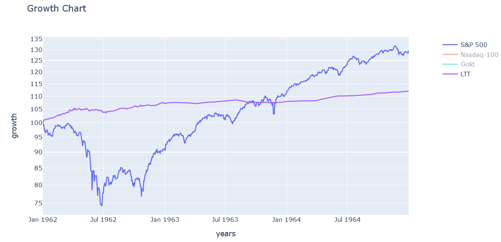

Schon im März 1962 begannen die Aktienkurse zu fallen. Der S&P 500 erreiche mit -25% im Juni 1962 seinen tiefsten Punkt. Von dort stieg er langsam wieder auf. Als sich die Hinweise auf eine schwere geopolitische Krise verschärften brach der Kurs im August 1962 noch einmal ein, erreicht aber dann nicht mehr den Tiefpunkt von Juni. Nach der Lösung der Krise im Oktober gingen die Aktien ganz schnell wieder hoch und schon im April 1963 war Brechgleich erreicht.

Während der ganzen Zeit stiegen die LTTs ganz langsam an, ohne dabei in irgendeiner Form auf diese Krise zu reagieren. Sie stellen damit wirklich einen perfekten Krisenhedge dar.

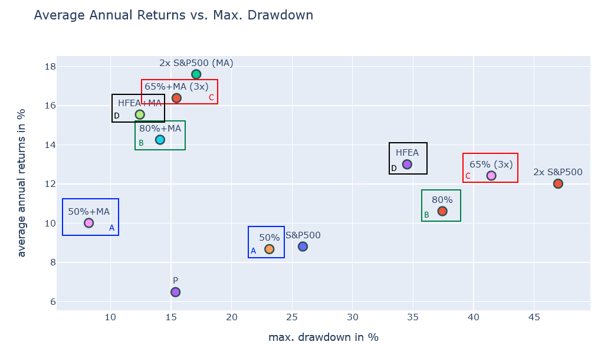

A) Details 50%: [https://paste.pics/61c55348c043f522dca6054f32ec344b](https://paste.pics/61c55348c043f522dca6054f32ec344b)

B) Details 80%: [https://paste.pics/0e05fbb8b8c748805e165d9eef5dd934](https://paste.pics/0e05fbb8b8c748805e165d9eef5dd934)

C) Details 65% (3x): [https://paste.pics/f713d1a425c2a840c85eddd86553dc15](https://paste.pics/f713d1a425c2a840c85eddd86553dc15)

D) Details HFEA: [https://paste.pics/56e8168b9c16b4e29e76b69cd09f9ac7](https://paste.pics/56e8168b9c16b4e29e76b69cd09f9ac7)

Der Crash an der Börse war eigentlich ziemlich harmlos, daher hat sich der S&P 500 schnell wieder erholt und erreicht innerhalb der drei Jahre immerhin ein CAGR von über 8%. Auch der 2x S&P 500 erreicht stolze 12%, was zeigt, dass die Pfadabhängigkeit vom LETF gar nicht wirklich negativ zum Tragen kommt. **HFEA**, **65% (3x)** und **80%** sind eindeutig die besten nicht MA-Portfolios. Allerdings weisen sie auch mit das meiste Risiko unter allen Portfolios auf.

Deutlich weniger Einbruch und dennoch ein höheres CAGR erreichen die MA-Portfolios. Ganz an der Spitze steht hier 2x S&P 500, welches fast 18% CAGR erreicht bei unter 20% Einbruch, also weniger Einbruch als der S&P 500. Das Hinzufügen von Gold verringert das CAGR leicht, es hat aber keine positive Auswirkung auf das Risiko.

## 1973-1980: Ölpreiskrise

Im Oktober 1973 startet der Jom-Kippur-Krieg, bei dem mehrere arabische Staaten Israel angriffen. Um westliche Länder für ihre Unterstützung Israels zu betrafen drosselten die arabischen Staaten die Erdölproduktion, was zu einer starken Erhöhung des Ölpreises führte. Gegen diese Knappheit eines des wichtigsten Treibstoffes der westlichen Wirtschaft konnten auch keine geldpolitischen Maßnahmen helfen, denn eine Verringerung des Zinses hätte die Inflation nur weiter angekurbelt. Investitionen durch höhere Zinsen zu verringern, hilft aber auch nicht direkt, weil es nicht die Ursache für den starken Preisanstieg bei der Energie bekämpft, sondern nur das Wirtschaftswachstum drosselt. Somit traten damals nahezu alle westlichen Volkswirtschaften in eine Phase der Stagflation ein, in welcher Preise stark stiegen und die Wirtschaft gleichzeitig schrumpfte.

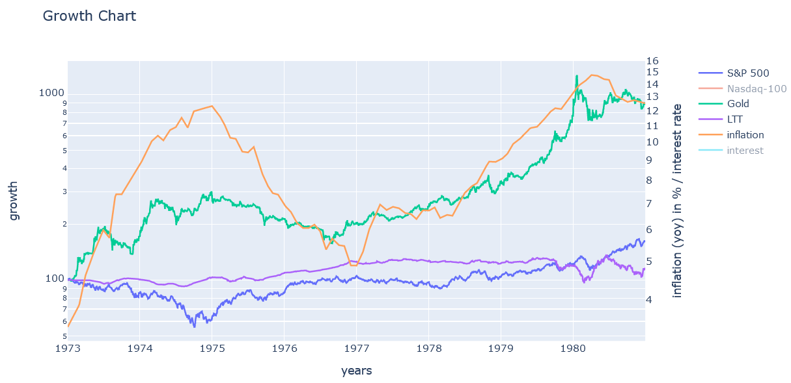

Schon im Januar 1973 startete der Aktienmarkt (S&P 500) langsam zu sinken, während die Inflation unaufhörlich stieg (von 3% auf 7%). Ab Oktober, als der Jom Kippur Krieg startete und die OPEC die Ölfördermenge reduzierte kam es zu einem ersten starken Absinken des Aktienmarktes um 16% bis Dezember 1973.

Im März 1984 sah es kurzzeitig so aus, als ob sich der Aktienmarkt erholen würde, doch brach der dann erneut um 35% ein. Vom letzten Allzeithoch war das dann ein Einbruch um insgesamt 44%. Innerhalb dieser Zeit erreicht die Inflation bis zu 12%. Als die Inflation wieder sank begann auch der Aktienmarkt sich zu erholen. Aber bei jeder noch so kleinen zwischenzeitlichen Erhöhung der Inflation brach er sofort wieder ein. Die Marktteilnehmer waren offensichtlich sehr nervös. Insgesamt dauerte es fast 4 Jahre, bis der Aktienmarkt wieder auf dem Niveau vor dem Kriese angelangt war. Interessant ist auch, dass die zweite Ölkrise im Jahr 1979 keinen großen negativen Effekt mehr auf den Aktienmarkt hatte.

In genau dieser Zeit bewegte sich Gold fast spiegelverkehrt zu den Aktien. In dieser Krise war es also der perfekte Hedge. LTTs hingegen liefen praktisch nur seitwärts oder sanken auch leicht ab, was mit der starken Zinserhöhung in dieser Zeit zusammenhängt. Die folgende Grafik stellt die LTTs im Vergleich zur Zinsrate dar:

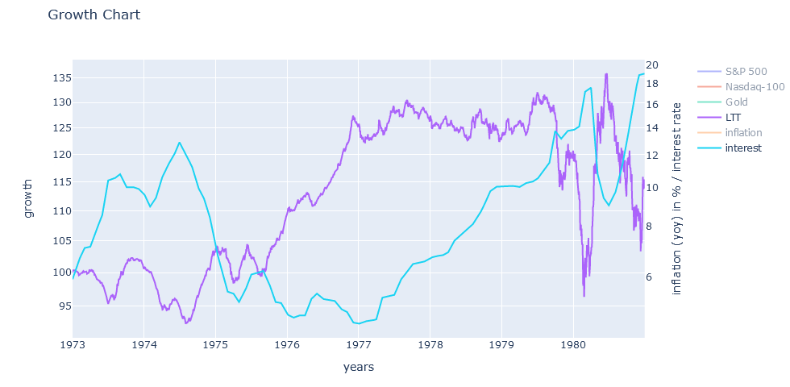

Wie wir sehen führen seichte Zinserhöhungen nicht zwangsläufig zu einem Einbruch der LTTs. Nur wenn die Zinsen stark und daher unerwartet angehoben werden, brechen die LTTs auch ein.

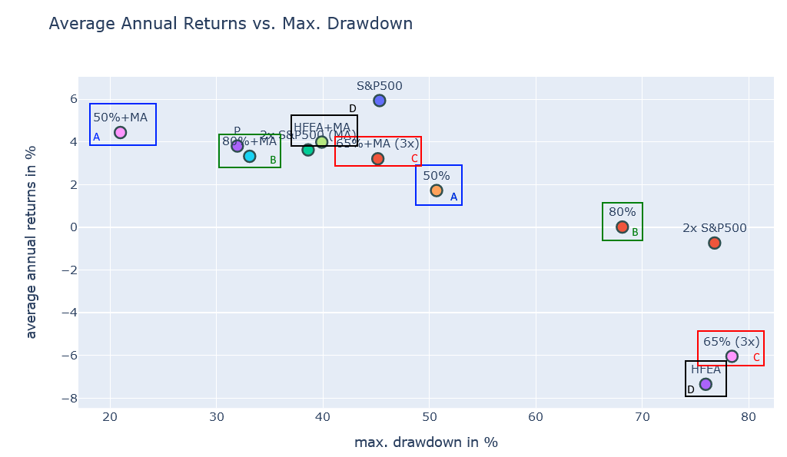

A) Details 50%: [https://paste.pics/f50859019f79ea1731bae432af711f97](https://paste.pics/f50859019f79ea1731bae432af711f97)

B) Details 80%: [https://paste.pics/4f64989b6533b8837576ea0437dcce22](https://paste.pics/4f64989b6533b8837576ea0437dcce22)

C) Details 65% (3x): [https://paste.pics/3c5fa60378db0e559e1e95ea3c8d3b4c](https://paste.pics/3c5fa60378db0e559e1e95ea3c8d3b4c)

D) Details HFEA: [https://paste.pics/ca9ab7171703d6a25835784243b5b553](https://paste.pics/ca9ab7171703d6a25835784243b5b553)

Der Einbruch zog sich über eine lange Zeit hin und war mit 44% beim S&P 500 sehr stark. Folglich verlor auch der 2x S&P 500 bis zu 75%. Der 2x S&P 500, **HFEA** und **65% (3x)** schaffen es innerhalb der 7 Jahre nicht ein positives CAGR zu erreichen. **80%** kommt immerhin auf ein CAGR von 0% und als einziges nicht MA-Portfolio ist das **50%** Portfolio mit einem CAGR von 1,8% profitabel.

Die MA-Varianten (ohne Gold) können hingegen ziemlich gute Gewinne aufweisen, auch wenn diese niedriger als das CAGR vom S&P 500 sind. **50%+MA** erreicht hinter S&P 500 das beste Ergebnis, kombiniert mit dem geringsten Risiko. **2x S&P 500 (MA)** ist in etwa ähnlich gut wie **HFEA+MA** und **80%+MA**.

Die Goldvarianten aller Portfolios erzielen eine wesentlich bessere Performance als die Varianten ohne Gold. **50%+G+MA** ist sogar da beste Portfolio mit einem CAGR von 7% und weniger als 20% Einbruch.

## 1987: Schwarzer Montag

Der genaue Grund für den Börsencrash am 19. Oktober 1987 ist ungewiss. Fakt ist, dass die Kurse in den Jahren zuvor sehr stark angestiegen waren. Ab August 1987 kam es dann zunehmend zu Gewinnmitnahmen großer Marktteilnehmer, weswegen die Kurse anfingen seitwärts zu laufen. Gleichzeitig stieg auch die Inflation stark an. Schon in der Nacht zum 19. Oktober gab es massive Verkaufswellen an den anderen Börsen in der Welt, die sich dann Panikartig an der US-Börse fortsetzte.

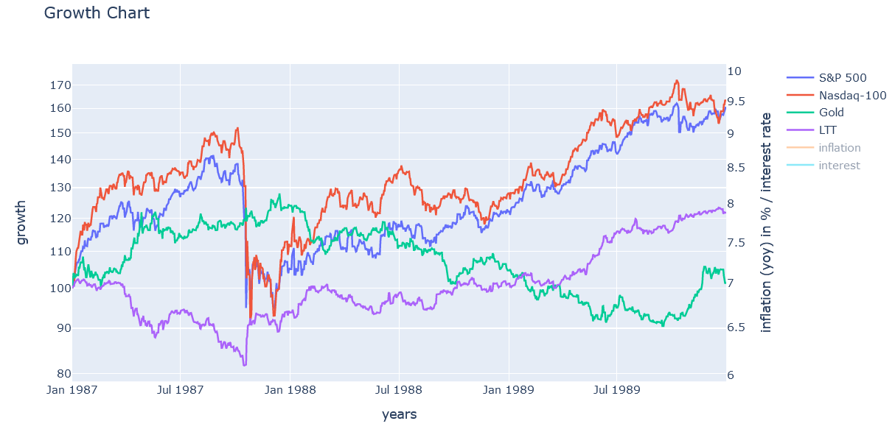

Wir sehen im S&P 500 einen starken Anstieg um über 40% in den ersten Monaten von 1987. Im August wird dann das Allzeithoch erreicht. Danach bricht der Kurs bis September um ca. 8% ein und erholt sich wieder leicht. Dann im Oktober kommt es zu einem massiven Einbruch um 30% innerhalb weniger Tage. Wenn man allerdings den Tiefpunkt im Oktober mit dem Jahresbeginn vergleicht, sind es nur -5%. Es war also bei weitem kein katastrophaler Einbruch.  Der Nasdaq-100 bewegt sich sehr ähnlich zum S&P 500, allerdings sind die Ausschläge nach oben etwas stärker und er erholt sich auch schneller wieder. Bis zu einem neuen Allzeithoch dauert es ca. 2 Jahre.

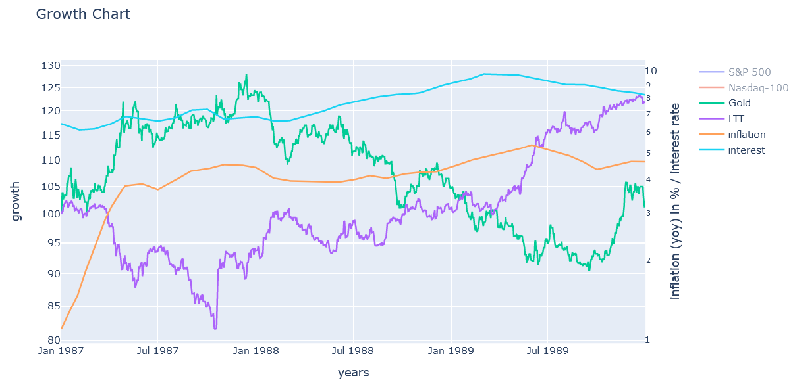

Die LTTs sind Anfang 1987 stark am Fallen, was an der damals sehr stark steigenden Inflation lag. Damit preisten die LTTs die Zinsanhebung ein. Die Inflation fängt sich dann auch ohne eine sofortige Zinsanhebung, wodurch die LTTs dann auch wieder ansteigen. Bei Gold verhält es sich exakt anders herum, erst stieg es und dann, als die Inflation nicht mehr weiterwuchs, fällt Gold wieder ab. Das zeigt sehr schön, dass Gold auch ein toller Hedge für LTTs ist.

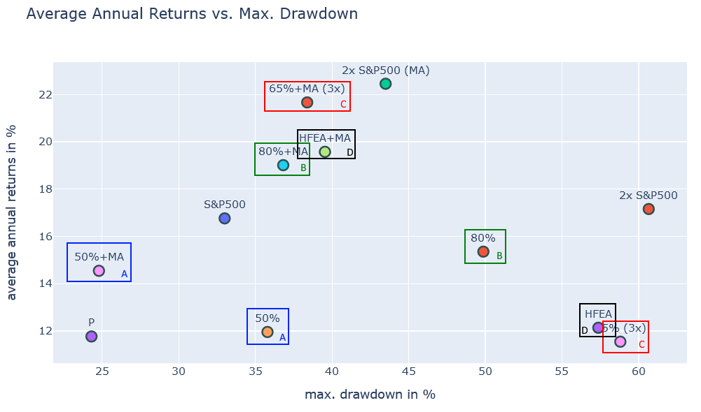

A) Details 50%: [https://paste.pics/56e56be6622bc8d8d90dd556d56ce810](https://paste.pics/56e56be6622bc8d8d90dd556d56ce810)

B) Details 80%: [https://paste.pics/312957d7f4d01f58c1d7b81756356b8c](https://paste.pics/312957d7f4d01f58c1d7b81756356b8c)

C) Details 65% (3x): [https://paste.pics/67c84cc781f328a84d48d6d74717e224](https://paste.pics/67c84cc781f328a84d48d6d74717e224)

D) Details HFEA: [https://paste.pics/1106939d4e13091e11f7d69ad06af478](https://paste.pics/1106939d4e13091e11f7d69ad06af478)

Keines der nicht MA-Varianten war in der Lage, innerhalb der 3 Jahre, eine S&P 500 Buy and Hold Strategie zu übertrumpfen. Der Hedge konnte aufgrund der Kürze des Einbruchs einfach nicht vollständig seinen Wert ausspielen. Lediglich die MA-Varianten erreichen ein höheres CAGR, allerdings hatten sie dann auch ein höheres Risiko.

Das beste Portfolio ist hier mal wieder das **2x S&P 500 (MA)**, gefolgt vom **80%+MA**, **HFEA+MA** und **65%+MA (3x)** Portfolio. Das beste nicht MA-Portfolio ist 80%, welches immerhin noch ein CAGR von 15,3% erreicht. Auch an diesem hohen CAGR erkennt man, dass es eigentlich keine wirkliche Krise war.

In den nicht MA-Varianten erhöht Nasdaq-100 das CAGR bei mehr oder weniger gleichbleibenden Risiko, während Gold das Risiko reduziert, aber auch deutlich das CAGR. Bei den MA-Varianten ist die ohne Nasdaq-100 und Gold tatsächlich durchgängig die beste.

## 1990: Der zweite Golfkrieg

Ein verrückter Diktator greift das Nachbarland an? Hört sich bekannt an? Tja, die ganze Weltgeschichte ist voller solcher Ereignisse und so passierte es auch 1990 im Irak. Saddam Hussein marschiert in Kuwait ein und annektiert den Stadtstaat. Da er im Gegensatz zu Legrein keine Atomwaffen besaß formierte sich sehr schnell eine Koalition unter der Führung der USA, welche den Irak aus Kuwait zurückdrängte.

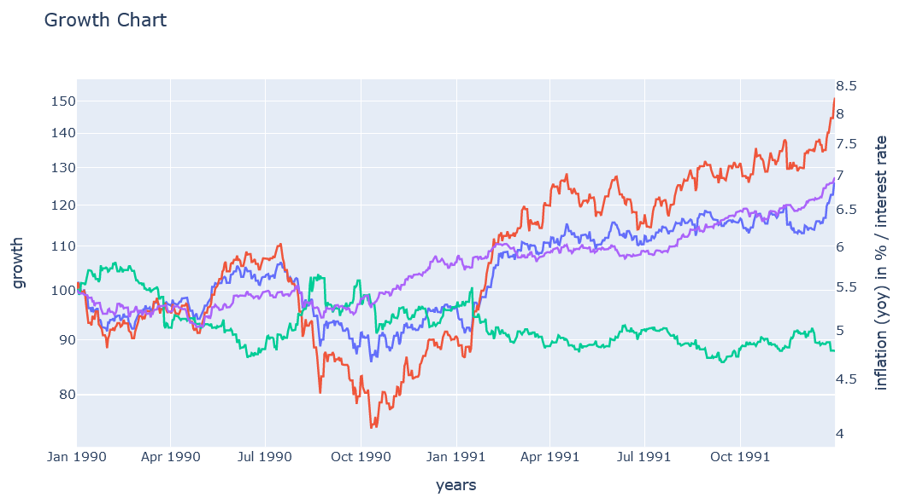

Im Juli 1990 erreichte der Aktienmarkt ein neues Hoch. Danach fiel der Kurs schon ziemlich heftig ab, was aber noch vor den ersten Angriffen des Iraks im August 1990 war. Es scheint fast so, als ob der Markt den Angriff einpreisen würde. Nach dem Angriff fiel der Kurs noch einmal massiv und erreicht im Oktober 1990 ein Tief von -20% im S&P 500 gegenüber dem letzten Hoch.

Allerdings erholt sich der Aktienmarkt noch bevor die US-Koalition geformt wurde und bricht dann im Januar noch einmal leicht ein, als die Koalition ihre Angriffe startete. Die schnellen militärischen Erfolge gegen den Irak führten dann aber auch wieder zu einer raschen Erholung.  Noch im Januar, ist der S&P 500 wieder Brechgleich mit dem Wert, den er ein Jahr zuvor hatte. Es folgt in den Jahren danach eine Phase des Wachstums am Aktienmarkt.

Während die Aktien fallen steigt gleichzeitig Gold an und als klar wurde, dass das Eingreifen der westlichen Koalition auch innerhalb der arabischen Welt gewünscht wurde und somit keine negative Reaktion der OPEC zu befürchten ist, sank der Goldpreis dann wieder ab. Die LTTs wachsen sie ganze Zeit unbeeindruckt von der Weltpolitik weiter an und stellen damit auch einen schönen Hedge dar. Im Übrigen sank ab 1991 die Inflation und auch gleichzeitig die Zinsrate.

A) Details 50%: [https://paste.pics/19b1a373079b17c036293c84e4252dde](https://paste.pics/19b1a373079b17c036293c84e4252dde)

B) Details 80%: [https://paste.pics/646414ea3e341147a5563afbd50f95c7](https://paste.pics/646414ea3e341147a5563afbd50f95c7)

C) Details 65% (3x): [https://paste.pics/4cb6496730846a04c9f2e6e2baa792ca](https://paste.pics/4cb6496730846a04c9f2e6e2baa792ca)

D) Details HFEA: [https://paste.pics/3e69db5aba926b9dbaade21e4148e332](https://paste.pics/3e69db5aba926b9dbaade21e4148e332)

Wir sehen sofort, dass die MA-Varianten innerhalb dieses Zeitraums deutlich schlechter abschneiden als die nicht MA-Varianten. Das **50%** Portfolio erreicht das CAGR vom S&P 500 Buy and Hold und das **80%** Portfolio das CAGR vom 2x S&P 500 Buy and Hold. Das beste Portfolio ist hier **HFEA** oder **65% (3x)**. Das schlechteste Portfolio ist **2x S&P 500 (MA)**, welches aber immerhin noch ein kleines positives CAGR erreicht. Im Vergleich zum **80%** Portfolio ist hier der Einbruch jedoch deutlich höher.

Das Hinzufügen von Nasdaq-100 ins Portfolio erhöht bei dieser Krise das CAGR, aber auch das Risiko. Gold wirkt sich hier eher negativ aus.

## 2000: Dot-Com Blase

In den Jahren vor der Jahrtausendwende wurde alles aus Tech gemacht. Man musste nur ein .com hinter seinen Firmennamen schreiben und schon war eine hohe Bewertung an der Börse garantiert. Anfang 2000 fingen sich einige Investoren an zu fragen, ob diese ganzen Tech-Unternehmen überhaupt rentabel sind und schauten sich die Ernten mal etwas genauer an. Dabei stellten sie fest, dass sehr viele hoch bewerte Firmen eigentlich kein tragfähiges Geschäftsmodell vorzuweisen haben.

Als dann auch noch mehr und mehr solcher Firmen Insolvenz anmelden mussten, sank das Vertrauen der Investoren in überbewertete Tech-Firmen und so begann auch der Aktienmarkt immer weiter zu sinken, weil große Mengen Geld abgezogen wurden. Nach über 5 Jahren saure Kirschen am Aktienmarkt waren dann allerdings viele Tech-Firmen gnadenlos unterbewertet. Auch begann die FED die Zinsen weiter zu sinken, so dass langsam aber sicher Geld zurück in den Aktienmarkt floss. Dann allerdings vor allen in typische Value-Unternehmen und natürlich auch im großen Stil in Immobilien.

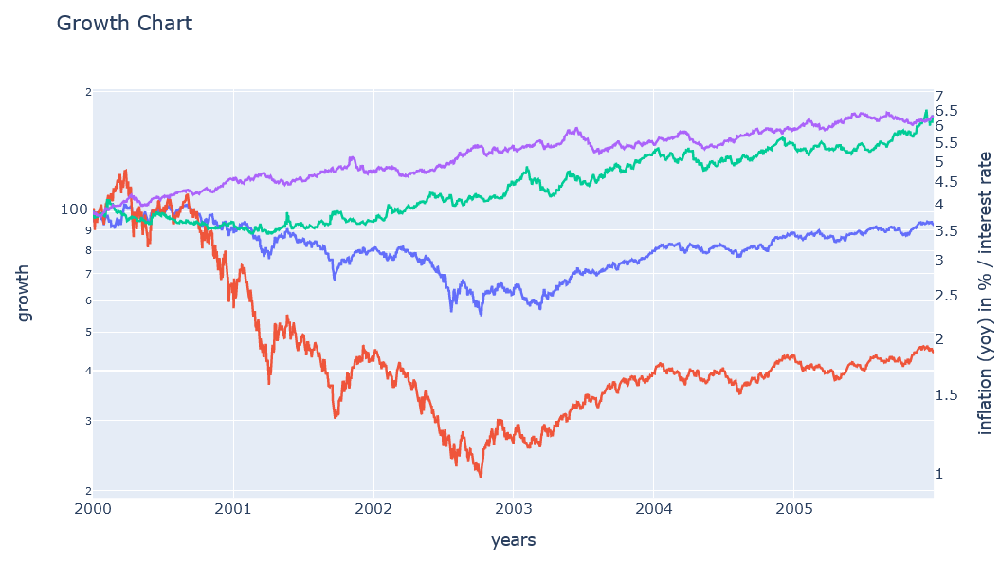

Das war ein sehr langer und langsamer Crash. Der S&P 500 starte schon Anfang 2000 einfach nur noch Seitwärts zu laufen, nachdem er im März noch einen letzten Höherpunkt erreicht hatte. Ab September sank er dann immer stärker ab. Es gab mehrere Anläufe zur Erholung aber alle scheiterten letztendlich. Im März 2001 und im September 2001 (wahrscheinlich wegen 9/11) sank der Aktienmarkt massiv ab. Das Minimum wurde aber erst im Oktober 2002 mit – 48% vom letzten Hoch erreicht. Danach ging der S&P 500 bis Mai 2003 seitwärts und erholte sich dann über viele Jahre hinweg. Selbst 2005 hatte er das letzte Hoch noch nicht erreicht.

Der Nasdaq-100 begann bereits im März 2000 massiv abzusinken und erreicht sein Minimum ebenfalls im Oktober 2002 mit -83%. Stellt euch mal vor, ihr habt 100k im Nasdaq angelegt und dürft ihm dann 3 Jahre lang zusehen wie er immer weiter sinkt. Ich möchte nicht wissen, was in so einer Situation in unserem Daily abgehen würde.

Nach über 20 Jahren ging endlich auch wieder Gold nach oben. Durch die Zinssenkungen der FED stiegen die LTTs ebenfalls langsam aber stetig an.

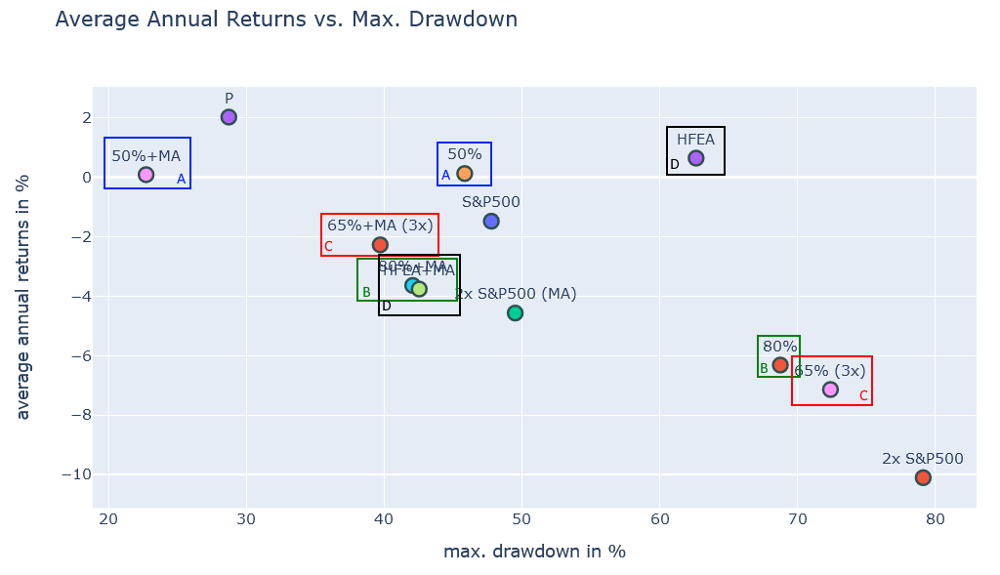

A) Details 50%: [https://paste.pics/43bfe4ed7511e0acb2b5ef1507010570](https://paste.pics/43bfe4ed7511e0acb2b5ef1507010570)

B) Details 80%: [https://paste.pics/d52f9be5f19e09115aa427f785bc309f](https://paste.pics/d52f9be5f19e09115aa427f785bc309f)

C) Details 65% (3x): [https://paste.pics/bb321f1c99c547846951eadc296b014a](https://paste.pics/bb321f1c99c547846951eadc296b014a)

D) Details HFEA: [https://paste.pics/a27913cecc2f8e1d2c7edc447e6e54f9](https://paste.pics/a27913cecc2f8e1d2c7edc447e6e54f9)

Diese Krise war vor allem eine heftige Aktienkrise, wodurch besonders Portfolios mit hoher Aktienallokation leiden. Lediglich **HFEA** und die **50%** Portfolios schaffen es überhaupt ein positives CAGR zu erreichen. Pro Jahr weniger als 1% Rendite zu erreichen, und dass über 5 Jahre hinweg ist schon ziemlich bitter.

Mit der MA-Strategie kann zumindest das CAGR erhöht und das Risiko verringert werden (außer bei **HFEA+MA**), dennoch erreicht kein MA Portfolio (bis auf **50%+MA**) ein positives CAGR. Ein Anteil von Nasdaq-100 verschlimmert die Situation nur und auch Gold scheint hier wenig zu helfen.

## 2007: Finanzkrise

Durch den großen Vertrauensverlust in Aktien und das Absenken der Zinsen seit dem Jahr 2000 ist in den USA viel Geld in Immobilien geflossen. Dies führte schlussendlich zu einer gewaltigen Blase am Immobilienmarkt. Im Jahr 2007 begann das Vertrauen in immer weiter steigende Immobilienpreise langsam zu schwinden. Dies führte dann auch dazu, dass viele riskante Immobilienkredite hinterfragt wurden und so schwand das Vertrauen in die Gläubiger und sogar in Banken, welche besonders viele solcher Kredite herausgegeben hatten. Als dann 2008 die Bank Lehman Brothers vor dem aus Stand brach der Aktienmarkt vollständig ein.

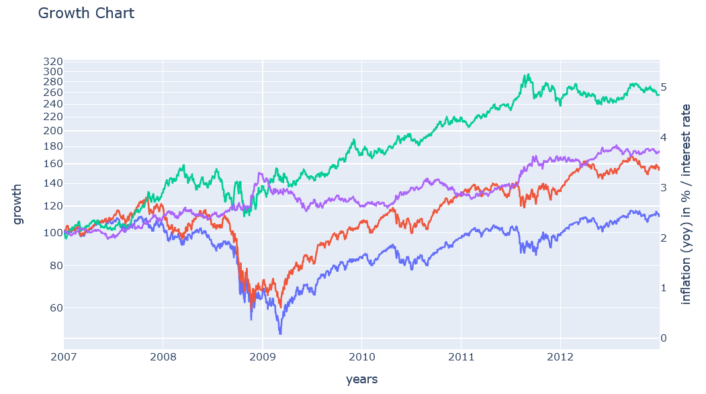

Das letzte Hoch im S&P 500 gab es im Oktober 2007. Allerdings war das auch nur noch eine kleine Verbesserung gegenüber dem vorherigen Hoch im Juli 2007. Man könnte sagen, dass der Aktienmarkt zu dieser Zeit eigentlich schon Seitwärts lief. Ab Oktober fing der Markt an immer tiefer zu fallen. Es gab zwar immer wieder zwischenzeitliche Erholungen, aber der Abwärtstrend konnte nicht gestoppt werden.

Als Lehman Brothers Pleite ging, gab es dann den endgültigen großen Crash. Auch gab es mehrere Versuche die Situation zu retten und im Januar 2009 gab es sogar mal ein lokales Hoch, aber der Boden wurde erst im Mai 2009 mit -55% gegenüber dem letzten Hoch erreicht. Damit zog sich der Crash insgesamt 2 Jahre hin, bevor die endgültige Erholung startete.

Die Erholung selbst war auch nicht besonders schnell, so dass erst im März 2012 wieder das Hoch von Oktober 2007 erreicht werden konnte. Das sind 5 Jahre „verlorene Zeit“ für alle Buy and Hold Investoren. Der Nasdaq-100 verhielt sich gegenüber S&P 500 relativ ähnlich, allerdings erholte er sich deutlich schneller. Das war vermutlich der erste Hinweis darauf, dass die Dot-Com Bubble nun endlich vorbei ist und Technologiewerte in den kommenden 10 Jahren wieder stark an Wert gewinnen werden.

Gold ist in all dieser Zeit stark gewachsen. Im März 2009 gab es aber auch hier einen Rücksetzer, der jedoch schnell wieder aufgeholt wurde. LTTs zeigten hingegen keinen richtigen Crash und als absehbar war, dass die Zinsen sinken werden, stiegen sie sogar zeitweise sehr stark an.

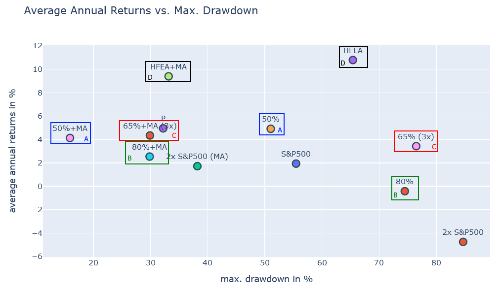

A) Details 50%: [https://paste.pics/7524355a1c5ea1a92191c43957ac176f](https://paste.pics/7524355a1c5ea1a92191c43957ac176f)

B) Details 80%: [https://paste.pics/3b78a0091513ceef939f0139fe583197](https://paste.pics/3b78a0091513ceef939f0139fe583197)

C) Details 65% (3x): [https://paste.pics/623c69b5ef16b3b92eff4176d0f4257b](https://paste.pics/623c69b5ef16b3b92eff4176d0f4257b)

D) Details HFEA: [https://paste.pics/77408279c47a64c6d8c938fa99c17b34](https://paste.pics/77408279c47a64c6d8c938fa99c17b34)

Das **80%** und 2x S&P 500 Portfolio haben ein negatives CAGR, was bedeutet, dass es diese 6 Jahre lang nicht geschafft haben Brechgleich zu erreichen. **HFEA** ist in dieser Krise der klare Gewinner, was daran liegt, dass Aktien und Anleihen sehr gut unkorreliert waren. Die anderen Portfolios halten sich eher im Mittelfeld auf und unterscheiden sich eigentlich nur wirklich beim Risiko.

Das risikoärmste nicht-MA Portfolio ist **50%** und in der MA Variante haben wir hier sogar nur einen Einbruch von unter 20% als Risiko. Das Hinzufügen von Gold bringt nicht bei allen Portfolios einen Vorteil in dieser Krise. Dagegen ist ein kleiner Nasdaq-100 Anteil durchaus Hilfreich, was an der schnellen Erholung des Nasdaq-100 nach 2009 liegt.

## 2020: Corona-Pandemie

Anfang Januar häuften sich die Fälle von Coronaausbrüchen in China. Über mehrere Wochen hinweg schien es sich um ein Problem zu handeln, welches lediglich auf den asiatischen Raum konzentriert ist. Die Reaktion der Chinesischen Regierung war beispiellos: Man riegelte ganze Großstädte ab und baute im Eilverfahren ganze Kliniken auf um die kranken Menschen versorgen zu können. Zu diesem Zeitpunkt waren die Auswirkungen auf die Lieferketten innerhalb der Firmen schon deutlich spürbar, doch für die westlichen Gesellschaften war es undenkbar, dass es ähnlich einschneidende Maßnahmen in Europa oder den USA geben könne.

Als dann nach der Wintersportsaison die ersten großen Coronaausbrüche in Europa auftrat und man Videos sehen konnte, auf denen italienische Militärtransporter massenweise Särge in ein Krematorium brachten, wurde auch uns klar, dass wir es mit einer außerordentlichen Situation zu tun haben. Es folgte in Europa und den USA ein gewaltiger Lockdown, der nur Wochen zuvor undenkbar gewesen wäre: abgesperrte Spielplätze, Zutrittsbeschränkungen für Supermärkte und Ausgangssperren.

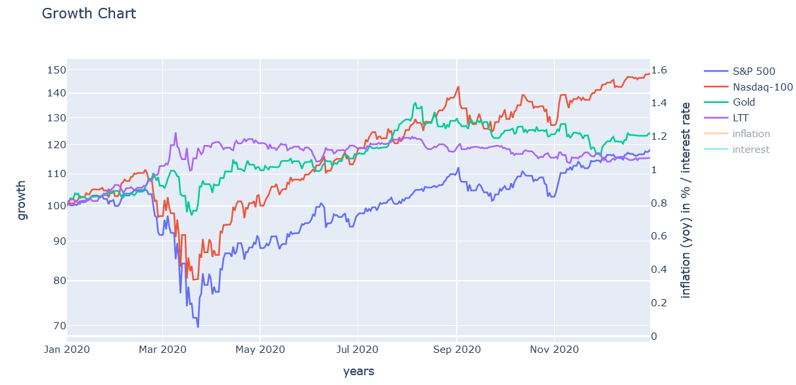

Am 19. Februar 2020 gab es das letzte Hoch im S&P 500. Kurz darauf stürzte der Kurs innerhalb weniger Tage komplett ab und erreichte am 23. März 2020 seinen Tiefpunkt mit -34%. Allerdings kam es, dank vieler Hilfspakete, zu einer sehr raschen Erholung und bereits im August 2020 wurde ein neues Allzeithoch erreicht. Der Nasdaq-100 erholte sich sogar noch schneller und erreicht schon im Juni ein neues Allzeithoch. Generell profitierten Tech-Werte in dieser Krise außerordentlich gut.

Gold fiel im März kurz und erholte sich ebenfalls schnell. Aber die starken Wertsteigerungen von Gold aus den letzten Jahren sind hier nun endgültig vorbei. Auch die Anleihen laufen nach einem kurzen Anstieg im März eher seitwärts. Eventuell wurde hier schon die Wahrscheinlichkeit zukünftiger Zinssteigerungen aufgrund von Inflation eingepreist.

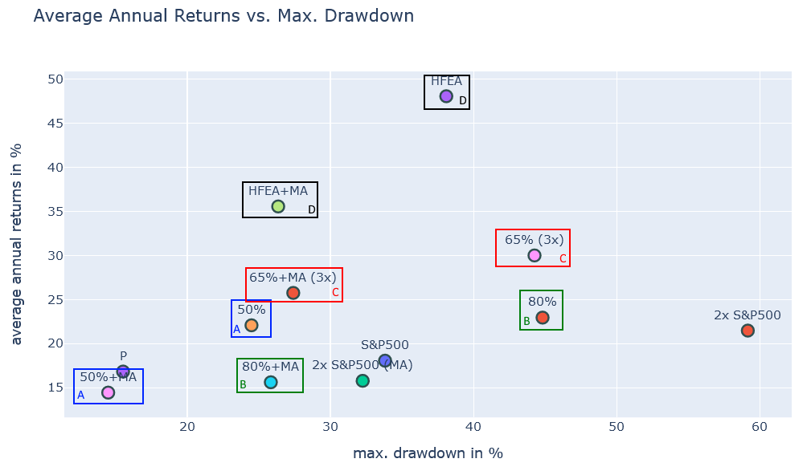

A) Details 50%: [https://paste.pics/aa3c3eca469b4bdd54cfd0558040e321](https://paste.pics/aa3c3eca469b4bdd54cfd0558040e321)

B) Details 80%: [https://paste.pics/67207664f623db678a8925878d618417](https://paste.pics/67207664f623db678a8925878d618417)

C) Details 65% (3x): [https://paste.pics/a05f8c4b3baebfd14552dd2fd2b88e49](https://paste.pics/a05f8c4b3baebfd14552dd2fd2b88e49)

D) Details HFEA: [https://paste.pics/59eb5c37c5239079954983ab9e5ad917](https://paste.pics/59eb5c37c5239079954983ab9e5ad917)

Wir können in dieser Grafik ganz deutlich erkennen, dass dies keine Aktienmarktkrise war. Ja, es gab einen kurzzeitigen Einbruch durch Panikverkäufe, aber davon abgesehen hat jedes Portfolio im Jahr 2020 einen richtig guten Gewinn abgeworfen. Selbst der 2x S&P 500 erreicht über 20% Gewinn, trotz Pfadabhängigkeit. Das beste Portfolio war **HFEA** und mit viel Abstand dazu **65% (3x)**. Die **80%** und **50%** Portfolios sind nahezu gleichauf.

Deutlich schlechter haben die MA-Portfolios abgeschnitten. Der Einbruch an der Börse war nur so kurz, dass man nicht durch einen Verkauf beim Unterschreiten des Moving Average Wertes profitieren konnte. In jedem Fall wäre es besser gewesen durch die Krise hindurch alle Werte im Portfolio zu halten.

Wie zu erwarten scheiden die Portfolios mit einem Anteil Nasdaq-100 besser ab als die Basisportfolios. Gold hingegen kann die Performance nicht verbessern und wirkt sich zum Teil sogar deutlich negativ aus.

## Fazit

Wir sehen, dass sich die Portfolios bei jeder Krise sehr unterschiedlich verhalten. Mal ist ein aktienstarkes Portfolio ganz vorn dabei und mal eher ein goldlastiges Portfolio. Mal erholt sich der Nasdaq-100 viel stärker als der S&P 500 und mal fährt man mit einer Buy and Hold Strategie am besten. Es ist damit offensichtlich, dass es „das beste Portfolio“ nicht gibt!

Im Bezug auf die aktuelle Börsensituation würde ich es als relativ wahrscheinlich halten, dass wir in den kommenden Jahren eher eine Situation wie die Ölkrise erleben werden. Durch die neue Corona-Welle in China und durch den Krieg und die daraus resultierenden Sanktionen wird die ohnehin schon schwierige Situation zur Beschaffung von Rohstoffen und Bauteilen nur schlimmer. Die Lieferengpässe, welche ja der Haupttreiber für die aktuelle Inflation sind werden zunehmen. Die Inflation wird vermutlich schlimmer werden, vor allem in Europa und vor allem weil die EZB aufgrund der hohen Verschuldung einiger Staaten zu lange zögern wird die Zinsen anzuziehen.

Bei einem Einstieg in HFEA oder ähnliche Portfolios, würde ich daher ein Portfolio wählen, welches in den 70er Jahren gute Performance erreichen konnte. Später, falls die Inflation wieder abflaut und sich zeigt, dass Tech-Werte weiterhin begehrt sind, kann der Goldanteil dann in Richtung Nasdaq-100 verschoben werden.

Hier habe ich noch einmal alle Krisen mit ihren Kennzahlen zusammengefasst:

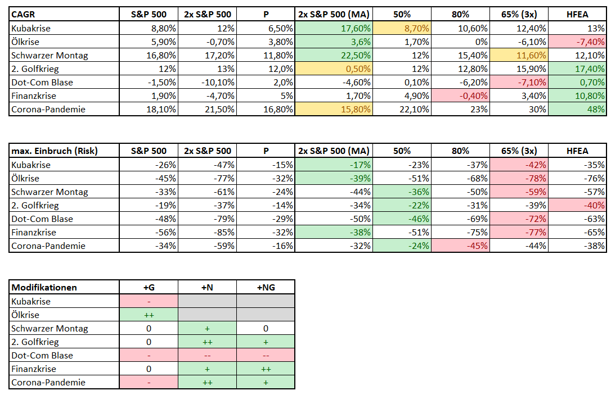

Das jeweils beste Portfolio ist grün hervorgehoben. Das jeweils schlechteste entweder rot oder gelb, falls das CAGR dennoch positiv war. Hier stechen zwei Portfolios deutlich hervor: **2x S&P 500 (MA)** sowie **HFEA**. Das **2x S&P 500 (MA)** Portfolio war vor allem in den frühen Krisen der Gewinner. Später ab dem 2. Golfkrieg eher der Verlierer, aber zumindest erreichte dieses Portfolio nur ein einiges Mal während der Dot-Com Blase ein negatives CAGR. Auch beim Risiko schnitt dieses Portfolio ziemlich gut ab.

**HFEA** punktete dagegen zuverlässig bei den Krisen ab dem 2. Golfkrieg. Dafür war der maximale Einbruch auch deutlich höher. Mit dem **50%** Portfolio ist man ziemlich risikoarm aufgestellt, dafür gewinnt man in einer Krise auch nicht allzu oft. Zumindest gab es hier aber gar keine Krise mit negativem CAGR. Das **80%** Portfolio liegt im Mittelfeld, mit relativ gutem CAGR aber auch hohem Risiko. Das **65% (3x)** Portfolio ist dagegen beim Risiko deutlich das Schlusslicht, und dass ohne einen großen Vorteil beim CAGR während der jeweiligen Krisen. Hinzu kommt hier auch noch das Emittentenrisiko, welches sich nicht modellieren lässt. Ich würde also persönlich von diesem Portfolio absehen.

Gold als Modifikation hat sich nur während der Ölkrise bewährt. Deutlich häufiger positiv wirkte dich Nasdaq-100 aus.

Wie immer findet ihr alle Daten und Analysen im Repository \[1\].

## Fragen

Ich habe das für euch mal simuliert und stelle es hier im Vergleich zu HFEA und den anderen Standardportfolios dar:

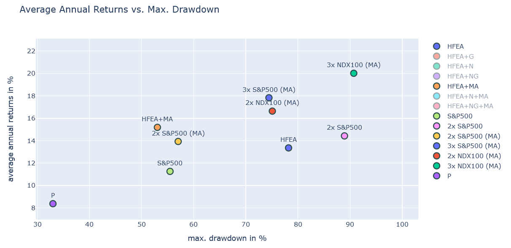

Wie man sieht kann sowohl **2x Nasdaq-100 (MA)**, als auch **3x S&P 500 (MA)** sowie **3x Nasdaq-100 (MA)**, trotz Steuerabzug, ein deutliche besseres CAGR erreichen. Allerdings ist auch das Risiko deutlich höher. **2x Nasdaq-100 (MA)** und **3x S&P 500 (MA)** liegen dabei in der Risikoregion wie das Original **HFEA** aber mit einem bis zu 4,5% höherem CAGR.

Allerdings darf man auch nicht vergessen: 3x S&P 500 in Europa bringt ein zusätzliches Emittentenrisiko mit und 2x Nasdaq-100 ist zwar ein ETF, aber es sind nur relativ wenige Werte in dem ETF vertreten. Falls aus irgendeinem Grund plötzlich Tech total fik ist, kann die Performance hier sehr schnell in den Keller gehen.

## Quellen

\[1\] [https://code.launchpad.net/zgea](https://code.launchpad.net/zgea)
