# Fazit

_(Anmerkung von Finanzflunder: Auch wenn in diesem Teil exemplarische WKNs genannt werden gilt weiterhin: KEINE ANLAGEBERATUNG!!!)_

**ZL;NG**

* *HFEA ist in Deutschland nur sehr bedingt möglich.*
* *Hier bietet sich als Ersatz eher die 2x S&P 500 (MA) Strategie an.*
* *Falls man die nicht möchte, kann man je nach persönlichen Risikoprofil und Broker eine der Ersatzstrategien wählen.*
* *Nutzt man einen Sparplan, so hat man tatsächlich eine gute Möglichkeit innerhalb von 15 Jahren ein kleines Vermögen damit aufzubauen.*
* *Dies war der letzte Teil der Serie, ich hoffe ihr hattet euren Spaß und habt was gelernt!*

Liebe Schwestern und Brüder der Mauerstraße,

heute erreichen wir das Ende unserer Abenteuerreise. Wir haben zusammen nach Daten gesucht, Bondfunds und gehebelte ETFs simuliert, Korrelationen berechnet und haufenweise Portfoliosimulationen durchgeführt. Nun ist es Zeit unsere Ergebnisse zusammenzufassen und ein Fazit zu ziehen.

## Ist HFEA in Deutschland möglich?

Leider haben unsere Simulationen ganz deutlich gezeigt, dass jeglicher Versuch HFEA in Deutschland nachzustellen, sei es durch die Verwendung von 3x gehebelten ETNs oder durch die Verwendung eines höheren Aktienanteils, schlechtere Ergebnisse liefert als die originale HFEA-Strategie mit **UPRO** und **TMF**. **65%** 2x S&P 500 zusammen mit 35% 1x LTT zu halten brachte schließlich, nach Berücksichtigung der Steuern, keinen nennenswerten Vorteil gegenüber einer einfachen Buy and Hold Strategie mit 1x S&P 500. Warum sollte man sich diesen Stress dann machen?

Erst ab **80%** 2x S&P 500 erreichten die gemittelten jährlichen Gewinne langsam die Region die man von HFEA erwarten würde. Und unser Portfolio mit **65% 3x** S&P 500 ETNs sowie 35% 3x ITT ETNs kommt zwar noch näher an HFEA heran, aber besitzt ein nicht zu unterschätzendes und mathematisch nicht modellierbares Emittentenrisiko, welches HFEA nicht hat.

Dennoch haben all diese Portfolio für sich gesehen eine Daseinsberechtigung, da sie immerhin ein höheres CAGR erreichen als S&P 500 Buy and Hold. Und das **50% Portfolio** mit 50% 2x S&P 500 und 50% 1x LTT erreicht zwar nur knapp ein CAGR von 10%, ist dafür aber deutlich Risikoärmer als eine Buy and Hold Strategie.

Möchte man jedoch das Maximum an CAGR herausholen, kommt man um ein Depot bei einer Bank, welche US ETFs besitzt nicht drum herum. Hier bietet sich FlatEx an, bei denen man US ETFs wie UPRO und TMF direkt kaufen kann (mit relativ hohen Gebühren) oder IBKR, über welche man Puts auf UPRO und TMF verkaufen kann, die einen bei einer Zuweisung dann jeweils 100 Anteile des ETFs ins Portfolio bringen. Bei einer guten Auswahl des Strike-Preises, bekommt man sogar noch eine kleine Prämie gezahlt, anstatt dass man selbst Ordergebühren zahlen muss.

Für diejenigen die ausschließlich in europäische ETFs investieren wollen, stellt die **2x S&P 500 (MA)** Strategie eine interessante Alternative dar, bei der alle Anteile vom 2x S&P 500 verkauft werden, sobald der Kurs unter dem 200 SMA (Simple Moving Average) schließt und wieder zurückkauft werden, wenn der Kurs über dem 200 SMA schließt. Damit kann langfristig ein höheres CAGR als mit HFEA erreicht werden, allerdings vertraut man damit auf einen Effekt, der sich nicht durch makroökonomische Theorien erklären lässt.

Wir sehen also, dass es das perfekte Portfolio nicht gibt, sondern höchstens eine Menge an Ideen, die jeder nach persönlichem Geschmack verfolgen kann oder eben auch nicht.

## Welches Portfolio passt zu mir am besten?

Um die Entscheidung für das persönlich beste Portfolio zu vereinfachen, habe ich eine kleine Grafik erstellt. Beantwortet einfach die Fragen in der Grafik und schon bekommt ihr eure individuelle Antwort:

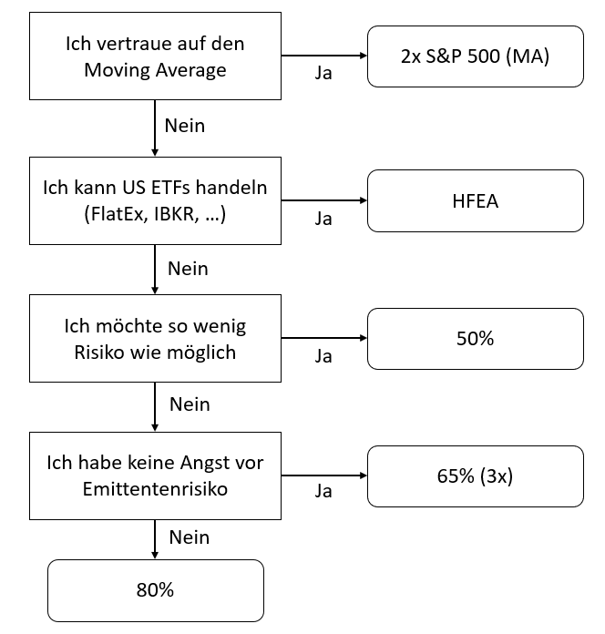

Nachdem ihr euch auf diese Weise für ein Basisportfolio entschieden habt, könnt ihr mit den folgenden Fragen schauen, ob ihr vielleicht eine Modifikation anwenden wollt:

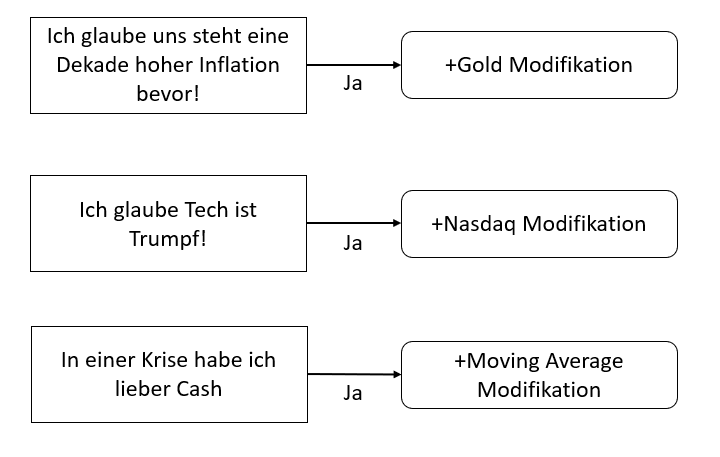

Bedenkt bei der Moving Average Modifikation, dass diese mit einem gewissen täglichen Aufwand einher geht, da ihr jeden Tag überprüfen müsst, ob der Moving Average von euren Basiswerten unterschritten wurde. Belohnt werdet ihr dann jedoch durch eine deutlich risikoärmere Variante, zumindest dann, wenn ihr auf den Moving Average vertraut, also technischer Analyse gegenüber aufgeschlossen seid.

&#x200B;

## Kannst du uns noch einmal alle Portfolios erklären?

Jetzt habt ihr euch also für ein Portfolio und eventuell sogar für eine Modifikation entschieden. Schauen wir uns also der Reihe nach alle Portfolios im Detail an und wie diese umgesetzt werden können.

## 50% Portfolio

Das **50% Portfolio** ist ein heißer Kandidat für alle r/Finanzen Freunde. Es ist das einzige Portfolio in der Liste, welches es nicht schafft den S&P 500 in einer Buy and Hold Strategie auszuperformen. Dafür weist es aber ein verringertes Risiko auf. In einer Buy and Hold Strategie kann der S&P 500 während einer Krise schon einmal 56%-57% verloren. Das **50% Portfolio** verliert hingegen nur 52% und in der MA Modifikation ist sogar nur ein Verlust von unter 30% möglich.

Es wird hier ein vierteljährliches Rebalancing durchgeführt. Wann genau ihr das Rebalancing macht ist euch selbst überlassen. Als ETFs bieten sich die folgenden Kandidaten an:

* 2x S&P 500: XTRACKERS S&P 500 2X LEVERAGED DAILY SWAP UCITS ETF (**WKN: DBX0B5**)
* 1x LTT: iShares $ Treasury Bond 20+yr UCITS ETF - USD ACC (**WKN: A2JKTZ**)
* 1x Gold: Xetra-Gold ETC (**WKN: A0S9GB**)
* 2x Nasdaq-100: Lyxor Nasdaq-100 Daily (2x) Leveraged UCITS ETF (**WKN: A0LC12**)

Es gibt aber auch Alternativen. Beispielsweise gibt es einige unter uns, die statt einem 2x S&P 500 ETF lieber den Amundi ETF Leveraged MSCI USA Daily (**WKN: A0X8ZS**) wählen, weil dieser etwas günstiger ist. Auch bei Gold gibt es sicher mehrere Möglichkeiten. Für LTTs und 2x Nasdaq-100 gibt es leider keine Alternativen, was vor allem beim Nasdaq-100 problematisch ist, da dieser sehr teuer ist (über 700€ aktuell).

## 80% Portfolio

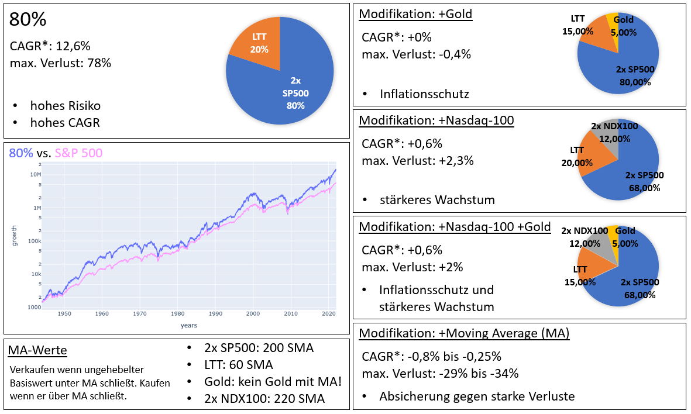

Dieses Portfolio eignet sich für die risikofreudigen unter uns. Mit **80%** 2x S&P 500 ist es sehr aktienlastig und der Hedge-Effekt von den Treasury Bonds kommt nur am Rande zum Tragen. Dafür haben wir mit einem CAGR von 12,6% eine ziemlich gute Rendite und performen damit deutlich besser als S&P 500 Buy and Hold. Mit einem maximalen Verlust von 78% ist das Risiko schon ordentlich, wenn auch in derselben Region wie bei HFEA.

Auch hier wird das Rebalancing vierteljährlich durchgeführt und als ETFs bieten sich wieder die gleichen Wertpapiere an:

* 2x S&P 500: XTRACKERS S&P 500 2X LEVERAGED DAILY SWAP UCITS ETF (**WKN: DBX0B5**)
* 1x LTT: iShares $ Treasury Bond 20+yr UCITS ETF - USD ACC (**WKN: A2JKTZ**)
* 1x Gold: Xetra-Gold ETC (**WKN: A0S9GB**)
* 2x Nasdaq-100: Lyxor Nasdaq-100 Daily (2x) Leveraged UCITS ETF (**WKN: A0LC12**)

Natürlich stehen hier ebenfalls die alternativen ETFs vom 50% Portfolio zur Verfügung.

## 65% (3x) Portfolio

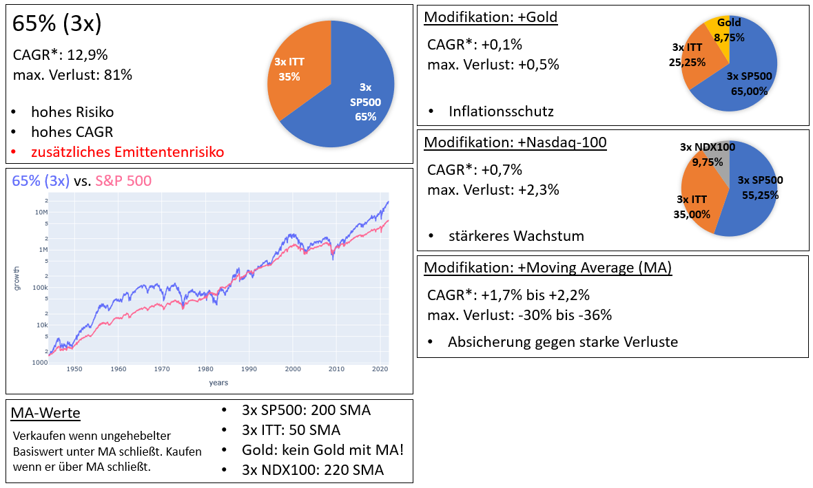

Dieses Portfolio ist für die Zocker unter uns. Mit dem größten CAGR der europäischen HFEA-Varianten steht es gar nicht mal so schlecht da, aber dafür ist das der maximale Verlust etwas höher als beim originalen HFEA. Zusätzlich kommt ein nicht zu unterschätzendes Emittentenrisiko. Wenn Weisheitsbaum als Emittent pleitegeht, ist es fraglich, ob ihr noch etwas von eurem Geld sehen werdet. Mit der Moving Average Strategie kann das Risiko zumindest etwas reduziert werden.

Bei unserer Krisenanalyse war dies auch das Portfolio, welches am schlechtesten durch die meisten Krisen gekommen ist. Das starke CAGR kommt daher vor allem aus den Jahren ohne Krise, womit sich dieses Portfolio absolut nur langfristig lohnt. Davon abgesehen wird auch hier wieder ein vierteljährliches Rebalancing durchgeführt und die folgenden Wertpapiere bieten sich hier an:

* 3x S&P 500: WisdomTree S&P 500 3x Daily Leveraged (**WKN: A1VBKR**)
* 3x ITT: WisdomTree US Treasuries 10Y 3x Daily Leveraged (**WKN: A14HU4**)
* 1x Gold: Xetra-Gold ETC (**WKN: A0S9GB**)
* 3x Nasdaq-100: WisdomTree NASDAQ 100 3x Daily Leveraged (**WKN: A3GL7E**)

Bis auf Gold, wo es zahlreiche Alternativen gibt, konnte ich keine anderen Alternativen Wertpapiere ausmachen. Beachtet auch, dass die Kosten der Weisheitsbaum-Produkte relativ hoch sind.

## HFEA Portfolio

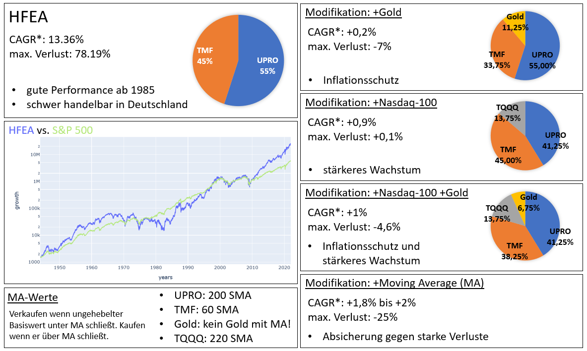

Das originale **HFEA Portfolio** mit US ETFs ist und bleibt der König unter unseren Kandidaten. Es besitzt mit einem CAGR von 13,4% die höchste Rendite unter den nicht MA-Portfolios und kann damit einen guten Vorsprung gegenüber einer S&P 500 Buy and Hold Strategie herausarbeiten. Der Nachteil ist der hohe maximale Verlust in einem Crash von über 78% und wenn wir uns den zeitlichen Verlauf ansehen, gibt es da diesen unangenehmen Einbruch in den 70er Jahren, als Aktien und Schatzkisten stark miteinander korrelierten und beide herunter gingen. Stagflation ist hier das Stichwort. Zumindest bei den Krisen nach 1985 schnitt das HFEA Portfolio allerdings sehr gut ab. Es ist jeweils deutlich besser als die anderen Portfolios durch die Hälfte der Krisen gekommen.

Mit Hilfe der Gold Modifikation kann man bezüglich der Stagflation etwas entgegenwirken. Das ändert nicht viel am CAGR, aber reduziert den maximalen Einbruch um ganze 7%. Mit einer MA-Modifikation bekommt man deutlich weniger Risiko und sogar noch ein bis zu 2% höheres CAGR.

Als Wertpapiere kommen hier **UPRO**, **TQQQ**, **TMF** und Gold (nehmt einfach Xetra Gold oder einen US Gold ETF, zum Beispiel **GLD**) in Frage und damit ist es nur handelbar, wenn man Zugriff auf US ETFs hat. Das geht soweit ich weiß über FlatEx oder auch über Broker wie IBKR, wenn man dort Cash Secured Puts verkauft.

## 2x S&P 500 (MA) Portfolio

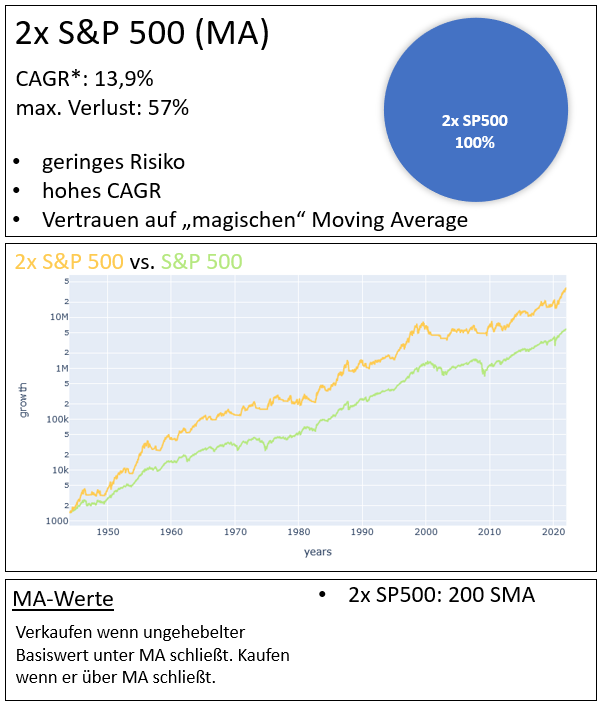

Diejenigen die sich durch Börsenastrologie (Technische Analyse) nicht abschrecken lassen könnten in Europa mit einem 2x S&P 500 Investment gut fahren, welches immer dann verkauft wird, wenn der Basiswert (S&P 500) den Simple Moving Average Wert über 200 Tage bei Börsenschluss unterschreitet. Zurückgekauft wird folgerichtig, wenn der Basiswert diesen SMA bei Börsenschluss überschritten hat.

Mit einem CAGR von 13,9% ist es das Portfolio, welches die höchste Rendite verspricht und der maximale Verlust bei einer Krise betrug in 80 Jahren „nur“ 57%, was deutlich besser als HFEA ist. Man erkennt auch in der Grafik, dass dieses Portfolio dauerhaft einen deutlichen Vorsprung gegenüber einem S&P 500 Buy and Hold hatte. Bei unserer Krisenanalyse schnitt dieses Portfolio, zusammen mit dem HFEA Portfolio sehr gut ab. Bei fast der Hälfte der zurückliegenden Krisen ist es als Gewinner hervorgegangen.

Das Problem an dem Ansatz ist, dass es keine vernünftige makroökonomische Erklärung gibt, warum gerade der 200 SMA so gut funktioniert. Vielleicht ändert sich dieses Verhalten in der Zukunft und in den nächsten 80 Jahren funktioniert der 300 SMA besser?

Außerdem muss man da auch wirklich jeden Tag dahinter sein, um das Unter- oder Überschreiten vom 200 SMA zu prüfen. Mit Werkzeugen wie Tradingview kann man sich das aber zum Teil etwas automatisieren.

Als Wertpapier kommt in Europa der XTRACKERS S&P 500 2X LEVERAGED DAILY SWAP UCITS ETF (**WKN: DBX0B5**) in Frage. Mit US ETFs kann man auch den **UPRO** nehmen, wodurch das Risiko steigt, aber das CAGR dann noch einmal ein Stück weiter nach oben geht.

## Aber was ist mit dem MSCI All World?

Ja genau, diesen Abschnitt habe ich für all die Besucher von r/Finanzen geschrieben. Natürlich habe ich eure Diskussionen zu meiner DD-Serie in eurem Daily gesehen und fand die Kritik sehr interessant. Zusammengefasst wurde mir vorgeworfen, dass meine Portfolios eine Länderwette und sogar eine Sektorwette darstellen. Und was soll ich sagen? Ihr habt Recht!

Seht es nun einmal ein, dass die Börse außerhalb der USA einfach faktisch nicht existiert. Der Markt ist die USA. Sollte die USA mal nicht mehr sein (Kometeneinschlag in Manhatten), dann haben wir auch auf der restlichen Welt keinen Aktienmarkt mehr. Dann nützt euch euer MSCI All World auch nichts mehr.

Aber als jemand der sich auch so langsam seine Gedanken über die Rente macht, verstehe ich natürlich eure Sorgen. Wer also aktuell einen MSCI All World hält und damit zufrieden ist, sollte sich zumindest mal überlegen, ob er oder sie den Anteil, den die USA im All World ETF ausmacht nicht direkt durch **HFEA** oder **2x S&P 500 (MA)** ersetzt. Dann kauft ihr entsprechend der prozentualen Aufteilung der anderen Märkte im All World ETF noch weitere ETFs für Europa, Asien und die Entwicklungsländer. Somit habt ihr weiterhin die gleiche Diversifikation wie zuvor, aber euer USA Anteil wird in Zukunft ordentlich drucken.

Ist euch das zu viel Arbeit? Tja! Von nichts tun kommt halt nichts. Aber ihr seid doch alles so coole ITler, also bastelt euch einfach eine Softwarelösung zusammen, die euch das vierteljährliche Rebalancing automatisiert. Ich bin auf jeden Fall der Meinung, das mit HFEA jede Cabonara besser schmeckt.

## Und wie wirkt sich ein Sparplan aus?

Das war eine besonders häufig gewünschte Frage. Es ist schwer diese Frage pauschal zu beantworten aber ich habe ein paar Simulationen für euch gemacht. Die Simulation funktioniert folgendermaßen:

* Das berechnete Portfolio (HFEA z.B.) wird in tägliche Gewinne von 1943 bis 2021 umgerechnet.
* Dann werden 300 Zeitintervalle mit einer Länge von 15 Jahren aus diesem Zeitraum herausgesucht. Die Intervalle können sich überlagern und sogar mehrmals vorkommen.
* Die Zeitintervalle werden alle „übereinander“ gelegt, daher das exakte Datum wird gelöscht, sondern es zählt nur noch die Anzahl der Tage seit dem Erstinvestment.
* Dann wird über alle 300 Gewinnserien das Wachstum mit 10.000$ Startkapitel und 100$ monatlicher Einzahlung berechnet.
* Anschließend wird der Wert der 300 berechneten Portfolios auf täglicher Basis gemittelt sowie die Standardabweichung und das Minimum und Maximum berechnet.

Für das **50% Portfolio** kommt auf diese Weise die folgende Grafik heraus:

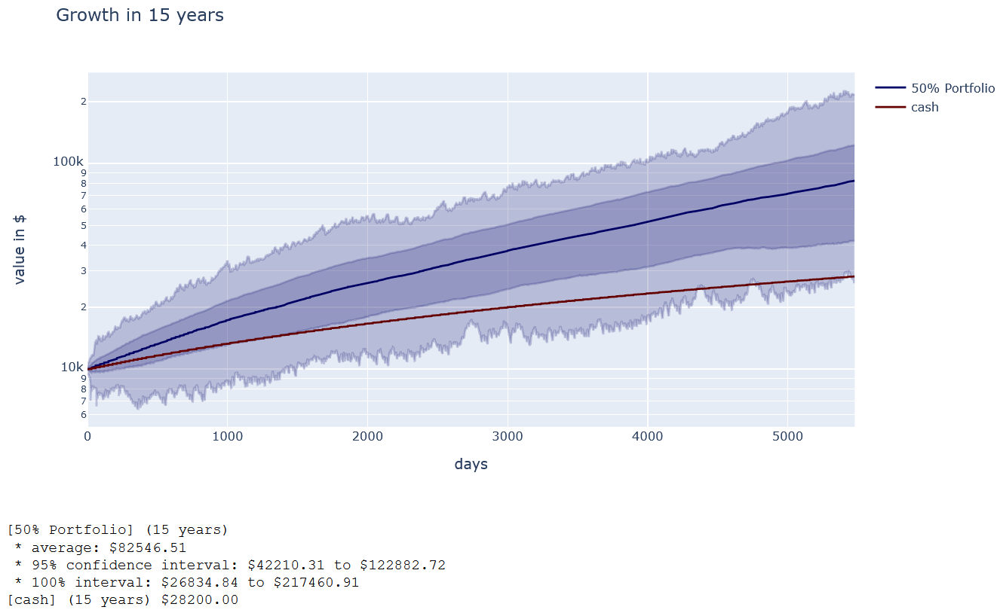

Wir sehen, dass wir im Mittel nach 15 Jahren bei gut 83k ankommen. Hätten wir Cash gespart wären das nur 28k. Der dunkelblaue Bereich in der Grafik stellt den Bereich der Standardabweichung um den Mittelwert da. Also 95% der Werte lagen in diesem Bereich. Ihr seht, dass der Bereich ziemlich groß ist und von 42k bis 123k reicht. Der hellblaue Bereich stellt den Bereich dar in dem 100% der Werte lagen. Hier erreichen wir im Minimum gerade etwas weniger als wenn wir das Geld in Cash ansparen würden. Die Chance, dass so ein Fall eintritt ist sehr klein, aber der Fall ist eben nicht zu 100% ausgeschlossen nach 15 Jahren (Erinnert ihr euch an die Grafik bei der viele Portfolios im schlimmsten Fall erst nach 25 oder 30 Jahren brechgleich erreichten)?

&#x200B;

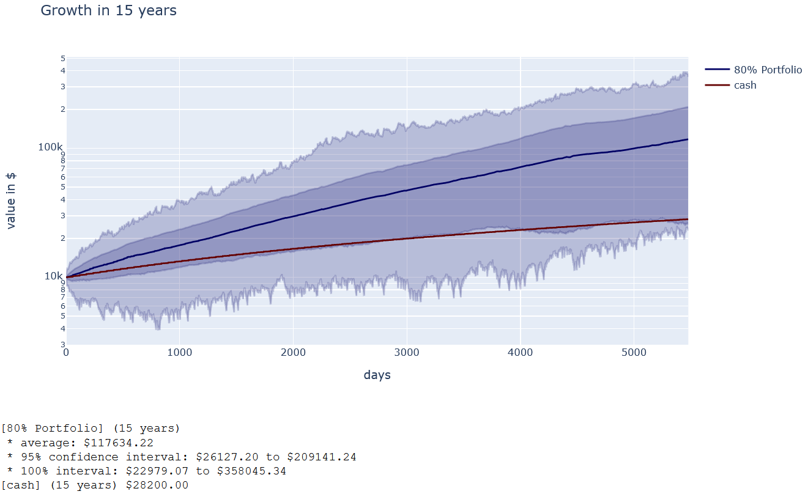

Das **80% Portfolio** schafft es im Mittel schon auf 118k nach 15 Jahren. Allerdings ist hier auch das Risiko deutlich höher. Wir sehen, dass die Cashgrenze ganz unten im dunkelblauen 95% Intervall liegt. Die Wahrscheinlichkeit hier mit weniger als dem Cash wieder rauszugehen ist also noch höher als beim Portfolio zuvor. Man muss ein 80% Portfolio länger halten um diese Wahrscheinlichkeit zu reduzieren.

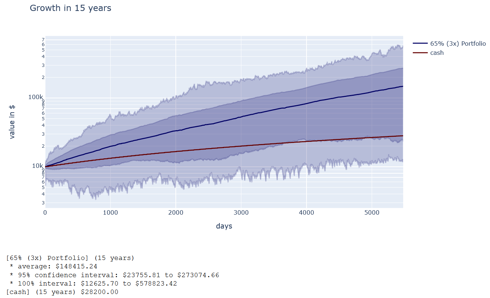

Das **65% (3x) Portfolio** ist bei dieser Berechnung tatsächlich das Beste. Es erreicht im Mittel 148k nach 15 Jahren und ist damit sogar besser als HFEA (wie wir noch sehen werden). Allerdings steigt hier das Risiko weniger als Cash zu erhalten noch einmal an und das Emittentenrisiko ist noch gar nicht berücksichtigt (Totalverlust).

&#x200B;

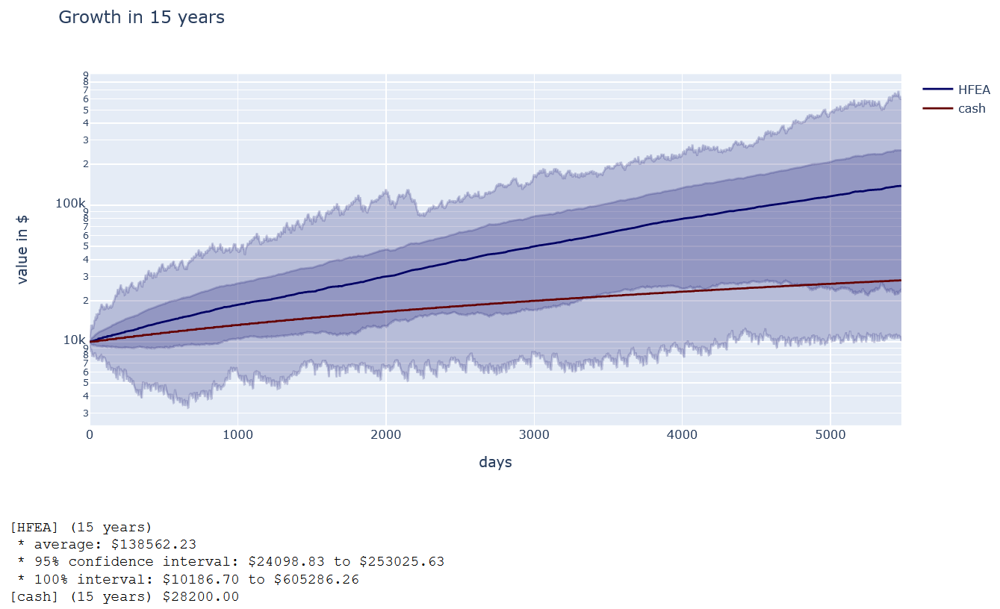

Das **HFEA Portfolio** sieht ziemlich ähnlich aus. Hier erreichen wir im Mittel 139k, also fast so viel wie bei **65% (3x)**. Das Verlustrisiko war auch ein wenig höher und dementsprechend kommen wir im schlimmsten Fall nur noch mit 10k nach 15 Jahren raus.

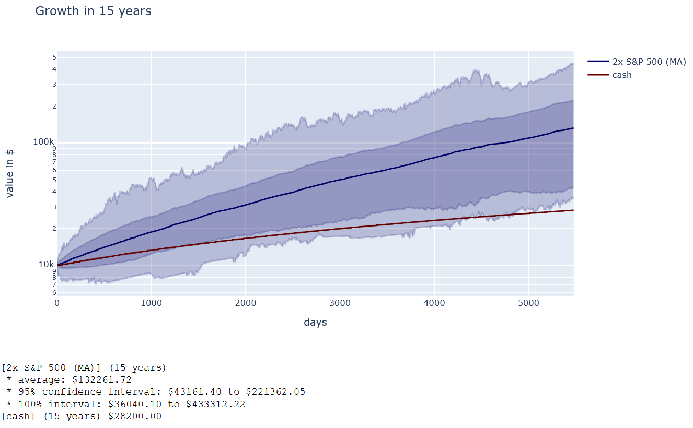

Ebenfalls ähnlich verhält sich **2x S&P 500 (MA)**, nur dass wir hier selbst im schlimmsten Fall noch mehr haben als Cash. Im Mittel werden immer noch stolze 132k erreicht und die untere Grenze des 95% Intervalls liegt bei 43k.

## Wie wirkt sich ein anderer Rebalancing-Zeitpunkt aus?

Bei meinen Tests habe ich bemerkt, dass es einen deutlichen Unterschied macht wie häufig ein Rebalancing durchgeführt wird. Bei einem monatlichen, halbjährigen oder jährlichen Rebalancing war das Ergebnis nicht so gut, wie **bei einem Rebalancing pro Quartal**. Ohne, dass ich das genauer untersucht habe, vermute ich, dass entweder zu schnell Geld vom Gewinnerteil in den Verliererteil des Portfolios umgeschichtet wird (monatlich) oder eben zu langsam (mehr als einmal pro Quartal).

Es gab auch kleine Unterschiede was den Tag des Rebalancing angeht. Das habe ich jedoch nicht im Detail untersucht, weil ich vermute, dass sich das mit der Zeit sowie wieder ändert. Es wäre daher nur eine Überanpassung an die Daten, wenn ich euch jetzt sage, dass zum Beispiel der 8. Tag vor dem Quartalsende ein guter Zeitpunkt wäre.

## ZahlGrafs persönliches Fazit

Das war für mich wirklich eine sehr interessante Serie von Untersuchungen. Ich bin ja niemand der einen volks- oder betriebswirtschaftlichen Hintergrund hat, daher waren viele Dinge die ich in den letzten 3 Monaten gelesen und untersucht habe komplett neu für mich. Meinen persönlichen Favoriten für mein Rentenportfolio konnte ich am Ende finden und ich hoffe, dass ihr auch fündig geworden seid.

Eigentlich war das ein Projekt, welches ich zu Weihnachten gestartet hatte um an 2 der 4 freien Tage mal „schnell“ etwas zu testen. Daraus sind nun ganze 3 Monate geworden, in denen ich nahezu jede freie Minute damit verbracht habe. So interessant das alles war, so bin ich jetzt auch etwas erschöpft von der Arbeit. Und damit freue ich mich, dass ich jetzt auch wieder Zeit für andere Projekte habe. Dennoch möchte ich hier keinen endgültigen Strich drunter ziehen, denn es gibt noch viele interessante Fragen denen man nachgehen könnte. Ich hoffe, dass ich irgendwann mal wieder den Drang verspüre diese offenen Fragen zu beantworten und dann würde ich euch natürlich mit einem Teil 13 und Teil 14 beglücken.

Wenn mir jemand zuvorkommen möchte, dann freue ich mich auch darüber. Die Daten und der Code sind für euch alle frei verfügbar \[1\] und falls ihr Fragen dazu habt, beantworte ich sie gerne.

Jetzt wünsche ich euch erst einmal viel Freude mit den Ergebnissen und viel Erfolg bei eurer persönlichen Anlagestrategie.

Vielen Dank für eure Aufmerksamkeit!   
Euer ZahlGraf

*P.S.: Ich möchte mich noch einmal bei allen Bedanken die hier interessante Fragen gestellt haben und mir bei dem einem oder anderem Problem mit den Daten halfen. Ein rufaus geht auch an den Nutzer* u/Finanzflunder *der mir eine requirements.txt Datei für das Repository erstellt hat und fleißig am Austesten des Codes ist.*

## Quellen

\[1\] [https://code.launchpad.net/zgea](https://code.launchpad.net/zgea)
