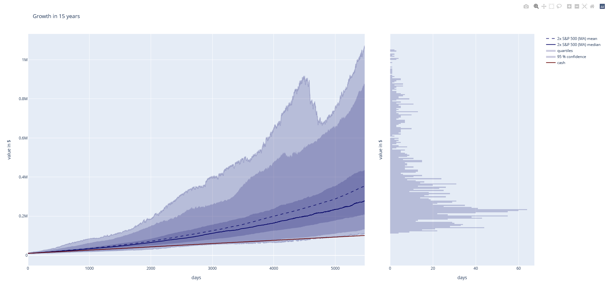

# HFEA-Germany


⚠️ **Disclaimer** ⚠️

This repository contains information on the [HFEA investment strategy](https://www.reddit.com/r/HFEA/). Investment is always connected with risk - your 
money is at risk - depending on traded products and location of your broker **your loss might even be larger than a complete loss!**. This repository 
only assembles information and **is by no means a recommendation of action!** The collected and evaluated information is no incitement to buy or sell 
stocks or other forms of capital investments.
## **This is not investment advice!**

<br />
<br />

## About the Code

---

The original code was published via [Code Launchpad](https://code.launchpad.net/zgea) by [/u/ZahlGraf](https://www.reddit.com/user/ZahlGraf/). The code is 
mostly left unchanged and the largest change are added docstrings, testing, cleaned Jupyter notebooks and comments/ explanations in the code itself. That 
said, minor changes have been made for visualization as in correction of the quartiles of the growth series and final performance distribution histograms,
for computational speed-up, for inclusion of models with transaction costs and for models with rebalancing based on volatility.



If you go through the code, there are some `DOCU` flags left which IMO need documentation/ brief explanations not provided yet. `FUTURE` flags hint on 
behaviour that could be changed. `NOTE` are mostly notes of caution.

The git diff to the original code on [Code Launchpad](https://code.launchpad.net/zgea) (as of 06.06.2022) is contained in the `zgea_diff.txt`, but without
differences in Jupyter notebook, due to the uncleared cell output which would result in a large and hard to read diff-file.

```bash
# diff-file to the original code Repo was created with
git diff origin/master..HEAD ":!*.ipynb" > F:/zgea_diff.txt
```

<br />

### Installation

Once you have cloned the Repo, for good measure create a virtual environment with `virtualenv` or `conda` (my choice) and run within the base folde

```bash
pip install -e .
```

## Code Application

---

The original code is described in detail in the [structured articles](https://github.com/Finanzflunder/HFEA-Deutschland/blob/main/README.md). Beyond that,
minor additions are testing the effect of transaction costs, adding visualizations for individual growth paths and checking volatility as alternative 
rebalancing indicator to the moving average.

<br />

## Best Practices & Testing

---

Clearing the output of the Jupyter notebooks (yes, they take a long time to run but merging notebooks is very painful, too) and testing described below.

### **Clearing Jupyter Notebook Outputs**

If Jupyter is installed, you can run

```bash
Jupyter nbconvert --clear-output --inplace *.ipynb
```

from the base folder to clear all Jupyter notebook output. This is recommended for pushing/ updating the code
but also helpful to limit the file size along with better usability/ searchability in the IDEs.

<br />

### **Code Testing**
<br />

**CAUTION: The testing so far only checks whether the code is running, not actually functioning as expected!**
<br />

FUTURE: Add tests that check the functionality - whether calculated outcomes are sensible, based on toy or example data.

FUTURE: Further speed up/ optimize calculations (most often pandas data structures are not optimal in terms of speed), as roughly 20% coverage 
are missing due to cell time-outs after 300s.

<br />

#### **Coverage Badge**

Follow the instructions in [this Repo](https://github.com/dbrgn/coverage-badge) to create the coverage badge (located in the `images` subfolder).

<br />

#### **Manual Testing**

**CAUTION: Getting the run coverage without existing `cached_clean_data` folder and including all Backtests will take several hours!**
<br />

To run the Jupyter notebook tests manually, run

```bash
pytest --collect-only --nbmake  # check which notebooks are found
pytest --nbmake  # execute testing (additional options could be added or pytest-xdist be used for multi-processing)
```

The testing can further be specified by including the `.coveragerc` for specified coverage reporting - also as html files if
explicit line coverage is desired:

```bash
# use file exclusion criteria in .coveragemc for coverage report in command line
pytest --color=yes --cov --cov-config=.coveragerc --nbmake

# if you prefer the report in form of .html's (to show uncovered lines), run
pytest --color=yes --cov --cov-config=.coveragerc --cov-report html --nbmake
```

<br />

#### **tox**

To run automatic tests that check whether the notebooks and the defined utils functions are running for different python versions 
(currently 3.7 - 3.10) you have to either run `tox -r` from within your created environment or install tox first manually via

```bash
pip install tox  # sudo apt install tox does NOT give you what is required
```

if to wish to run tox outside of any environment.

You also need to ensure that all python versions which are to be tested are installed on your machine beforehand (currently 3.7 - 3.10). 
So far I have tested the code only on windows. Feel free to add further tested platforms in the `tox.ini` if you have done so.
